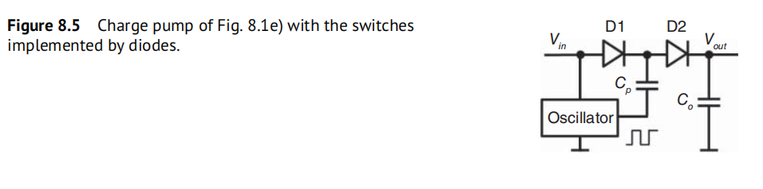
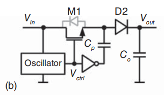
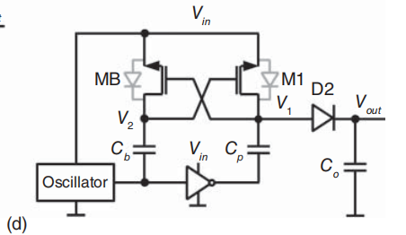
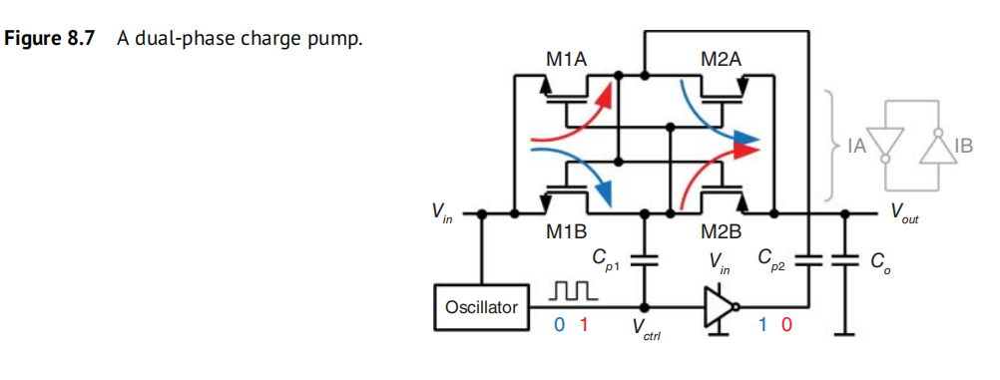
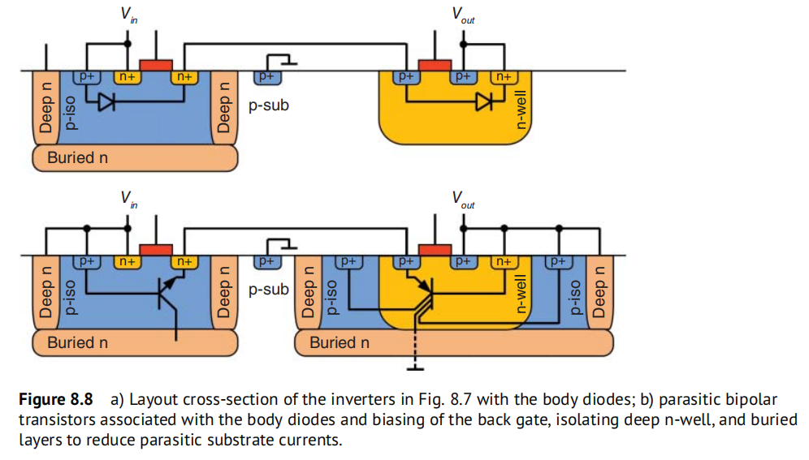

# DRAM 充电泵结构笔记

## 1. 二极管实现的单级 charge pump

**结构：**

- 输入：直流电源 $V_{in}$
- 振荡器输出：方波 $V_{ctrl}$（在 0 和 $V_{in}$ 间摆动）
- 泵电容 $C_p$
- 输出端滤波电容 $C_o$
- 两个二极管：D1（输入侧）、D2（输出侧）

> 目标：利用 $C_p$ 把输出电压从 $V_{in}$ 提升到接近 $2V_{in}$。

### 1.1 低电平相：给 $C_p$ 充电

- $V_{ctrl} = 0$
- D1 导通，D2 截止
- 中间节点电压记为 $V_X$

此时：
$$
V_X \approx V_{in} - V_D
$$

（通过 D1 充电，损失一个二极管压降 $V_D$。）

于是：
$$
V_{C_p} = V_X - V_{ctrl} \approx V_{in} - V_D
$$

> 第一处损失：  
> $C_p$ 只被充到 $V_{in} - V_D$，而不是理想的 $V_{in}$。

---

### 1.2 高电平相：抬高 $C_p$ 底板

- $V_{ctrl}$ 从 0 跳到 $V_{in}$
- 为保持电容电压不变：
$$
V_X^{new} = V_{ctrl}^{new} + V_{C_p}
\approx V_{in} + (V_{in} - V_D) = 2V_{in} - V_D
$$

此时：

- D1 反偏 → 关断，防止电荷回流到输入；
- 若输出电压还较低，则 D2 正偏 → 导通，给 $C_o$ 和负载充电。

最终输出被充到：
$$
V_{out} \approx V_X^{new} - V_D
\approx (2V_{in} - V_D) - V_D = 2V_{in} - 2V_D
$$

> 第二处损失：  
> 从中间节点到输出又掉一个 $V_D$。

---

### 1.3 小结

- 理想情况（无二极管压降）  
  $$
  V_{out,ideal} \approx 2V_{in}
  $$
- 包含二极管压降时  
  $$
  V_{out} \approx 2V_{in} - 2V_D
  $$

再考虑负载电流、寄生等，实际 $V_{out}$ 通常比上式更低。

---

## 2. 用 PMOS 替代 D1 的“错误”实现

图 8.6(a) 可视为图 8.5 的变体：  
把 D1 换成了一个由振荡器驱动栅极的 PMOS M1，想实现更“理想”的开关。

### 2.1 拓扑说明

- 输入：$V_{in}$
- 振荡器输出一相时钟，接 M1 栅极，并驱动 $C_p$ 底板
- M1 为 PMOS：
  - 一端接 $V_{in}$
  - 一端接 $C_p$ 上板节点 $V_X$
- 期望：在某一相位，M1 像图 8.5 中的 D1 那样，把电荷从 $V_{in}$ 推向 $C_p$；  
  另一相位关断，允许 $C_p$ 自举至接近 $2V_{in}$。

---

### 2.2 相位 1：M1 作为开关给 $C_p$ 充电

- 振荡器输出低电平（接近 0）；
- PMOS 导通条件：
  $$
  V_{SG} = V_S - V_G \approx V_{in} - 0 \gg |V_{tp}|
  $$
  因此 M1 强导通。

结果：

- $C_p$ 上板节点 $V_X \approx V_{in}$，底板为 0；
- 电容电压：
  $$
  V_{C_p} \approx V_{in}
  $$

与图 8.5 不同，这里 M1 像理想开关一样，$C_p$ 可以几乎被充到 $V_{in}$。

---

### 2.3 相位 2：自举 $C_p$ 底板（理想情况）

- 振荡器输出高电平，将 $C_p$ 底板抬到 $V_{in}$。

若忽略 M1 和寄生二极管的影响，根据电荷守恒：
$$
V_X^{ideal} = V_{bottom}^{new} + V_{C_p}
\approx V_{in} + V_{in} = 2V_{in}
$$

理想情况下，上板节点 $V_X$ 被推进到接近 $2V_{in}$。

---

### 2.4 实际问题 1：体二极管钳位

- PMOS 在 n-well 中，n-well 一般接 $V_{in}$；
- 源/漏的 p+ 扩散与 n-well 形成寄生 p-n 二极管。

当上板试图升到 $2V_{in}$ 时：

- 上板 p+ 区比 n-well（$= V_{in}$）高了约 $V_{in}$；
- 该 p-n 结被正向偏置，体二极管导通。

结果：电荷从上板通过体二极管流回 $V_{in}$，直到只剩一个正向压降：
$$
V_X \approx V_{in} + V_D
$$

这已经把最大电压限制在 $V_{in} + V_D$ 附近，远小于理想的 $2V_{in}$。

---

### 2.5 实际问题 2：源/漏角色翻转 + 阈值限制

也可以从 MOS 导通条件来理解：

- 对 PMOS，电势更高的一端会成为源极；
- 当上板电压 $V_X$ 被推高时，实际上上板变成了“源”，下端接 $V_{in}$ 的一端变成“漏”，栅极仍在 $V_{in}$。

此时：
$$
V_{SG} = V_X - V_G
$$

如果 $V_X$ 被推得太高，使得 $V_{SG} > |V_{tp}|$，沟道再次导通，M1 会把上板电压往下拉向 $V_{in}$，直到达到平衡：
$$
V_{SG} \approx |V_{tp}| \Rightarrow V_X \approx V_{in} + |V_{tp}|
$$

也就是说，从阈值条件看，M1 会把上板钳在约 $V_{in} + |V_{tp}|$ 的位置。

---

### 2.6 结果与图 8.5 的对比

- 理想希望：
  $$
  V_X \to 2V_{in}
  $$
- 实际被钳制在：
  $$
  V_X \approx V_{in} + \min(V_D,\ |V_{tp}|)
  $$
  （取决于是寄生二极管先导通，还是 MOS 阈值条件先约束。）

之后通过输出整流级时还会再掉一个二极管压降或阈值，因此：

- 图 8.5：理论上最高约为 $2V_{in} - 2V_D$；
- 图 8.6(a)：由于第一级（M1）就被钳在 $V_{in} + V_D$ 或 $V_{in} + |V_{tp}|$，几乎得不到“倍压”效果。

这就是文中所说  
“用 PMOS 直接替换 D1 在本质上是行不通的（does not work in the first place）” 的原因：

- M1 的体二极管与阈值效应，把被自举的节点电压钳在离 $2V_{in}$ 很远的位置；
- 结果该结构的升压能力非常有限。

---

## 用 NMOS 替代 D1 的实现

图 8.6(b) 可以看作是在图 8.5 的基础上，把左侧二极管 D1 换成 **NMOS M1 + 反相器驱动的自举电容 $C_p$**。

### 1. 拓扑说明

- 输入电源：$V_{in}$
- 振荡器输出：$V_{ctrl}$  
  - 直接接到 M1 的栅极；  
  - 送入反相器，反相信号驱动 $C_p$ 的下极板。
- $C_p$：泵电容，上极板接节点 $V_X$（同时接 M1 一端）；下极板接反相器输出。
- M1：NMOS，**一端接 $V_{in}$，一端接 $V_X$**。  
  M1 的 body（p-well）**被连接到源端/节点 $V_X$**，通过工艺阱结构与 $V_{in}$ 之间形成一个 p–n 结，这就是图中虚线标出的“体二极管”：
  - 阳极在 $V_X$；
  - 阴极在 $V_{in}$。
- D2 + $C_o$：和图 8.5 一样，负责整流和输出滤波。

---

### 2. 相位 1：$V_{ctrl} = V_{in}$（高电平）——给 $C_p$ 充电

- $V_{ctrl} = V_{in}$；
- 反相器输出约为 0（低电平）：
  - $C_p$ 下极板在 0；
  - M1 栅极在 $V_{in}$。
- 初始时假设 $C_p$ 不带电，上极板 $V_X \approx 0$。

因为节点 $V_X$ 电位更低，这一端可视为 M1 的源极：

- $V_S = V_X \approx 0$  
- $V_G = V_{in}$  
- $V_{GS} = V_G - V_S \approx V_{in} \gg V_{th}$

M1 强导通，相当于一个源跟随器，把 $V_X$ 拉向栅极电压减去阈值电压：

$$
V_X \approx V_{in} - V_{th,eff}
$$

其中 $V_{th,eff}$ 包括 body effect 的影响（因为 body 跟着 $V_X$ 走，$V_{SB}$ 不为 0）。

此时电容电压为：

$$
V_{C_p} = V_X - V_{bottom} \approx (V_{in} - V_{th,eff}) - 0 = V_{in} - V_{th,eff}
$$

> 第一相的关键：  
> **$C_p$ 只能被充到 $V_{in} - V_{th,eff}$，而不是完整的 $V_{in}$**，天生损失一个阈值。

此时体二极管的状态：

- 阳极在 $V_X \approx V_{in} - V_{th,eff}$；
- 阴极在 $V_{in}$；
- $V_{anode} < V_{cathode}$ → 体二极管 **反向偏置**，不导通。

---

### 3. 相位 2：$V_{ctrl} = 0$（低电平）——自举 $C_p$ 底板

- $V_{ctrl}$ 从 $V_{in}$ 跳到 0；
- 反相器输出从 0 跳到 $V_{in}$：
  - $C_p$ 下极板从 0 抬到 $V_{in}$；
  - M1 栅极从 $V_{in}$ 掉到 0，NMOS 沟道截止。

若暂时忽略体二极管，利用电容电压保持不变：

$$
V_X^{ideal}
= V_{bottom}^{new} + V_{C_p}
\approx V_{in} + (V_{in} - V_{th,eff})
= 2V_{in} - V_{th,eff}
$$

也就是说，**理想情况下** 上极板会被推到接近 $2V_{in} - V_{th,eff}$。

---

### 4. 体二极管的钳位作用

现在考虑图中虚线标出的体二极管：

- 阳极在 $V_X$；
- 阴极在 $V_{in}$（这一侧的 n 区与 p-well 形成的 p–n 结）。

当 $V_X$ 试图升高到 $2V_{in} - V_{th,eff}$ 时，一定会满足：

$$
V_X > V_{in} + V_D
$$

其中 $V_D$ 为该 p–n 结的正向导通电压（例如约 0.6–0.7 V）。

于是体二极管开始**正向导通**，把电荷从节点 $V_X$ 拉回 $V_{in}$，直到达到新的平衡：

$$
V_X \approx V_{in} + V_D
$$

> 第二相的关键：  
> 虽然自举本来能把 $V_X$ 推到接近 $2V_{in} - V_{th,eff}$，  
> 但由于 **body 被绑在源端，通过阱结构与 $V_{in}$ 形成的体二极管正向导通**，  
> 最终 $V_X$ 被钳在 $V_{in} + V_D$ 左右，远低于理想的 $2V_{in}$。

注意：

- 此时 M1 栅极已经是 0，$V_{GS} \approx -V_X < 0$，NMOS 沟道处于 **关断状态**；
- 泄放通路主要是 **体二极管**，而不是像 PMOS 情况那样通过通道导通和源漏翻转来泄放。

---

### 5. (b) 结构为什么“不 work”

综合两相来看：

1. 第一相中，$C_p$ 只能充到 $V_{in} - V_{th,eff}$（源跟随器效应 + body effect），
2. 第二相中，即使理论自举能到 $2V_{in} - V_{th,eff}$，被体二极管钳在 $V_{in} + V_D$，
3. 之后再通过 D2 或后级开关到达输出端，还会再掉一个 $V_D$ 或 $V_{th}$。

结果是：在低电压工艺（例如 1.5 V、1.2 V）下，这种 NMOS 替代 D1 的结构**几乎不能提供足够的升压**，远达不到理想的 $2V_{in}$，所以论文才会说：

> “Replacing D1 … by an NMOS transistor does not work in the first place.”

---

## 带局部自举的 nMOS 电荷泵（正确的 n 型实现）

### 1. 拓扑概要

- 输入电源：$V_{in}$
- 振荡器输出：$V_{ctrl}$  
  - 直接驱动泵电容 $C_p$ 的下极板；  
  - 作为反相器 I1 的输入。
- 反相器 I1：输出驱动自举电容 $C_b$ 的下极板。
- $C_p$：泵电容，上极板为节点 $V_X$，下极板接 $V_{ctrl}$。
- NMOS M1：
  - 一端接 $V_{in}$；
  - 一端接 $V_X$；
  - body（p-well）与 $V_X$ 相连，通过阱结构与 $V_{in}$ 之间形成体二极管 DB，**阳极在 $V_{in}$，阴极在 $V_X$**。
- DB（二极管）：从 $V_{in}$ 到 M1 栅极节点，给 $C_b$ 充电并限制栅极电压。
- $C_b$：local bootstrapping 电容，上极板接 M1 栅极，下极板接 I1 输出。
- D2 + $C_o$：输出整流和滤波，不在此处展开。

目标：
1. 防止在 $C_p$ 自举时体二极管导通泄放；
2. 消除 M1 作为开关时的阈值损失。

---

### 2. 相位 A：$V_{ctrl} = V_{in}$（预充 $C_b$）

- $V_{ctrl} = V_{in}$。
- I1 输出 $\approx 0$，故：
  - $C_b$ 下极板为 0；
  - 通过 DB，M1 栅极被拉到约 $V_{in} - V_D$，DB 随后反偏关断。
- $C_b$ 两端电压：
  $$
  V_{C_b} \approx (V_{in} - V_D) - 0 = V_{in} - V_D
  $$
- 此相位主要完成 **$C_b$ 的充电**。  
  M1 的栅源电压 $V_{GS}$ 很小，几乎不导通；$C_p$ 的电压保持上一个周期的状态。

---

### 3. 相位 B：$V_{ctrl} = 0$（local bootstrapping 驱动 M1 给 $C_p$ 充电）

- $V_{ctrl}$ 从 $V_{in}$ 跳到 0。
- I1 输出从 0 跳到 $V_{in}$，因此：
  - $C_b$ 下极板升至 $V_{in}$；
  - $C_b$ 电压保持不变，M1 栅极被自举到：
    $$
    V_G \approx V_{in} + (V_{in} - V_D) = 2V_{in} - V_D
    $$
- 此时 M1 另一端在 $V_{in}$，故：
  $$
  V_{GS} = V_G - V_S \approx (2V_{in} - V_D) - V_{in} = V_{in} - V_D
  $$
  只要 $V_{in} - V_D > V_{th}$，M1 强导通。
- M1 作为低阻开关，将 $V_{in}$ 几乎无损地传到 $V_X$，于是：
  $$
  V_X \approx V_{in}, \quad V_{C_p} = V_X - V_{ctrl} \approx V_{in} - 0 = V_{in}
  $$

相位 B 结束时：

- $C_p$ 已被充到接近 $V_{in}$；
- M1 栅极因 $C_b$ 的自举而获得足够的 overdrive，**不存在源跟随式的阈值损失**。

---

### 4. 下一周期：$V_{ctrl}$ 再次变高，自举 $C_p$

在下一个周期，$V_{ctrl}$ 从 0 再次跳到 $V_{in}$：

- $C_p$ 下极板从 0 抬到 $V_{in}$；
- $C_p$ 电压保持约 $V_{in}$，因此：
  $$
  V_X^{boost} \approx V_{in} + V_{in} = 2V_{in}
  $$
- 此时 M1 栅极由 I1 输出重新回到低电平、并经 DB 被限制在约 $V_{in} - V_D$，M1 关断：
  $$
  V_{GS} \approx (V_{in} - V_D) - 2V_{in} < 0
  $$
- 体二极管 DB 的阳极在 $V_{in}$，阴极在 $V_X^{boost}$：
  - 因为 $V_X^{boost} > V_{in}$，该 p–n 结始终 **反向偏置**，不会导通泄放。

于是 $V_X$ 得以保持在接近 $2V_{in}$，再通过 D2 向输出电容 $C_o$ 转移电荷。

---

### 5. 与图 8.6(a)/(b) 的对比与优点

- **避免体二极管泄放**：  
  把 M1 的 body 通过阱结构与源端节点 $V_X$ 绑在一起，使体二极管方向为“阳极在 $V_{in}$，阴极在 $V_X$”，在 $V_X > V_{in}$ 的自举状态下始终反偏，避免了 (a)/(b) 中那种在自举时被钳在 $V_{in} + V_D$ 的问题。

- **消除阈值损失**：  
  通过 $C_b$ 的 local bootstrapping，让 M1 在给 $C_p$ 充电的相位具有：
  $$
  V_{GS} \approx V_{in} - V_D > V_{th}
  $$
  因此 $V_X$ 可以真正充到接近 $V_{in}$，而不是像 (b) 中那样被限制在 $V_{in} - V_{th}$。

- **最终效果**：  
  这一结构能在低电压 CMOS 工艺中有效地把节点 $V_X$ 提升到接近 $2V_{in}$，是“正确的 n 型晶体管实现”。

## 交叉耦合 nMOS 电荷泵（cross-coupled charge pump）

### 1. 拓扑概要

- 输入电源：$V_{in}$  
- 振荡器输出：$\phi$  
  - 直接接到 $C_b$ 下极板；  
  - 经反相器后得到 $\bar\phi$，接到 $C_p$ 下极板。
- $C_p$：泵电容，下极板接 $\bar\phi$，上极板为节点 $V_1$。  
- $C_b$：泵电容，下极板接 $\phi$，上极板为节点 $V_2$。  
- M1：nMOS，源接 $V_{in}$，栅接 $V_2$，漏接 $V_1$。  
- MB：nMOS，源接 $V_{in}$，栅接 $V_1$，漏接 $V_2$。  
- 两管的 body 通过阱工艺与各自的高电位侧相连，使体二极管方向从 $V_{in}$ 指向 $V_1$/$V_2$，在自举时保持反偏。  
- D2 + $C_o$：输出整流与滤波。

目标：  
1. 用交叉耦合自举消除阈值损失；  
2. 在 $V_1$ 上产生接近 $2V_{in}$ 的泵电压。

---

### 2. 相位 A：$\phi = 0, \ \bar\phi = V_{in}$ —— 预充 $C_b$

- 假设此时电路刚刚启动，未进入稳态

- $C_b$ 上下极板为 0。$C_p$上下极板为$V_{in}$ 。 

此时 MB：

- 源在 $V_{in}$，栅在 $V_1 = V_{in}$，漏在0  
  $V_{GS,MB} = V_{in} \gg V_{th}$，MB 导通。  

MB 将 $V_{in}$ 传到 $V_2$，考虑阈值损失：
$$
V_2 \approx V_{in}-V_{th}
$$

因 $C_b$ 下板为 0：
$$
V_{C_b} \approx V_2 - 0 \approx V_{in}-V_{th}
$$

即 $C_b$ 被充到约 $V_{in}-V_{th}$，为下一相位自举 M1 做准备。  
此时 $C_p$ 下板在 $V_{in}$，上板 $V_1$ 保持$V_{in}$。

- 假设电路进入稳态，

- 上一周期末 $V_1$ 已自举到接近 $2V_{in}$，$V_2$ 约为 $V_{in}$。  

此时 MB：

- 源在 $V_{in}$，栅在 $V_1 \approx 2V_{in}$，  
  $V_{GS,MB} \approx V_{in} \gg V_{th}$，MB 强导通。  

MB 将 $V_{in}$ 传到 $V_2$，几乎无阈值损失：
$$
V_2 \approx V_{in}
$$

因 $C_b$ 下板为 0：
$$
V_{C_b} \approx V_2 - 0 \approx V_{in}
$$

即 $C_b$ 被充到约 $V_{in}$，为下一相位自举 M1 做准备。  
此时 $C_p$ 下板在 $V_{in}$，上板 $V_1$ 保持上相位末的值。

---

### 3. 相位 B：$\phi = V_{in}, \ \bar\phi = 0$ —— 自举 M1，给 $C_p$ 充电

- $C_b$ 下极板升到 $V_{in}$，电压保持不变，则：
$$
V_2^{boost} \approx V_{in} + V_{C_b} \approx 2V_{in}-V_{th}
$$

M1：

- 源在 $V_{in}$，栅在 $V_2^{boost}$：
$$
V_{GS,M1} \approx 2V_{in} - V_{th}-V_{in} = V_{in}-V_{th} > V_{th}
$$
- M1 强导通，将 $V_{in}$ 几乎无损地传到 $V_1$：
$$
V_1 \approx V_{in}
$$

此时 $C_p$ 下极板在 0：
$$
V_{C_p} = V_1 - 0 \approx V_{in}
$$

相位 B 结束时，$C_p$ 已被充到接近 $V_{in}$。

---

### 4. 回到相位 A：自举 $C_p$，得到高电压

当时钟再从相位 B 回到相位 A：

- $\bar\phi$ 从 0 升到 $V_{in}$，$C_p$ 下极板从 0 抬到 $V_{in}$；  
- 电容电压 $V_{C_p} \approx V_{in}$ 保持不变，因此：
$$
V_1^{boost} \approx V_{in} + V_{in} = 2V_{in}
$$

此时：

- M1 栅极重新回到约 $V_{in}-V_{th}$（通过 $C_b$ 的放电回到预充状态），$V_{GS,M1}＜0$ ，M1 关断；  
- MB 的栅极在 $V_1^{boost}$，为当前相位给 $C_b$ 充电提供高栅压，使其充电至$V_{in}$，电路进入稳态，后续分析回到2、相位A。  
- 体二极管方向从 $V_{in}$ 指向 $V_1$/$V_2$，此时 $V_1^{boost}, V_2^{boost} > V_{in}$，p-n 结反偏，高电压节点不被泄放。

经过若干周期，$V_1$ 在接近 $2V_{in}$ 与略低的值之间交替，  
经 D2 和 $C_o$ 整流后得到接近 $2V_{in}$ 的直流输出（减去 D2 的压降和非理想损失）。

---

### 5. 特点

- 通过交叉耦合自举，M1 与 MB 在各自导通相位都有较大的 $V_{GS}$，显著减小阈值损失。  
- 体二极管方向设计得当，在自举状态下始终反偏，避免了 (a)、(b) 结构中出现的漏电和钳位问题。  
- 结构对称，等效输出电阻较小，适合在低电压 CMOS 工艺中产生较高的泵电压。

## Cross coupled charge pump

### 1. 电路结构

- 两相时钟：`CLK` 与 `CLKB`（互补、180° 相位差）。
- 上飞跨电容：`Cu1`  
  - 上板接 `CLK`，下板接节点 `U1`。
- 下飞跨电容：`Cd1`  
  - 下板接 `CLKB`，上板接节点 `D1`。
- 交叉耦合开关：  
  - `MN2` / `MP1`：主导 **`VDD → D1`** 的充电通路；  
  - `MN1` / `MP2`：主导 **`VDD → U1`** 的充电通路；  
  - 栅极互相交叉连接，使谁被自举、谁导通自动切换。
- 输出端：`Vout` 通过整流开关与 `U1` / `D1` 相连，再通过 `Cout` 和 `Rout` 滤波负载。

目标：交替将 `U1` 与 `D1` 提升到约 $2V_{DD}$，使 `Vout` 稳定在接近 $2V_{DD}$。

---

### 2. 相位 A：`CLK = VDD`, `CLKB = 0`

- 交叉耦合使 `MN2` / `MP1` 导通：节点 `D1` 被充到
  $$
  D1 \approx V_{DD}
  $$
- 此时 `Cd1` 两端电压为
  $$
  V_{Cd1} \approx V_{D1} - V_{CLKB} \approx V_{DD} - 0 = V_{DD}
  $$
  即 `Cd1` 记住了一个 `VDD` 的电压。
- 节点 `U1` 保持上一相位末的状态（下一相位由 `Cu1` 自举）。

---

### 3. 相位 B：`CLK = 0`, `CLKB = VDD`

- 交叉耦合使 `MN1` / `MP2` 导通：节点 `U1` 被充到
  $$
  U1 \approx V_{DD}
  $$
- `Cd1` 下板从 0 升到 `VDD`，电压保持不变：
  $$
  D1^{new} = V_{CLKB}^{new} + V_{Cd1} \approx V_{DD} + V_{DD} = 2V_{DD}
  $$
  节点 `D1` 被自举到约 $2V_{DD}$。
- `D1` 通过后级整流/开关向 `Cout` 充电，提升 `Vout`。

下一半个周期中：

- 再次 `CLK = VDD`, `CLKB = 0` 时，过程对称：  
  - `D1` 回到约 `VDD`；  
  - `U1` 被 `Cu1` 自举到约 $2V_{DD}$，同样为 `Vout` 充电。

---

### 4. 结果

- 节点 `U1` 与 `D1` 在 $V_{DD}$ 与 $2V_{DD}$间交替自举；
- 输出端经过 `Cout` 滤波后得到平均值：
  $$
  V_{out} \approx 2V_{DD} - \Delta V
  $$
  其中 $\Delta V$ 为开关导通压降等非理想因素引起的损失。

该结构就是后续多级电荷泵的基本 **voltage doubler 单元**。

---

### 5. 另一种思路

还有一种理解方式就是将M1A和M2A视为反相器`IA`，将M1B和M2B视为反相器`IB`，所有的晶体管就形成了交叉耦合CMOS反相器，工作原理如上图所示。

- 相位A：$V_{ctrl}=0$，$C_{p1}$将反相器`IA`输入拉为低电平；另一个反相器`IB`通过$C_{p2}$收到相反的输入信号，

  因此M1B和M2A导通：M1B从输入向$C_{p1}$充电，而M2A从$C_{p2}$向输出$C_{o}$充电并提供输出负载电流$I_{load}$

- 相位B：$V_{ctrl}=1$，M1A和M2B导通，刷新$C_{p2}$并将$C_{p1}$连接至输出。

- 由于栅极都处于$V_{DD}\sim 2V_{DD}$，避免了阈值损失、

由于采用了两相工作(dual-phase)，电荷泵可以提供两倍于单相设计的负载电流$I_{load}$，而对于相同的$I_{load}$，输出电压纹波可以降低50%，对于相同最大负载电流，可以以一般的开关频率工作，或将$C_{p1}$和$C_{p2}$尺寸减小一半

除此之外，在启动时，所有的电容都不带电，而由于体二极管的存在可以对$C_{p1}$和$C_{p2}$进行预充电，而在时钟周期启动之后能进一步启动电路

---

### 6. 寄生bipolar

由于自举电压的存在，节点电压超过输入电压时，会有至少一个体二极管导通，所以需要仔细观察版图。上图所展示的是其中一个反相器，假设体二极管导通，电荷就会由寄生bipolar直接从集电极流向衬底，无法向节点充电，导致电荷泵失效，所以需要做好背栅连接和隔离如上图的图b所示。