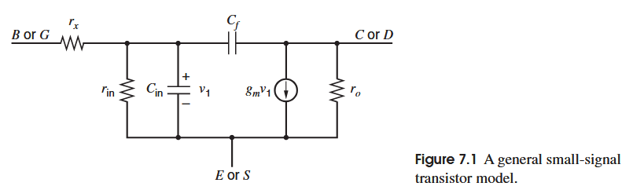
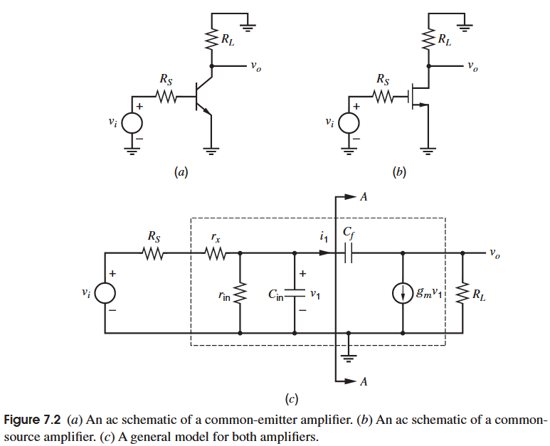
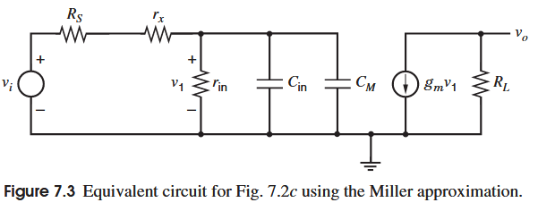
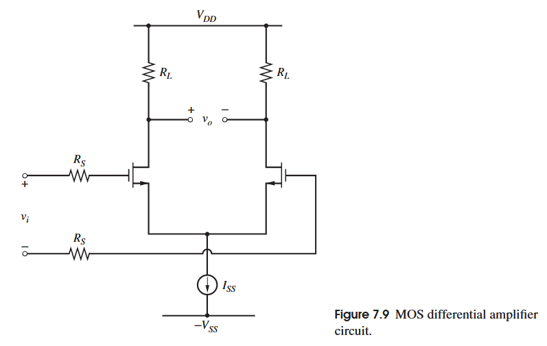
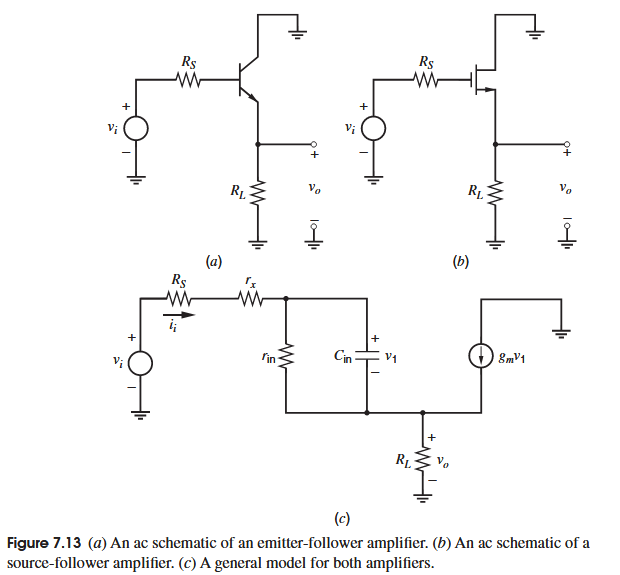
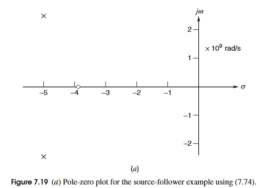
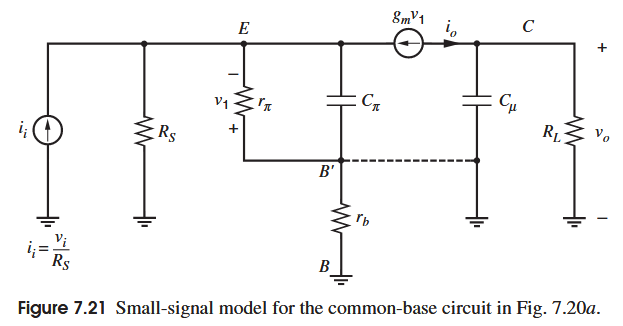
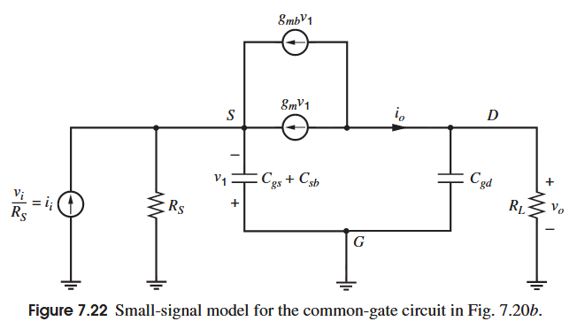

[toc]

# 频率响应

在低频情况下，可以借助等效的小信号模型很轻松的得到电路的低频特性，其中的元件不过电阻，受控源，但当频率提升之后，电容的影响也必须考虑在内，且由于电容的特性，可能导致电路的特性有所削弱，如何正确的分析电路中的频率响应，是这一章的核心要义，其中会有极为复杂的式子，重点是了解其频率变化带来的影响以及电路特性，具体的数值不需要特别记忆。

本章仍然由Gary的书为主体思路，Razavi的这一章虽然网上有人喜欢，但其这一章的内容眼花缭乱，思维极其跳跃，对于结构的简化和拓展混乱，大长串式子更是毫无分析过程和章法，其中还不乏许多小巧思，虽然看上去极具吸引力，易于分析电路，但过于执着奇技淫巧反而会忽略电路本身的性质，故本章不采用Razavi的思路。

## 单级放大器频率响应

MOS管和bipolar在模型上有一些相似之处，故在分析它们构成的单极放大器时，可以先对它们的通用模型进行分析，在对各自进行分类分析得到结果，如下图所示的是通用晶体管的小信号模型

在MOS管和bipolar中的各个元件有着不同的对应关系，如下表所示

| 通用模型 | Bipolar模型 | MOS模型  |
| -------- | ----------- | -------- |
| $r_x$    | $r_b$       | 0        |
| $r_{in}$ | $r_{\pi}$   | $\infty$ |
| $C_{in}$ | $C_{\pi}$   | $C_{gs}$ |
| $C_f$    | $C_{\mu}$   | $C_{gd}$ |
| $r_o$    | $r_{o}$     | $r_o$    |

### 米勒效应

在分析电路中的一种近似方法就是米勒效应近似，为了解释这个近似，观察下面这个共源/共射单级放大器

其中的虚线框就是前面提到的通用模型，这种近似方法主要用于分析从输入端看进去的阻抗，即从上图的AA平面看进去的阻抗。也是用KCL进行分析，这里直接给结果：
$$
i_1=[1-A_v(s)]sC_fv_1
$$
其中$A_v(s)$为电路的传递函数（增益）：
$$
A_v(s)=\frac{v_o}{v_i}=-g_mR\left(\frac{1-s\frac{C_f}{g_m}}{1+sR_LC_f}\right)
$$
可以看到从AA看进去的阻抗为$[1-A_v(s)]sC_f$，这相比电容$C_f$本身的阻抗放大了$[1-A_v(s)]$倍，这就是米勒效应，但由于增益本身就是频率的函数，在分析时很复杂，故用低频时的增益替代这个传递函数，有：
$$
C_M=[1-A_{v0}]C_f
$$
这种用低频时的增益替代复函数的增益的近似被称为米勒近似(Miller Approximation)，而$C_M$被称为米勒电容(Miller Capacitance)，在这个共射/共源模型中，低频增益为$A_{v0}=-g_mR$，那么有米勒电容：
$$
C_M=[1+g_mR]C_f
$$
可以看到由于增益往往大于1，所以米勒电容通常大于反馈电容本身的阻抗。

那么我们可以得到上图的新的等效模型，用$C_M$替代了$C_f$，这可以更好的分析输入阻抗和前馈传输，但需要注意的是，**米勒近似在高频时的反馈传输和输出阻抗的分析时并不奏效**，它会造成电路零点的忽略和错误对输出阻抗的估计。米勒电容的物理意义是：由于在低频时，$C_f$的一端是$v_i$另一端是$-g_mRv_i$，那么就会有$(1+g_mR)v_i$的压差在$C_f$上进而流过$i_1$的电流，而米勒电容的两端压差仅有$v_i$，要产生一样的电流$i_1$，就需要将电容扩大$(1+g_mR)$倍以产生一样的电流模型。

### 共射共源频率响应

回到对于单级放大器的分析，我们先用米勒近似进行分析，在分析原本的电路进行验证和比较分析。

利用图7.3的电路，注意$v_i$先在$R_S+r_x+r_{in}$上进行了分压，同时合并$C_{in}+C_{M}$作$C_{t}$：
$$
A(s) = \frac{v_o}{v_i} 
= -g_m R_L 
\frac{r_{in}}{R_S + r_x + r_{in}} 
\cdot 
\frac{1}{
1 + s C_t \frac{(R_S + r_x) r_{in}}{R_S + r_x + r_{in}}
}
= K \frac{1}{1 - \frac{s}{p_1}}
$$

其中$K$为电路的低频增益，$p_1$为电路的极点。
$$
K = -g_m R_L \frac{r_{in}}{R_S + r_x + r_{in}} \\
p_1 = \frac{R_S + r_x + r_{in}}{(R_S + r_x)r_{in}} \cdot \frac{1}{C_t}
= -\frac{1}{[(R_S + r_x)\|r_{in}] C_t}
= -\frac{1}{[(R_S + r_x)\|r_{in}] \cdot [C_{in} + C_f (1 + g_m R_L)]}
$$
很明显在该分析中电路为单极点，那么取$s=j\omega$则可以得到电压增益的3dB点：
$$
\omega _{-3dB}=|p_1|= \frac{1}{[(R_S + r_x)\|r_{in}] \cdot [C_{in} + C_f (1 + g_m R_L)]}
$$
再进行精确分析，采用下图中对输入源进行诺顿等效的电路：

其中由诺顿等效的阻抗$R=(R_{S}+r_x)\parallel r_{in}$，等效的输入电流源$i_{i}=\frac{v_{i}}{R_{S}+r_x}$

根据在X，Y两点的KCL可以得到最后的结果为：
$$
\frac{v_o}{v_i} = 
-\frac{g_m R_L R}{R_S + r_x} 
\cdot 
\frac{1 - s \frac{C_f}{g_m}}
{1 + s(C_f R_L + C_f R + C_{in} R + g_m R_L R C_f) + s^2 R_L R C_f C_{in}}
$$
当然可以得到其低频增益：
$$
\left.\frac{v_o}{v_i}\right|_{\omega = 0}
= -g_m R_L \frac{r_{in}}{R_S + r_x + r_{in}}
$$
可以看到两种分析的低频增益是一致的，而这里的精确分析有一个大小为$\frac{g_m}{C_f}$的正实零点，其源自于输入信号通过$C_f$馈通到输出，这个零点在这里的影响很小，因为其处于非常高的频率上，不过在其他的电路中，这个馈通导致的正实零点会带来很大的麻烦。

观察分母可以发现这个电路包含两个极点，这与米勒电容的分析不同，通常这两个极点相隔很远，我们可以把它们记为$p_1,p_2$进行主极点分析。
$$
D(s)=\left(1-\frac{s}{p_1}\right)\left(1-\frac{s}{p_2}\right)\\
=1-s\left(\frac{1}{p_1}+\frac{1}{p_2}\right)+\frac{s^2}{p_1p_2}\\
\approx1-\frac{s}{p_1}+\frac{s^2}{p_1p_2}
$$
对照前面的频率响应方程可以得到：
$$
p_1 = -\frac{R_S + r_x + r_{in}}{(R_S + r_x)r_{in}}
\cdot
\frac{1}{\left[ C_{in} + C_f \left( 1 + g_m R_L + \frac{R_L}{R} \right) \right]}
= -\frac{1}{\left[(R_S + r_x) \parallel r_{in}\right]
\cdot
\left[ C_{in} + C_f \left( 1 + g_m R_L + \frac{R_L}{R} \right) \right]}
$$
可以看出几乎和米勒近似的分析得到的主极点相差不多，而多出来的$\frac{R_L}{R}$和$g_mR_L$相比也小得多，这说明米勒近似确实能较好的得到主极点的大小并且忽略较高的其他极点，这在分析$\omega _{-3dB}$点时确有大用。

接下来也可以得到$p_2$的大小：
$$
p_2=\frac{1}{p_1}\frac{1}{R_LRC_fC_{in}}\\
= -\left(
\frac{1}{R_L C_f} + \frac{1}{R C_{in}} + \frac{1}{R_L C_{in}} + \frac{g_m}{C_{in}}
\right)
$$
如果代入之前表中通用模型对应的bipolar和MOS的元件参数，就可以得到相应的极点关系，不过我们接下来直接对差动对中的共射/共源级进行分析，这一方面是由于差动对本身就有共源/共射结构，另一方面是由于可以借由此同时分析差动对这一经典结构的差模增益和共模增益。

#### bipolar差分放大器差模增益

下图展示的是典型的差动对电路，$v_i$为小信号输入，$E$为虚拟地，而等效的差模半边电路如图7.6所示。

上图所展示的是差模半边电路和它的小信号等效电路，其中忽略了$C_{cs}$，如果有必要的话，可以将其与$R_L$并联形成$Z_L$。

代入上图中的小信号组件于之前求得的频率响应中可得：
$$
\frac{v_o}{v_i} =
- \frac{\dfrac{g_m R_L R}{R_S + r_b} \left( 1 - s \dfrac{C_\mu}{g_m} \right)}
{1 + s (C_\mu R_L + C_\mu R + C_\pi R + g_m R_L R C_\mu) + s^2 R_L R C_\mu C_\pi}
$$
其中$R=(R_S+r_{b})\parallel r_{\pi}$，采用主极点近似得到：
$$
p_1
= -\frac{1}{\left[(R_S + r_b) \parallel r_{\pi}\right]
\cdot
\left[ C_{\pi} + C_{\mu} \left( 1 + g_m R_L + \frac{R_L}{R} \right) \right]}
$$
如果直接用米勒近似可得：
$$
p_1\approx -\frac{1}{[(R_S + r_b)\|r_{\pi}] \cdot [C_{\pi} + C_{\mu} (1 + g_m R_L)]}
$$
其中$C_{\mu}(1+g_mR_L)$即米勒电容$C_M$，可以看到如果$g_mR_L\gg\frac{R_L}{R}$，那么米勒近似的结果就会非常精确。

再由精确分析中的结果可以得到非主极点的值：
$$
p_2=-\left(\frac{1}{R_LC_{\mu}}+\frac{1}{RC_{\pi}}+\frac{1}{R_LC_{\pi}}+\frac{g_m}{C_{\pi}}\right)
$$
其中的最后一项$\frac{g_m}{C_{\pi}}>\frac{g_m}{C_{\pi}+C_{\mu}}=\omega _T$，故$|p_2|>\omega _T$，其中$\omega _T$为特征频率，所以非主极点的作用可以忽略不计，同理，零点$z=\frac{g_m}{C_{\mu}}$也大于特征频率，故在这里也可以忽略不计。

#### MOS差分放大器差模增益

上图展示的是MOS管组成的差动对，和bipolar类似，而下图展示的则是其差分半边电路和小信号等效模型。

虽然在小信号中忽略了输入和输出的二分之一，但无伤大雅。此外还忽略了$C_{sb}$和体效应的$g_{mb}$，因为设$v_{bs}=0$，同时还忽略了$C_{db}$，如果有必要可以将其与$R_L$并联得到$Z_L$进行分析；此外忽略了$C_{gb}$，因为其在小信号中可以和$C_{gs}$合并得到$C_{gs}+C_{gb}$，又因为$C_{gs}\gg C_{gb}$，故$C_{gs}+C_{gb}\approx C_{gs}$。代入MOS的小信号模型进通用模型的结果得到：
$$
\frac{v_o}{v_i} =
- \frac{g_m R_L \left( 1 - s \frac{C_{gd}}{g_m} \right)}
{1 + s (C_{gd} R_L + C_{gd} R_S + C_{gs} R_S + g_m R_L R_S C_{gd}) + s^2 R_L R_S C_{gd} C_{gs}}
$$
 那么由主极点近似可以得到：
$$
p_1
= -\frac{1}{R_S 
\cdot
\left[ C_{gs} + C_{gd} \left( 1 + g_m R_L + \frac{R_L}{R_S} \right) \right]}
$$
而用米勒近似得到的主极点为：
$$
p_1\approx -\frac{1}{R_S  \cdot [C_{gs} + C_{gd} (1 + g_m R_L)]}=-\frac{1}{R_S  \cdot (C_{gs} + C_M)}
$$
其中$C_M=C_{gd}(1+g_mR_L)$，可以看出和bipolar类似，两种结果相差无几。

在根据通用模型的非主极点结果可以得到：
$$
p_2=-\left(\frac{1}{R_LC_{gd}}+\frac{1}{R_SC_{gs}}+\frac{1}{R_LC_{gs}}+\frac{g_m}{C_{gs}}\right)
$$
还是最后一项$g_m/C_{gs}$，相较$\omega _T=g_m/(C_{gs}+C_{gd}+C_{gb})$大得多，所以非主极点的影响也可以忽略，而零点也是一样。

#### 差分放大器的共模增益

正如之前章节所述，共模增益会放大同时加在两个输入的不需要的信号，即共模信号，故共模增益越小越好，而共模信号中的高频成分则让我们也必须关注电路共模抑制比在高频的情况。

下图展示的是bipolar和MOS差分放大器的共模半边电路，其中$R_T$和$C_T$代表尾电流源的输出阻抗和寄生电容，由于半边电路使得共用阻抗翻倍，故$R_T$和$C_T$分别变为$2R_T$和$C_T/2$。

直接对整个电路进行分析是困难的，我们可以先对尾电流源的两个元件进行分析，为了尾电流源有较强的抗干扰性，其一般会设计的较长，甚至采用cascode结构，那么会导致$R_T$往往很大，而$C_T$所包含的部分除了尾电流源的$C_{cs}$或$C_{db}$，还有输入管的$C_{sb}$，所以假设这个电容也很大，$R_T$取1$M\Omega$，$C_{T}$取$1pF$，（%其实这个数值在现代工艺很难到这么夸张，我用.18工艺电阻测得一半都达不到，电容可以靠近一些，但也到不了1pF，不过主要是能体现这个点的极点较近就行%）那么这个时间常数$R_TC_T=1\mu s$，同时可以得到转折频率为$1/(2\pi R_TC_T)=166kHz$，在这个频率下阻抗主要由$R_T$控制，高于这个频率由$C_T$控制，鉴于这个频率很低，故一般来说这个阻抗$Z_T=R_T\parallel C_T$的变化早于电路其他部分变化。

假设$R_S$较小，那么绝大多数的$v_{ic}$都会落在$Z_T$上，故可以得到共模增益的近似结果：
$$
A_{cm}=\frac{v_{oc}}{v_{ic}}\approx-\frac{R_L}{Z_T}
$$
其中
$$
Z_T=\frac{2R_T}{1+sC_TR_T}
$$
故有：
$$
A_{cm}(s)=\frac{v_{oc}}{v_{ic}}(s)\approx-\frac{R_L}{2R_{t}}(1+sC_TR_T)
$$
可以看出共模增益在$\omega =1/R_TC_T$之后以6dB/octave上升，但也不能无限上升，因为之后电路中其他的电容开始起作用，使得增益下降，不过这个下降的频率处于非常高的位置。

上图所展示了电路有关共模的频率特性，图a展示的是共模增益的变化，图b展示的是差模增益的变化，差模增益在$f=1/2\pi RC_t$后开始以-6dB/octave下降（%不要在意符号问题%），其中$R=(R_s+r_x)\parallel r_{in}$，$C_t=C_{in}+C_{M}$，根据之前章节的对于CMRR的定义：
$$
CMRR=\frac{|A_{dm}|}{|A_{cm}|}
$$
在幅值响应关系上，可以考虑为差模减去共模(log关系)，也就是在图c中所示，CMRR在$1/2\pi R_TC_T$开始由于$|A_{cm}|$的上升而下降，而在差模增益在$1/2\pi RC_t$下降之后进一步加速下降，因此，随着共模信号频率上升，抑制共模信号的能力也会进一步下降。

上图展示的是用OTA作为第一级，共源作为第二级的二级运放的$A_{cm}$响应图（%其实是CMRR图，因为仿真的方法是将运放接为单位增益，然后再在两个输入端同时加大小为1的ac信号，故$A_{dm}=1$，用这种方法测得的$A_{cm}$也就自然是CMRR了%），由于第二级为单端输入单端输出，不对CMRR提供贡献。而第一级虽然并非全差分，但在假设完全对称时也可以类似的假设CMRR的分析成立，可以看到在251kHZ附近$A_{cm}$开始变大，而在190MHz附近$A_{cm}$开始变小，完全符合分析结果。类似的结果可以在其他结构的运放进行验证。

### 跟随器的频率响应

上图所展示的是典型的跟随器结构以及其通用小信号模型，$R_S$为输入源电阻，$R_L$为负载电阻，假设晶体管的输出阻抗$r_o$远大于负载电阻，那么在小信号中它们处于并联关系可以省略为单个负载电阻，同时将$R_S$和$r_x$合并为$R_s'$，除此之外还忽略$C_f$的影响，因为在电阻$R_S'$较小的情况下，其与$C_f$组成的低通滤波导致增益下降的频率处于极高位置，进而先把它忽略。

同样根据KCL可以得到：
$$
\frac{v_o}{v_i} = 
\frac{g_m R_L + \dfrac{R_L}{r_{in}}}
{1 + g_m R_L + \dfrac{R_S' + R_L}{r_{in}}}
\left[
\frac{1 - \dfrac{s}{z_1}}{1 - \dfrac{s}{p_1}}
\right]
$$
其中
$$
z_1=-\frac{g_m+\frac{1}{r_{in}}}{C_{in}} \\
p_1=-\frac{1}{R_1C_{in}} 
$$
其中的$R_1=r_{in}\parallel \frac{R_S'+R_L}{1+g_mR_L}$

可以看到在低频时增益约为1，在高频时增益受极点和零点影响。

#### 射级跟随器频率响应

上图是射级跟随器的小信号图，其中忽略了$C_{\mu}$，和在分析共射一样，代入bipolar的模型进入通用结果可以得到：
$$
z_1=-\frac{g_m+\frac{1}{r_{\pi}}}{C_{\pi}}\approx-\frac{g_m}{C_{\pi}}\approx-\omega _T \\
p_1=-\frac{1}{C_{\pi}R_1}
$$
其中
$$
R_1=r_{\pi}\parallel \frac{R_S'+R_L}{1+g_mR_L}
$$
一般而言，零点的位置会略大于极点的位置，它们同时又都接近特征频率。假如$g_mR_L\gg1$，且$R_S'\ll R_L$，那么$R_1\approx 1/g_m$，则极点也处于特征频率附近，然而如果$R_S'$也较大，那么极点位置就会小于特征频率。

上图展示了一个案例，实线为$C_{\mu}/C_{gd}$为0时的情况，其中零点为$-3.85\times 10^9 rad/s$，极点为$-3.57\times 10^9 rad/s$，两者位置很近，在高频情况下，$C_{\pi}$被短路，而受控源$g_mv_1$输出为0，增益表现为简单的分压$R_L/(R_L+R_S')$，而加入被忽略的$C_{\mu}$，其也起到分压的作用，其一段连在基极，一段在接在地的集电极，而在高频时体现为低通的衰减，如图所示，这种情况下电路的$f_{-3dB}$为$725MHz$，但依然有着很高的带宽。

正如之前介绍的一样，跟随器的一个作用就是因为其高输入阻抗和低输出阻抗，那么对于这两者的频率响应分析也是很有必要的。

先回顾一下低频下的输入和输出阻抗式子：(输出阻抗不考虑$R_L$)
$$
R_i=r_{\pi}+(\beta _0+1)(R_L\parallel r_o)\\
R_o=\frac{R_S+r_{\pi}}{1+\beta_0}
$$
我们还是先忽略$C_{\mu}$，可以注意到加入$C_{\pi}$可以将其与$r_{\pi}$并联为$z_{\pi}$替代低频中$r_{\pi}$的位置，同时$\beta_0$也替换为$g_mz_{\pi}$，除此之外加入$r_b$并忽略$r_o$（还是和之前一样，和$R_L$并联，如果不考虑负载直接把$R_L$换成$r_o$也可以），可以得到
$$
z_i=r_b+z_\pi+(g_mz_\pi+1)R_L \\
z_o=\frac{z_\pi+R_S+r_b}{1+g_mz_\pi}
$$
其中
$$
z_\pi=\frac{r_\pi}{1+sC_\pi r_\pi}
$$
代入其中整理得到：
$$
z_i=r_b+R_L+\frac{R}{1+sCR}
$$
其中
$$
R=(1+g_mR_L)r_\pi \\
C=\frac{C_\pi}{1+g_mR_L}
$$
可以将输入阻抗的模型简化为下图：

如果需要考虑$C_{\mu}$，可以将其加在B'和地之间，会表现为一个处于高频的极点，总之，输入阻抗在高频会表现为容性而下降。

接下来看输出阻抗，可以看到其分子分母都有$z_\pi$，那么分别考虑低频和高频：
$$
\left.z_o\right|_{\omega =0}\approx\frac{1}{g_m}+\frac{R_S+r_b}{\beta_0}
$$
而在高频由于$C_\pi$被短路，$z_\pi \to 0$，因此有：
$$
\left.z_o\right|_{\omega =\infty}=R_S+r_b
$$
可以看到在低频和高频，跟随器的输出阻抗都是阻性的，假如集电极电流较小，使得$1/g_m>(R_S+r_b)$，那么在频率升高过程中，输出阻抗表现为一段容性使得其变小。但假如集电极电流较大，例如几百mA，那么$1/g_m<(R_S+r_b)$，那么随着频率增加，输出阻抗表现为一段感性，使得输出阻抗变大，这种表现可能会对电路产生重大影响，特别是电路为电容负载时，可能会造成电路的振荡。如果恰好$1/g_m=(R_S+r_b)$，那么在很宽的频率上输出阻抗都表现为阻性，为了在PVT条件下满足这个情况，通常会使得$R_S\approx 1/g_m$，而使得$r_b\ll R_S$。

假设集电极的偏置使得输出阻抗为感性，那么可以表现为如下图所示的简化模型：

在低频时，电感短路，阻抗为$\left.z_o\right|_{\omega =0}=R_1\parallel R_2$，如果$R_1\ll R_2$，则$\left.z_o\right|_{\omega =0}\approx R_1$；在高频时，电感开路，阻抗为$\left.z_o\right|_{\omega =\infty}=R_2$，根据电路图可以得到输出阻抗的表达式：
$$
z_o=\frac{(R_1+sL)R_2}{R_1+R_2+sL}\approx \frac{(R_1+sL)R_2}{R_2+sL}
$$
根据之前的式子：$z_o=\frac{z_\pi+R_S+r_b}{1+g_mz_\pi}$，取$R_S'=R_S+r_b$，同时代入$z_\pi=\frac{r_\pi}{1+sC_\pi r_\pi}$，得到：
$$
z_o = 
\frac{\dfrac{r_\pi}{1 + s C_\pi r_\pi / (g_m r_\pi)} + R_S'}
{1 + \dfrac{1}{1 + s C_\pi r_\pi}}
= \frac{r_\pi + R_S' + s C_\pi r_\pi R_S'}
{\beta_0 + 1 + s C_\pi r_\pi}
\approx 
\frac{
\left( \dfrac{1}{g_m} + \dfrac{R_S'}{\beta_0} + s C_\pi r_\pi \dfrac{R_S'}{\beta_0} \right) R_S'
}{
R_S' + s C_\pi r_\pi \dfrac{R_S'}{\beta_0}
}
$$
其中假设了$\beta_0\gg1$，对照这两个式子可以得到等效电路图中
$$
R_1=\frac{1}{g_m}+\frac{R_S'}{\beta_0} \\
R_2=R_S' \\
L=C_\pi r_\pi \frac{R_S'}{\beta_0}
$$
在这个分析中我们还是忽略了$C_{\mu}$的影响，这对于中低大小的$R_S'$是合理的忽略。

经过上述分析，可以看出射级跟随器的输入输出阻抗会受到频率影响，这可能会限制电路的有效带宽。

#### 源极跟随器频率响应

上图展示的是源极跟随器的小信号模型，我们首先不考虑$C_{gd},C_{gb},C_{sb}$的影响，这个模型与射级跟随器的重要区别在于体效应的$g_{mb}$，这受控源可以用$1/g_{mb}$大小的电阻替换，其与$R_L$并联，表示为$R_L'=R_L\parallel (1/g_{mb})$，同样用MOS的元件替换通用模型中的元件可以得到：
$$
z_1=-\frac{g_m}{C_{gs}}\approx -\omega _T \\
p_1=-\frac{1}{C_{gs}R_1}
$$
其中$R_1=\frac{R_S+R_L'}{1+g_mR_L'}$。

和bipolar中零点和极点的关系一样，零点的位置会略大于极点的位置，它们同时又都接近特征频率。假如$g_mR_L'\gg1$，且$R_S\ll R_L$，那么$R_1\approx 1/g_m$，则极点也处于特征频率附近，然而如果$R_S$也较大，那么极点位置就会小于特征频率。

可以预见的是，随着频率升高，增益直到特征频率都会处于较为稳定的状态，而在特征频率附近会有小小的下降之后又归于平稳。这是由于高频下$C_{gs}$的短路仅造成了输入信号馈通到$R_L$上产生分压，而不是一些寄生电容直接将信号馈通到地。这一增益曲线和bipolar中的例子相似。

加入$C_{gd},C_{gb},C_{sb}$的影响之后，代入到通用模型之中，可以预见的是这些寄生电容的加入会增加新的极点，但其位置并不明晰，且精确的分析极为复杂：
$$
\frac{v_o}{v_i}=\frac{g_mR_L'}{1+g_mR_L'}\frac{1+s\frac{C_{gs}}{g_m}}{1+as+bs^2} \\
a = 
\frac{R_L'(C_{gs} + C_{sb}) + R_S(C_{gs} + C_{gd}') + R_S g_m R_L' C_{gd}'}
{1 + g_m R_L'}
\approx
\frac{R_L'(C_{gs} + C_{sb}) + R_S C_{gs} + R_S g_m R_L' C_{gd}'}
{1 + g_m R_L'}
\\
b = 
\frac{R_S R_L'[C_{sb}(C_{gs} + C_{gd}') + C_{gs} C_{gd}']}
{1 + g_m R_L'}
\approx
\frac{R_S R_L'[C_{sb} C_{gs} + C_{gs} C_{gd}']}
{1 + g_m R_L'}
$$
其中$C_{gd}'=C_{gd}+C_{gb}$，a和b近似的假设为$C_{gs}+C_{gd}'\approx C_{gs}$。可以看到零点确实和之前的一样，也和预测的一样有两个极点，而如果$C_{gd}'$和$C_{sb}$都为零，那么得到的极点也和之前一致。对这个结果进行近似和求解是困难的，主极点近似似乎能帮助我们，但它并不是时时有效，因为极点可能是复杂的/复数的(complex)。

Gary书中提供了一道例题，其解出了
$$
z=-\frac{g_m}{C_{gs}}=-3.85\times 10^9 rad/s \\
p_{1,2}=-5.1\times 10^9\pm j2.3 \times 10^9 rad/s
$$
有关图如下：

可以看出，极点和零点离得很近，图上表现为单极点的滚落，但是可以得知的是源极跟随器的带宽依然很大，有$f_T$的数量级。

此外如果负载的除了电阻以外还有电容的话，就会与$C_{sb}$并联，只要源极跟随器晶体管是在阱中制造的，并且其源极与阱相连以避免体效应，就会产生这样的负载电容。井体电容可能很大，会严重影响电路的 3 分贝带宽。

关于源极跟随器的输入输出阻抗，其等效的小信号电路类似，除了$g_{mb}$之外，可以得到近似的结果。
$$
z_i=z_{gs}+(1+g_mz_{gs})R_L' \\
z_o=\frac{z_{gs}+R_S}{1+g_mz_{gs}}
$$
其中
$$
z_{gs}=\frac{1}{sC_{gs}} \\
R_L'=R_L\parallel \frac{1}{g_{mb}}\parallel r_o \approx R_L\parallel \frac{1}{g_{mb}}
$$
以上关系忽略了$C_{gd}$，对于输入阻抗，低频时为无穷大，高频时为$1/g_m$，如果考虑$C_{gd}$，就加入一个处于高频的极点，总而言之输入阻抗和bipolar一样在高频表现为容性。对于输出阻抗，低频为$1/g_m$，高频为$R_S$，当然其在不同大小关系下的阻性、容性、导性和bipolar类似；同样，对于$C_{gd}$，对于不大的$R_S$，对其的忽略是合理的。一个主要的不同是MOS的$g_m$小于bipolar的，因此考虑输出阻抗的导性条件($1/g_m<R_S$)，这种导性的情况会比射级跟随器的情况更加少。

### 共基共栅频率响应

上图展示的是共基级和共栅级的电路图，以及它们的通用小信号模型，这种结构有着低的输入阻抗，高的输出阻抗，接近1的电流增益(current buffer)，大的带宽。在小信号图中，使用了诺顿等效表示了输入信号，不过在接下来的分析中我们会忽略$R_S$，因为其相比输入阻抗小得多，同时如果$r_x$很小，可以将电容$C_f$视作单纯与$R_L$进行了简单的并联，同时忽略了小信号阻抗$r_o$，输出电流全部由$g_m$提供流向$C_f$和$R_L$的并联。
$$
\frac{i_o}{i_i}=\frac{g_mr_{in}}{g_mr_{in}+1}\frac{1}{1+s\frac{r_{in}}{g_mr_{in}+1}C_{in}} \\
z_{in}=\frac{1}{sC_{in}+\frac{1}{r_{in}}+g_m} \\
z_{o}=R_L\parallel C_f
$$
需要额外提一句的是，Gary书上在current buffer给的$z_{in}$是仅考虑$r_{in}$和$C_{in}$的并联，并不是真正的输入阻抗。这里得到的输入阻抗和跟随器的输出阻抗其实一致，只是后者的输出阻抗加入了$r_b$。此外，由于忽略了晶体管的$r_o$，导致输出阻抗仅由负载和$C_f$影响，输入阻抗也会缺少一部分因$r_o$产生的影响，前者对于较小的负载而言，这种忽略是可以容忍的。

#### 共基级频率响应

上图是共基级的小信号模型，代入到通用模型的解当中可得：
$$
\frac{i_o}{i_i}=\frac{g_mr_{\pi}}{g_mr_{\pi}+1}\cdot\frac{1}{1+s\frac{r_{\pi}}{g_mr_{\pi}+1}C_{\pi}}
$$
取$\beta_0=g_mr_\pi$，$\alpha_0=\beta_0/(\beta_0+1)$：
$$
\frac{i_o}{i_i}\approx \frac{\beta_0}{\beta_0+1}\cdot \frac{1}{1+s\frac{C_\pi}{g_m}}=\alpha_0\frac{1}{1+s\frac{C_\pi}{g_m}} \\
z_{in}=\frac{1}{sC_{\pi}+\frac{1}{r_{\pi}}+g_m} \\
z_{o}=\frac{R_L}{1+sC_\mu R_L}
$$
可以看到，在低频时，电流增益接近1，且有一个极点$p=-g_m/C_\pi \approx\omega_T$，因此共基级有着大的带宽，此外输入阻抗也在低频时较小，高频继续下降的趋势，这是由于$C_{\pi}$直接将输入与地短接的原因，不过该极点的位置也接近特征频率，这似乎与射级跟随器的输出频率时出现的导性表现不同，但实际上是由于对于$R_S$和$r_b$ 的忽略，导致了输入阻抗的分子缺少了零点，所以更精确的分析还是参考射级跟随器比较好。而输出阻抗虽然没有考虑$r_o$，不过其存在一个由于$C_{\mu}$导致阻抗下降的极点确实是事实，假如考虑了$r_o$，那么输出阻抗在低频就约为$(g_mr_o)R_S$（在考虑$r_o$时就不考虑外加的$R_L$了）这是个非常大的数量级，而在高频仍然会因为$C_{\mu}$导致阻抗下降（对于npn管是$C_{cs}$）。

如果输出电流仅考虑流过$R_L$的电流，那么$C_{\mu}$就会和$R_L$产生分流，导致引入一个新极点$p_2=-1/R_LC_{\mu}$

与 $C_μ$ 被米勒倍增的共射级不同，共基级不包含从集电极到发射极的反馈电容，不会产生米勒效应。因此，较大的 RL 值对共基级频率响应的影响远小于共发射级。

#### 共栅级频率响应

上图展示的是共栅级的小信号模型，与通用模型有小小的差别，首先是体效应的$g_{mb}$受控源，由于其控制电压$v_{bs}$和$g_m$的控制电压$v_{gs}$一致，所以直接可以直接合并，此外还有寄生电容$C_{gb},C_{gd},C_{sb}$，首先$C_{gb}$被短路，所以省略，$C_{gd}$与$R_L$并联，如果考虑输出信号为电流，可以被忽略，然后是$C_{sb}$，其与$C_{gs}$并联。

代入到通用模型的解中：
$$
\frac{i_o}{i_i}=\frac{1}{1+s\frac{C_{gs}+C_{sb}}{g_m+g_{mb}}}
$$
可以看到电流在低频为1，且有一个$p_1=-(g_m+g_{mb})/(C_{gs}+C_{sb})$的极点，假如$C_{gs}\gg C_{sb}$，那么$|p_1|\approx (g_m+g_{mb})/C_{gs}>g_m/C_{gs}=\omega_T$，所以共栅级也是一个带宽很大的结构。且可以看出来输入与输出同相，即相移为$0^\circ$。

这里不再赘述输入和输出阻抗了，前者可以直接参考源极跟随器的输出阻抗，低频是约为$1/g_m$，高频时有可能出现导性阻抗，后者和bipolar类似，在低频时表现为$(g_mr_o)R_S$，高频由于$C_{gd}$导致阻抗下降。

和bipolar类似，如果仅考虑输出为流过$R_L$的电流，那么就需要加入由于$C_{gd},C_{db}$的一个极点$p_2=-1/R_L(C_{gd}+C_{db})$。

与共源级不同的是，共源级的$C_{gd}$是米勒电容，而共栅级则不包含从漏极到源极的反馈电容，因此不会产生米勒效应。因此，较大的 $R_L$值对共栅级频率响应的影响要比共源级小得多。

## 多级放大器频率响应

在多级放大器中会会出现多个极点，导致直接计算整个传递函数然后求解各个极点变得异常复杂，这里介绍一种计算主极点的方法，**零值时间常数法(zero-value time constant,ZVTC)**，它能快速分析主极点的大小以进行估计电路的$\omega_{-3dB}$点，然后再在计算机仿真中进行验证，在此之前先介绍主极点假设

### 主极点假设

电路的小信号传递函数一般表示为：
$$
A(s) = \frac{N(s)}{D(s)} = \frac{a_0 + a_1 s + a_2 s^2 + \cdots + a_m s^m}{1 + b_1 s + b_2 s^2 + \cdots + b_n s^n}
$$
其中$a_0,a_1,a_2\dots a_m$和$b_1,b_2\dots b_n$为常数，在这里忽略零点的影响，可以将上式化为：
$$
A(s) = \frac{K}{\left( 1 - \frac{s}{p_1} \right) \left( 1 - \frac{s}{p_2} \right) \cdots \left( 1 - \frac{s}{p_n} \right)}
$$
其中$p_1,p_2\dots p_n$为传递函数的极点。

对比上面两个方程，很明显有：
$$
b_1=\sum^n_{i=1}\left(-\frac{1}{p_i}\right)
$$
当其中一个极点占据主导地位（或者说它比其他的极点小得多），这种常见的情况表示为：
$$
|p_1| \ll |p_2|, |p_3|, \ldots \quad \text{故有} \quad 
\left| \frac{1}{p_1} \right| \gg 
\left| \sum_{i=2}^{n} \left( -\frac{1}{p_i} \right) \right|
$$
那么也就有：
$$
b_1\simeq\left|\frac{1}{p_1}\right|
$$
对于在频域中的增益幅值，可以根据传递函数得到：
$$
|A(j\omega)| = \frac{K}{
\sqrt{
\left[ 1 + \left( \frac{\omega}{p_1} \right)^2 \right]
\left[ 1 + \left( \frac{\omega}{p_2} \right)^2 \right]
\cdots
\left[ 1 + \left( \frac{\omega}{p_n} \right)^2 \right]
}}
$$
如果考虑主极点，则可以化简为：
$$
|A(j\omega)|\simeq\frac{K}{\sqrt{1+\left(\frac{\omega}{p_1}\right)^2}}
$$
这个近似关系直到$\omega\simeq |p_1|$都较为精确，故而可以用来预测$\omega_{-3dB}$，即：
$$
\omega_{-3dB}\simeq|p_1|\simeq\frac{1}{b_1}
$$

### 零值时间常数法

本部分需要一定的线性代数知识才能理解，但数学本身并不是重点，重点在于学习方法，如有需要可以翻阅有关资料以进一步理解背后数学原理。

电路中的极点都和电容有关，而零值时间常数法是通过将每个电容都置零（开路，故该方法也称开路时间常数法,open-circuit time-constant analysis，当然输入也要置零），然后计算从每个电容看进电路的电阻，相乘得到该电容的时间常数，然后相加所有电容的时间常数便是主极点的时间常数。

上图所展示的是一个使用内部电容反馈的共射级放大器，根据上面的说法，有：
$$
\omega_{-3dB}\approx|p_1|\approx\frac{1}{b_1}=\frac{1}{\sum T_0}
$$
那么将每个电容的对应电阻标记为$C_\pi-R_{\pi 0},C_{\mu}-R_{\mu0},C_{x}-R_{x0}$，那么就有：
$$
b_1=R_{\pi 0}C_{\pi}+R_{\mu 0}C_{\mu}+R_{x0}C_{x}
$$
针对电路可以分析有：
$$
R_{\pi 0}=r_{\pi}\parallel(R_S+r_b)
$$
再根据KCL可以得到：
$$
R_{\mu 0}=R_{\pi 0}+R_L+g_mR_LR_{\pi 0}
$$
$R_{x0}$也可以用同样的方法计算，假如$r_b\ll r_{\pi}$，那么可以合并$C_{x}$和$C_{\mu}$，则有：
$$
\omega_{-3dB}=\frac{1}{R_{\pi 0}C_\pi+R_{\mu 0}C_\mu}
$$
代入得到：
$$
\omega_{-3\text{dB}} = 
\frac{1}{
R_{\pi 0}
\left\{
C_{\pi} + C_{\mu}
\left[
(1 + g_m R_L) + \frac{R_L}{R_{\pi 0}}
\right]
\right\}
}
$$
这个结果与精确计算的结果一致，但过程极为简便。同时需要注意的是，**零值时间常数法不会提供非主极点和零点的信息**。

下图展示的射级跟随器的小信号电路进一步阐述这个方法，

在$C_\pi$进行电阻的求解，根据KCL可以得到：
$$
R_{\pi 0}=\frac{v_1}{i}=r_{\pi}\parallel\frac{R_S+r_b+R_L}{1+g_mR_L}
$$
则可以得到主极点：
$$
|p|=\frac{1}{R_{\pi 0}C_{\pi}}
$$
但需要注意的是，该方法没有给出零点的情况，所以上面得到的主极点并不是-3dB点频率，然而，这依然是一个非常实用的方法，我们可以自行对零点的存在进行预判和分析，*这类电路通常有一条直接耦合输入和输出的电容通路，就像$C_{\pi}$在发射极跟随器中的作用一样。*

关于零值时间常数法，其通过计算各个电容的时间常数得到预测的主极点，它可以帮助我们得知电路中哪个元件对-3dB频率影响最大。

同时需要注意一点，我们常说的主极点近似与零值时间常数法中的主极点近似有些许不同，前者通常指代的是在电路中某个节点其极点较小，我们认为其为电路的主极点且视为-3dB频率（由于一些寄生的米勒电容，这种假设也许成立），但后者是指忽略其他更大的极点而只关注最小的极点，并不对电路的节点进行忽略，所以其包含了所有节点带来的极点信息，举一个例子：

假设一个电路有两个一样大的负实极点$\omega_x$，那么电路的幅频响应为：
$$
|G(j\omega)|=\frac{G_0}{1+\left(\frac{\omega}{\omega_x}\right)^2}
$$
那么这个电路的-3dB频率为：
$$
\omega_{-3dB}=\omega_{x}\sqrt{\sqrt{2}-1}=0.64\omega_x
$$
而零值时间常数法预估的极点为：
$$
\sum T_0=\frac{2}{\omega_x}
$$
则基于这个主极点假设得到的-3dB频率为：
$$
\omega_{-3dB}=\frac{1}{\sum T_0}=0.5\omega_x
$$
可以看到和真正的-3dB频率的误差为22%，而假设是直接的主极点假设（即假设只有一个主极点），则其主极点就是-3dB频率，即：
$$
\omega_{-3db}=\omega_{x}
$$
这个误差来到了0.36%。

总而言之，只要电路的不同部分之间存在高度隔离，就可以使用这种技术。要估算给定部分的主极点，可对该部分的零值时间常数求和。

### 电流镜负载差分对的频率响应

电流镜负载的差分对的小信号增益之前已经介绍，而主要的小信号增益随频率变化（[MOS差分放大器差模增益](#MOS差分放大器差模增益)）以及CMRR（[差分放大器的共模增益](#差分放大器的共模增益)）也在之前部分介绍了，但有一个差别就是电流镜带来的零极点，下图展示的是有源负载差分对的电路图：

由于我们只关注电流镜带来的影响，故假设所有MOS管的$r_o\to \infty$并且忽略所有寄生电容，除了X点的电容，则简化的小信号图如下：

其中$C_x$包括了$C_{gs3},C_{gs4}$以及其他的寄生电容，对于完全的差分输入，可以把Y看作交流地。

根据ZVTC可以得到$C_x$相关的极点为
$$
p=-\frac{g_{m3}}{C_{x}}
$$
以及一个零点：
$$
z=-\frac{2g_{m3}}{C_x}
$$
> 鉴于拉扎维和格雷都没有给出计算过程，这里简单推导一下这个零点：
>
> 根据输出节点的KCL：$i_o=-i_{d4}-i_{d2}$
>
> 其中$i_{d4}=g_{m4}v_{x}$，$i_{d2}=-g_{m2}\frac{v_{in}}{2}$；
>
> 而$v_x/(\frac{1}{g_{m3}}\parallel \frac{1}{sC_x})=-i_{d1}=-g_{m1}\frac{v_{in}}{2}$
>
> 联立上面的关系消去$v_x$，得到$G_m$的关系式：
> $$
> G_m=\frac{i_{out}}{v_{in}}=g_{m1}\frac{1+\frac{sC_x}{2g_{m3}}}{1+\frac{sC_x}{g_{m3}}}
> $$

这是一个左半平面零点，其是上面那个极点的两倍大小，相关的幅频相频图如下：

可以看到其对于相频影响为0~-19.4°，对于幅频响应的影响可以这样理解：在原来输出电流由$i_2$和$i_4$一起决定，而在高频之后$C_x$被短路，则$i_4$变为零，故跨导减半，这个短路的过程发生在极点和零点之间，不过鉴于$C_x\approx C_{gs3}+C_{gs4}\approx 2C_{gs3}$，那么$|p|\approx g_{m3}/2C_{gs3}\approx \omega_{T(M_3)}/2$，所以这对零极点仅在极高频对电路产生影响。但在一些结构中，如cascode结构中，这个极点可能因为寄生的电容过多导致下降的很快，尤其是受cascode电流镜的宽影响，会影响电路的稳定性。

> 此外还有一个推论，在左半平面，当极点和零点成对出现时，即$z=\alpha p$零点位置处于极点位置$\alpha$倍，在极点处的增益为$A_p$，经过极点后增益开始下降，到达零点后增益变得平缓，且增益为$A_z$，就满足$A_z=\frac{1}{\alpha}A_{p}$，当极点在前时，$\alpha$大于1，$A_{z}<A_{p}$，反之也成立。

## 频域响应与时域响应

之前所讨论的频率响应的效果均是基于输入正弦波的情况，也就是直接取$s=j\omega$的情况，但实际输入时可能会遇到更多的情况，如输入方波，三角波等等，了解对于这些输入信号在电路的频率响应和时域响应也是有必要的。

我们考虑一个简单的电路，其传递函数如下，仅包含一个负实极点：
$$
\frac{v_o}{v_i}(s)=\frac{K}{1-\frac{s}{p_1}}
$$
其中$K$为低频增益，$p_1$为主极点，那么-3dB频率为$\omega_{-3dB}=-p_1$，现在输入一个小的阶跃信号大小为$v_a$，假设电路的响应是线性的，对于输入的阶跃信号的频域变换式为$v_i(s)=v_a/s$，那么有输出的频率响应：
$$
v_o(s)=\frac{Kv_a}{s}\frac{1}{1-\frac{s}{p_1}}=Kv_a\left(\frac{1}{s}-\frac{1}{s-p_1}\right)
$$
那么其时域的阶跃响应即为：
$$
v_o(t)=Kv_a(1-e^{p_1t})
$$
其关系如下图所示：

可以得知输出逼近$Kv_a$，且指数项的时间常数为$-\frac{1}{p_1}$。取上升时间(rise time)为输出信号从最终值的10%到90%的时间变化量的话，则有：
$$
0.1Kv_a = Kv_a(1 - e^{p_1 t_1})\\
0.9Kv_a = Kv_a(1 - e^{p_1 t_2})
$$
那么可以解出上升时间：
$$
t_r=t_2-t_1=-\frac{1}{p_1}ln9=\frac{2.2}{\omega_{-3dB}}=\frac{0.35}{f_{-3dB}}
$$
假设$f_{-3dB}=10MHz$，那么可以得知上升时间为35ns。

在这一节的结尾，需要提醒的几点有：

- 以上的一些公式和计算均基于阶跃响应输入到单极点的稳定系统，如果是多极点系统，那么虽然大体的上升/下降趋势和单极点相似，但具体响应会有可能截然不同，比如说对于存在复极点的系统，在其频率响应上会出现尖峰(peaking)，其时域响应会出现过冲(overshoot)，而对于一些极点分离较远的情况，可能有过阻尼(damping)的现象，这些会在之后的稳定性分析中仔细分析。
-  以上的分析均基于输入是**小信号**的情况，也就是放大器仍然工作于线性情况，但如果输入的信号过大导致放大器工作于非线性的情况，输出的情况和这里的分析就大相径庭了，大信号的分析也会在稳定性的分析中提及。