***当我们在讨论一个成百上千个MOS管组成的集成电路里的某一个MOS管的每一个参数特性时，这是一种精细的表现还是一种病态的追求，我不知道，但有些事，还是知道为好***

- [Models for Intergrated-Circuit Active Devices](#models-for-intergrated-circuit-active-devices)
  - [MOSFET](#mosfet)
    - [MOSFET的传输性质](#mosfet的传输性质)
      - [MOS管的栅源电压组成](#mos管的栅源电压组成)
    - [MOSFET小信号模型](#mosfet小信号模型)
    - [频率响应](#频率响应)
    - [亚阈值](#亚阈值)
- [Single-Transistor and Multiple-Transistor Amplifiers](#single-transistor-and-multiple-transistor-amplifiers)
  - [多晶体管放大器](#多晶体管放大器)
    - [MOS Cascode](#mos-cascode)
    - [Active Cascode](#active-cascode)
  - [Differential Pairs](#differential-pairs)
    - [差分对的直流特性](#差分对的直流特性)
      - [bipolar差分对](#bipolar差分对)
      - [MOS差分对](#mos差分对)
    - [差分对的交流特性](#差分对的交流特性)
      - [完美对称的差分对的小信号分析](#完美对称的差分对的小信号分析)
        - [对于bipolar差分对](#对于bipolar差分对)
        - [对于MOS差分对](#对于mos差分对)
    - [差分对失调](#差分对失调)
      - [对于bipolar：](#对于bipolar)
      - [对于MOS：](#对于mos)
    - [失调差分对的小信号分析](#失调差分对的小信号分析)
- [Current Mirros,Active Loads,and References](#current-mirrosactive-loadsand-references)
  - [Current Mirrors](#current-mirrors)
    - [Simple Bipolar Current Mirrors](#simple-bipolar-current-mirrors)
    - [Simple MOS Current Mirrors](#simple-mos-current-mirrors)
    - [Simple Current Mirror with Beta Helper](#simple-current-mirror-with-beta-helper)
    - [Simple Current Mirror with degeneration](#simple-current-mirror-with-degeneration)
    - [Cascode Current Mirror](#cascode-current-mirror)
    - [Wilson Current Mirrror](#wilson-current-mirrror)
  - [Active Load](#active-load)
    - [小信号分析](#小信号分析)
    - [CMRR](#cmrr)
  - [Voltage and Current References](#voltage-and-current-references)
    - [Low-Current Biasing](#low-current-biasing)
      - [Sensitivity](#sensitivity)
      - [Wildar Current Source](#wildar-current-source)
        - [Bipolar Wildar Current Source](#bipolar-wildar-current-source)
        - [MOS Wildar Current Source](#mos-wildar-current-source)
      - [Peaking Current Source](#peaking-current-source)
        - [Bipolar Peaking Current Source](#bipolar-peaking-current-source)
        - [MOS Peaking Current Source](#mos-peaking-current-source)
    - [Supply-Insensitive Biasing](#supply-insensitive-biasing)
    - [Self-Biasing](#self-biasing)
- [Output Stages](#output-stages)
  - [CMOS Class AB Output Stages](#cmos-class-ab-output-stages)
    - [Common Drain Configuration](#common-drain-configuration)
    - [Common-Source Configuration With Error Amplifiers](#common-source-configuration-with-error-amplifiers)
- [Operational Amplifiers with Single-Ended Outputs](#operational-amplifiers-with-single-ended-outputs)
  - [运放的应用](#运放的应用)
  - [基础二级运放](#基础二级运放)
    - [输入阻抗，输出阻抗，电压增益](#输入阻抗输出阻抗电压增益)
    - [输出摆幅](#输出摆幅)
    - [输入失调电压](#输入失调电压)
      - [系统失调电压](#系统失调电压)
      - [随机失调电压](#随机失调电压)
    - [输入电压范围](#输入电压范围)
    - [CMRR](#cmrr-1)
    - [PSRR](#psrr)
      - [PSR与电源电容](#psr与电源电容)
    - [过驱动电压](#过驱动电压)
  - [辅助放大器（Active-cascode Amp）](#辅助放大器active-cascode-amp)

# Models for Intergrated-Circuit Active Devices
##  MOSFET
###  MOSFET的传输性质
下图为NMOS的结构剖面图

 

 称为增强型是因为在没有在Gate端施加电压时（即$V_{GS}=0$）沟道不导通，沟道需要被*增强*才能导通。

 接下来在衬底（body），源极（source），漏极（drain）都接地时，在栅极（Gate）施加电压，此时栅极（通常由金属或多晶硅）、衬底（p型硅）、介质层（$SiO_2$或high-k材料）形成电容，在栅极施加正压时，衬底的沟道会聚集电子，形成*耗尽层*，如下图所示：

 

 这个沟道的厚度可以由二极管的耗尽层即空间电荷区公式得到：

$$
X=(\frac{2\epsilon \phi}{qN_A})^{\frac{1}{2}}
$$

 其中$\epsilon$为硅的介电常数，$N_A$为p型衬底的掺杂浓度（假设均匀掺杂），$\phi$为耗尽层中交界处的电势。

 耗尽层的单位面积电荷为：

$$
Q=qN_AX=\sqrt{2qN_A\epsilon \phi}
$$

 当硅界面处的电势达到两倍的费米电势$\phi _f$时，*反型层*出现。
 费米电势（费米能级）被定义为：

$$
\phi _f=\frac{kT}{q}ln[\frac{N_A}{n_i}]
$$

 其中k为玻尔兹曼常数，$n_i$是本征载流子浓度：

$$
n_i=\sqrt{N_cN_v}exp(-\frac{E_g}{2kT})
$$

 其中$E_g$为硅在T=0K时的带隙，$N_c$为导带有效态密度，$N_v$为价带有效态密度。

 费米电势通常为0.3V，在硅表面的电势达到两倍费米电势之后，会在耗尽层的表面积累电子，形成一个电子组成的沟道。这个沟道中的电荷浓度可以用上面的单位面积电荷表示，不过由于耗尽层不再变厚，这个值固定在$Q_b=\sqrt{2qN_A\epsilon 2\phi _f}$。倘若有电压施加在源极和衬底之间，即$V_{SB}>0$，此时衬底的电势小于源极的，需要更大的栅极电压形成反型层，耗尽层的电荷此时为$Q_b=\sqrt{2qN_A\epsilon (2\phi _f+V_{SB})}$。

对于衬偏效应，它是影响晶体管小信号模型的一个重要因素，甚至有时候不正确的偏置会导致严重的漏电问题，以NMOS为例，其源漏级是N型，衬底为P型，假如$V_{SB}>0$，则导致阈值电压上升进而影响晶体管导通和关闭，在小信号上，引入$g_{mb}$作为$v_{bs}$对于阈值电压的影响表现，注意与$g_{mb}$相关的$v_{bs}$，$v_{bs}$的上升导致阈值电压下降，进而认为是漏电流的增加，与$g_m$并联，故也有称衬底为第二栅极的说法；与$V_t$相关的是$V_{SB}$，$V_{SB}$的上升导致阈值电压上升。为了减少体效应对于阈值电压的影响，有时候会用衬底连接源极，使得$V_{SB}=0$，这种情况是衬源二极管零偏，没有电压差和电流产生，在现代工艺中一般芯片都是以P型为衬底，而PMOS的N衬底则需要另外的N-well以形成PMOS，也就是说NMOS的衬底其实都连在一起，如果再连接各个NMOS的源极，会导致每个NMOS的体效应混乱，所以一般NMOS的衬底都连接在地电位，而PMOS由于处于阱中，能够保证衬底之间的隔离，则可以用这种源衬连接的方法。

不过话说回来，并不是所有的源和漏连在一起都是好事，源衬相连的目的是为了减弱体效应的影响，但实际电路还需要具体分析，假如在PMOS中源级和衬底都连在$V_{DD}$，但漏级上升到$V_{DD}\sim2V_{DD}$时（自举效应，可以参考自举开关），会导致漏源颠倒，漏级和衬底正偏产生漏电流，这是所不期望的，所有一般衬底和有源区都是处于零偏和反偏状态。

 将栅源电压形成反型层时的电压称为**阈值电压**，它由三部分组成，第一部分是维持反型层的电荷量$Q_b$；第二部分是栅极金属与硅之间的功函数差$\phi _{ms}$；第三部分是硅和介质层界面处的表面电荷$Q_{ss}$。故阈值电压公式为：

$$
V_t=\phi_{ms}+2\phi_f+\frac{Q_b}{C_{ox}}-\frac{Q_{ss}}{C_{ss}} \\
 =V_{t0}+\gamma(\sqrt{2\phi_f+V_{SB}}-\sqrt{2\phi_f})
$$

 其中$V_{t0}$为无衬偏时的阈值电压，$\gamma$定义为$\frac{1}{C_{ox}}\sqrt{2q\epsilon N_A}$.

 通过调整p型衬底的掺杂可以调整$V_{t0}$的大小，可以调整p型材料的注入使$V_{t0}$控制在0.3~ 1.5V，甚至可以注入n型材料使$V_{t0}$控制在-1~-4V。

 在$V_{GS}$大于$V_{t}$时，在漏源之间施加电压$V_{DS}$，在沟道形成了垂直和水平电场，这就是被称为场效应晶体管的原因。可以根据沟道的电子以及电压电场关系得到漏极电流的公式，推导过程非常简单，不再赘述。其中需要提到的是：从源到漏的电位逐渐升高，这是从漏指向源的电场导致的结果，当漏源电压越大，这个电场越强，电流也就越大。在漏极的电压增大但不超过$V_{GS}-V_{t}$时，始终存在受漏源电压差控制的电场，在这个电压区间，称晶体管工作在三极管区（或者线性区），其电流电压公式如下所示：

$$
I_D=\frac{k'}{2}\frac{W}{L}[2(V_{GS}-V_t)V_{DS}-{V_{DS}}^2]
$$

 

其中$k'=\mu_nC_{ox}=\frac{\mu_n\epsilon _{ox}}{t_{ox}}$，这也就常说的工艺常数，因为这个值常常由工艺决定，当然不同的公式中会有$k$的存在，一般来说$k=k'/2$。

而当漏源电压较小时，上面的公式中$V_{DS}^2$可以忽略，公式退化为：
$$
I_{D}=k'\frac{W}{L}(V_{GS}-V_t)V_{DS}
$$
在这个部分，可以认为抛物线变成了一条直线，如下图所示，

那么也可以认为这是一个受$V_{GS}$控制的电阻，电流为$I_{D}$，两端的电压为$V_{DS}$，那么有导通电阻：
$$
R_{on}=\frac{1}{\mu_nC_{ox}\frac{W}{L}(V_{GS}-V_t)}
$$
需要注意的是，哪怕源漏没有压差/没有导通电流，也是可以处于导通状态的，这与bipolar不同。

当$V_{DS}$增长时，漏极的电压上升，直到$V_{DS}=V_{GS}-V_t$时，漏极的电压和栅极电压之间形成电势差正好不再形成沟道，这种现象称为**沟道夹断**。随着$V_{DS}$继续升高，这个夹断点从漏极向源极移动，以保证夹断点的电压为$V_{GS}-V_t$。故而用$V_{GS}-V_t$代替$V_{DS}$可以得到饱和区的漏极电流公式，同时如果考虑由于夹断点的移动，加上$V_{DS}$的影响，得到**沟道长度调制效应**调整后的漏极电流公式：

$$
I_D=\frac{k'}{2}\frac{W}{L}(V_{GS}-V_t)^2(1+\lambda V_{DS})
$$

 其中$\lambda=\frac{1}{V_A}$，被称为沟道长度调制系数，$V_A$为厄利电压，$V_A=L_{eff}(\frac{dX_d}{dV_{DS}})^{-1}$，需要提到的是在实际的MOS晶体管中，由于耗尽区的场不是一维的，因此$X_d和V_{DS}$的变化关系极为复杂，所以计算$\lambda$是十分困难的，需要根据实验值确定，它通常与有效沟道长度成反比，与掺杂浓度成反比。

下图给出了NMOS器件的输入转移特性以及输出特性曲线，PMOS中所有的电压和电流极性相反，Gray在他的书中为了防止bipolar晶体管中“饱和区”一词在MOS管中反复使用引起的误解，故他将MOS管的饱和区称为有源区（active region）

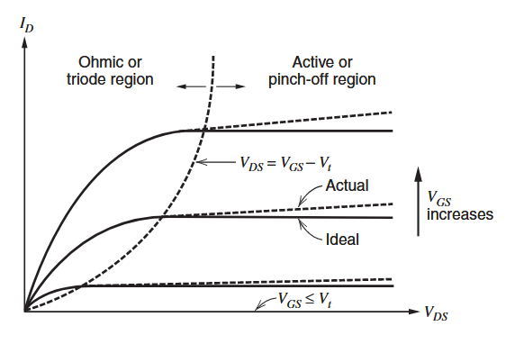

#### MOS管的栅源电压组成

$V_{GS}=V_{ov}+V_t$
我们把$V_{ov}$称为过驱动电压，根据square-law可以知道：$V_{ov}=\sqrt{\frac{2I_D}{k'(W/L)}}$，那么过驱动电压受到三个部分影响，一个是漏极电流、一个是工艺参数k'，其中包含了迁移率$\mu$，它随温度升高而降低、一个是设计参数即宽长比。

$V_t$前面已经介绍，这里介绍其受温度的影响：

$$
V_t=\phi_{ms}+2\phi_f+\frac{\sqrt{2qN_A\epsilon (2\phi _f)}}{C_{ox}}-\frac{Q_{ss}}{C_{ss}}
$$

 其中$\phi _{ms},Q_{ss},C_{ox}$与温度无关，而根据之前给出的$\phi _f$的公式，结合本征载流子的公式得到：

$$
\phi _f=\frac{kT}{q}ln\left[\frac{N_Aexp\left(\frac{E_g}{2kT} \right)}{\sqrt{N_cN_v}} \right]
$$

对$V_t$关于T求导，并代回$\phi _f$，得到：

$$
\frac{dV_t}{dT}=-\frac{1}{T}\left[\frac{E_g}{2q}-\phi _f \right]\left[2+\frac{\gamma}{\sqrt{2\phi _f}} \right]
$$

可以得知，当$\phi _f<E_g/(2q)$时，随温度升高，阈值电压降低。

###  MOSFET小信号模型

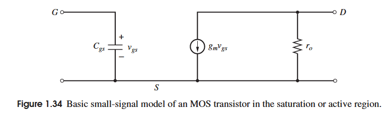

对于这个处于饱和区的基本模型:
$$
g_m=k'\frac{W}{L}(V_{GS}-V_t)=\sqrt{2k'\frac{W}{L}I_D}=\frac{2I_D}{V_{GS}-V_t}=\frac{2I_D}{V_{ov}} \\
r_o=\frac{V_A}{I_D}=\frac{1}{\lambda I_D}\propto \frac{L_{eff}}{I_D} \\
C_{gs}=\frac{2}{3}WLC_{ox}
$$

上图给出了更加细致的小信号模型，
$$
g_{mb}=\frac{\partial I_D}{\partial V_{BS}}=-k'\frac{W}{L}(V_{GS}-V_t)(1+\lambda V_{DS})\frac{\partial V_t}{\partial V_{BS}} \\
其中\frac{\partial V_t}{\partial V_{BS}}=-\frac{\gamma}{2\sqrt{2\phi _f+V_{SB}}}=-\chi=-\frac{C_{js}}{C_{ox}} \\
有g_{mb}=\frac{\gamma k'(W/L)(V_{GS}-V_t)}{2\sqrt{2\phi _f+V_{SB}}} \\
\frac{g_{mb}}{g_m}=\frac{\gamma}{2\sqrt{2\phi _f+V_{SB}}}=\chi
$$
$\chi$通常为0.1~0.3，不过也可看到$\chi$的值受到$V_{SB}$的影响
$$
C_{sb}=\frac{C_{sb0}}{\left(1+\frac{V_{SB}}{\psi _0} \right)^{1/2}} \\
C_{db}=\frac{C_{db0}}{\left(1+\frac{V_{DB}}{\psi _0} \right)^{1/2}} \\
当MOS处于三极管区：C_{gd}=C_{gs}=\frac{C_{ox}WL}{2} \\
当MOS处于饱和区：C_{gd}=0,C_{gs}=\frac{2WLC_{ox}}{3}
$$
$C_{gb}$代表着栅极与体极或衬底之间的电容，它模拟的时栅极接触材料与有源器件区域外的衬底之间的寄生氧化物电容，这个电容与栅极-衬底电压无关，这种类型的寄生电容是集成电路上所有多晶硅和金属走线的基础，在模拟和计算高频电路和器件性能时需要考虑在内，其值取决于氧化物厚度，在二氧化硅厚度为100$\AA$时，这个电容为3.45fF。

在源和漏端还有一些寄生电阻，它们源于接触以及扩散区，它们通常反比于沟道宽度W，对于1$\mu m$的W，阻值为50$\Omega$-100$\Omega$，但在手算时，为了简便通常忽略它们，在栅和衬底也有类似的寄生电阻，不过由于在这些端口的电流很小，故可以忽略这些电阻。
### 频率响应

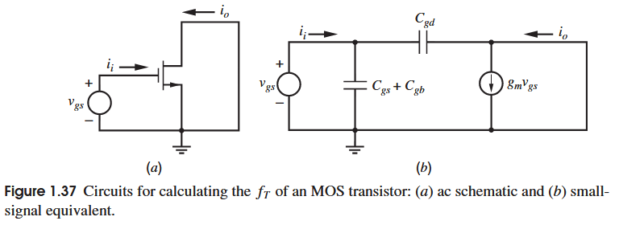

和bipola一样，定义特征频率(transition frequency)$f_T$，在此频率下，电流增益将为1，虽然MOS管的栅极在低频阻抗无穷大，输入电流为0，但在高频下由于栅漏电容，栅源电容的存在导致小信号电流可以进入，如上图所示的小信号模型所示，由于$v_{ds}=v_{bs}=0$，所以不考虑$g_{mb}.r_o,C_{sb},C_{db}$，故有KCL：
$$
i_i=s(C_{gs}+C_{gb}+C_{gd})v_{gs} \\
i_o\simeq g_mv_{gs}\quad \text{(忽略反馈}C_{gd}\text{的电流)} \\
\frac{i_o}{i_i}\simeq \frac{g_m}{s(C_{gs}+C_{gd}+C_{gb})}
$$
代入$s=j\omega$作为频率响应，同时使结果等于1，得到特征频率：
$$
\omega=\omega_T=\frac{g_m}{C_{gs}+C_{gd}+C_{gb}} \\
f_T=\frac{1}{2\pi}\omega_T=\frac{1}{2\pi}\frac{g_m}{C_{gs}+C_{gb}+C_{gd}}
$$
忽略相比$C_{gs}$较小的$C_{gd}$和$C_{gb}$，代入饱和区的$C_{gs}$和$g_m$关系式:
$$
f_T=\frac{1}{2\pi}\frac{\mu_nC_{ox}(W/L)V_{ov}}{2/3WLC_{ox}}=1.5\frac{\mu_n}{2\pi L^2}V_{ov}
$$
取bipolar特征频率的近似：$f_T=2\frac{\mu_n}{2\pi W_B^2}V_T$，这个结果和MOS是高度相似的，但是可以看出，由于热电压$V_T=26mV$远小于MOS的$V_{ov}$，同时$W_B$对于bipolar是纵向深度的物理量，相比MOS管$L$可以在工艺上可以做的更小，故而bipolar的特征频率是比MOS管大的，当然在短沟道下，平方律的退化会导致特征频率的结果也出现变化，即$f_T\propto L^{-2}$变化为$f_T\propto L^{-1}$，这一点在后面会详细介绍
###  亚阈值
亚阈值区又称弱反型区。阈值电压代表的是栅压达到阈值反型点所需的栅压，此时反型电荷密度等于掺杂浓度，表面势为两倍的费米能级与本征费米能级的势垒高度(以p衬底为例$\psi _s=2\psi _{fp}$)，大于该电压后反型层电荷密度便大于掺杂浓度，称为强反型，此时电压电流关系确实可以用平方律来模拟，但当栅压小于阈值电压时，也不是完全不能导电，此时虽然没有形成强反型层，但载流子仍然可以通过扩散越过势垒进入沟道，故**亚阈值电流为扩散电流**。

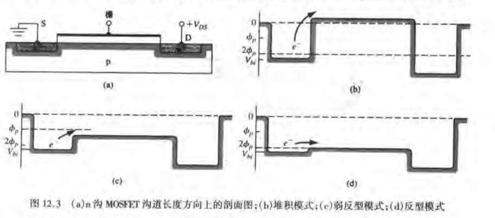

关于亚阈值电流的推导并不重要，这里直接给出结果：
$$
I_D=\frac{W}{L}I_texp\left(\frac{V_{GS}-V_t}{nV_T}\right)\left[1-exp(-\frac{V_{DS}}{V_T})\right] \\
$$
其中$I_t=qXD_nn_{p0}exp\left(\frac{k_2}{V_T}\right)$

$I_t$代表的是当$V_{GS}=V_t$，$W/L=1$，且$V_{DS}\gg V_T$时的漏极电流。

$n=1+\chi=1+C_{js}/C_{ox}$它所代表的是在亚阈值区，栅压对表面势控制为氧化层电容与耗尽区电容的分压，即
$$
\frac{d \psi _s}{d V_{GS}}=\frac{C_{ox}}{C_{js}+C_{ox}}=\frac{1}{n}
$$
对该式子进行求解得到：
$$
\psi _s=\frac{V_{GS}}{n}+k_1
$$
其中$k_1$为常数，需要注意的是上式仅在弱反型区有效，即$V_{GS}>V_t$时这个关系不适用，那么我们可以再进行变形：
$$
\psi _s=\frac{V_{GS}-V_t}{n}+k_2
$$
其中$k_2=k_1+V_t/n$

可以通过式子看出，当$V_{DS}>3V_T$时，电流的最后一项趋于1，这与饱和区的MOS管不同，后者需要MOS管工作为电流源的漏源电压取决于过驱动电压，而前者则为固定的值，同时公式也表明当栅源电压小于阈值电压漏电流不为零，如下图所示：

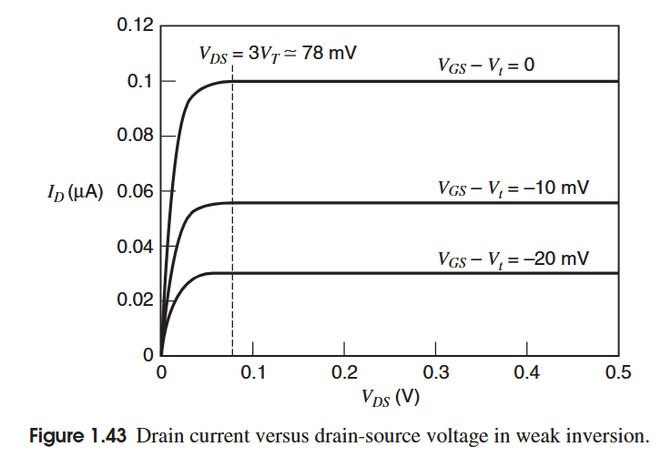

# Single-Transistor and Multiple-Transistor Amplifiers
## 多晶体管放大器

### MOS Cascode

所谓cascode即共源共栅（CS-CG）结构，如下图所示：

由于输入在栅极，故$R_i\to \infty$，为了得到跨导，令输出短接到地，那么在输出有KCL：
$$
i_o+g_{m2}v_{ds1}+g_{mb2}v_{ds2}+\frac{v_{ds1}}{r_{o2}}=0
$$
在M2的源极有：
$$
g_{m1}v_i+\frac{v_{ds1}}{r_{o1}}+g_{m2}v_{ds1}+g_{mb2}v_{ds1}+\frac{v_{ds1}}{r_{o2}}=0
$$
那么得到跨导：
$$
G_m=\frac{i_o}{v_i}\bigg|_{v_o=0}=g_m\left(1-\frac{1}{1+(g_{m2}+g_{mb2})r_{o1}+\frac{r_{o1}}{r_{o2}}}\right)
$$
可以看到这个值是小于1的，但由于$(g_{m2}+g_{mb2})r_{o1}\gg1$，所以这个值可以近似认为是1，那么也就有$G_m\simeq g_{m1}$，也就是说cascode结构并不会怎么影响跨导，这是由于M2从源极看进去的阻抗导致的，我们把它记为$R_{i2}$，同时，将负载记为$R$，正如图中所示，在电路中它表现为M2漏极连接的电流源负载（或电阻偏置负载之类）和输出负载的并联，如$R=R_D\parallel R_L$，那么从M2的源极看进去的电阻为：
$$
R_{i2}=\frac{r_{o2}+R}{1+(g_{m2}+g_{mb2})r_{o2}}\simeq \frac{1}{g_{m2}+g_{mb2}}+\frac{R}{(g_{m2}+g_{mb2})r_{o2}}
$$
当然，在测试跨导时，由于输出短接，$R=0$，那么可以看到输入的共源级电流$i=g_{m1}v_i$，会流向$r_{o1}$和$R_{i2}$的并联，相较于前者，后者电阻更小，那么大部分电流流向共栅管，同时，由于共栅管的电流增益为1，所以大部分的电流流去输出，也就导致$G_m\simeq g_{m1}$，这里可以再进一步说一下，由于$R_{i2}$的值很小，导致M1单管的增益其实很小，即$A_{v1}=g_{m1}R_{o1}=g_{m1}(r_{o1}\parallel R_{i2})\simeq g_{m1}R_{i2}$，假设$R_{i2}$中的负载项$R$，与$r_{o2}$数量级一致，那么这个增益也就为$A_{v1}\simeq \frac{2g_{m1}}{g_{m2}+g_{mb2}}$，可以近似认为是2左右的数量级，这会带来一个好处，就是它削弱了M1的米勒效应，M1的$C_{gd}$电容受到米勒效应等效到输入的电容不会变大很大，进而不会产生很大的频率影响。

回到输出阻抗，根据共栅级的公式很容易得到输出阻抗为：
$$
R_o=r_{o1}+r_{o2}+(g_{m2}+g_{mb2})r_{o1}r_{o2}\simeq (g_{m2}+g_{mb2})r_{o1}r_{o2}
$$
那么最后，整个cascode结构的增益为$A_v=G_mR_o=\simeq g_{m1}(g_{m2}+g_{mb2})r_{o1}r_{o2}$，也就是两个MOS管本征增益的数量级，鉴于MOS管不受电流增益$\beta$的影响，故而可以继续堆叠共栅管以提高增益，会引发一系列问题，其中之一就是消耗过多电压裕度。在BiCMOS工艺中，可以用bipolar来替代共栅的MOS管，因为前者有着更高的跨导$g_m$，而MOS管有着输入电流为0的优点，也正如前面提到的，更小的M1负载也可以提供更好的频率响应，这一点后面会提到。

### Active Cascode

如图所示，展示了一种不堆叠共栅管来提高共源共栅管的增益的方法，也就是通过增加一个辅助放大器形成负反馈来提高增益，定性而言，假如该辅助放大器的增益$a$为无穷大，那么M1的漏极电压被钳位在$V_{BIAS}$，导致流经M1输出阻抗的电流不发生变化，也就是输出电压的变化不会导致输出电流的响应，也就形成了无穷大的输出阻抗，当然由于辅助放大器的增益不可能无穷大，所以只是提高了输出阻抗而不是使其无穷大。当输出电压变大时，由于输出阻抗的存在，导致流入M2漏极的电流变大，进而导致M1的漏级电压变大，被辅助放大器的负端提取，然后放大$(-a)$倍输出到M2栅极，使得M2的漏电流变小，进而提到反馈调制的作用，相比普通的cascode有更大的输出阻抗。

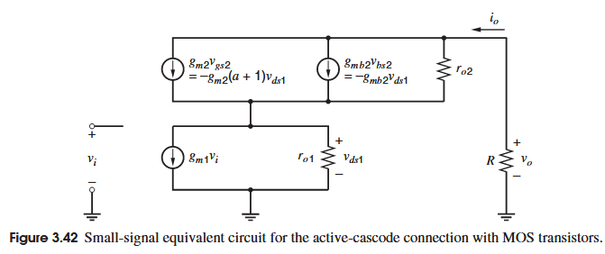

上图展示了这种结构的小信号等效模型，其中值得注意的是M2的等效模型的跨导$g_{m2}$被放大了$(a+1)$倍，这是由于源极电压也就是M1的漏极电压被放大再被输入到M2栅极导致的：
$$
v_{gs2}=v_{g2}-v_{s2}=v_{g2}-v_{ds1}=-(a)v_{ds1}-v_{ds1}=-(a+1)v_{ds1}
$$
我们可以认为是M2的跨导$g_{m2}$被放大了$(a+1)$倍，那么可以直接代入到上一节中对于cascode的结论中有：
$$
G_m=\frac{i_o}{v_i}\bigg|_{v_o=0}=g_m\left(1-\frac{1}{1+[(a+1)g_{m2}+g_{mb2}]r_{o1}+\frac{r_{o1}}{r_{o2}}}\right)\simeq g_{m1}
$$

$$
R_o=r_{o1}+r_{o2}+[(a+1)g_{m2}+g_{mb2}]r_{o1}r_{o2}\simeq [(a+1)g_{m2}+g_{mb2}]r_{o1}r_{o2}
$$

这个结构最大的问题是在频率上升之后导致的辅助放大器增益下降，会导致输出阻抗也受到影响，更坏的情况可能会导致电路不稳定。对于其更多的内容可以见[辅助放大器(Active-cascode Amp)](#辅助放大器(Active-cascode Amp))

##  Differential Pairs

差分对的实用性源于两个关键性要素：
- 差分对的级联可以直接级联，无需级间耦合电容以实现直流隔离，因为差分对的输出本身具有共模输出
- 差分输入对两个输入的差模敏感，并且可以高度抑制两个输入的共模信号
###  差分对的直流特性
####  bipolar差分对

对于bipolar差分对，分析大信号时，假设其尾电流源的阻抗$R_{TAIL}->\infty$，晶体管的输出阻抗$r_o->\infty$，晶体管的基区阻抗$r_b=0$，这些假设对大信号分析的误差并不大，通过KVL在输入环路的分析，以及bipolar的基极-发射极电压和集电极电流关系，还有发射级的KCL：

$-(I_{e1}+I_{e2})=I_{TAIL}=\frac{I_{c1}+I_{c2}}{\alpha_F}$

得到差分输入电压与两个集电极电流的关系：

$$
I_{c1}=\frac{\alpha_FI_{TAIL}}{1+exp(-\frac{V_{id}}{V_T})}
$$

$$
I_{c2}=\frac{\alpha_FI_{TAIL}}{1+exp(\frac{V_{id}}{V_T})}
$$
其中$V_{id}=V_{i1}-V_{i2}$，两个电流与差分输入电压的关系如下图所示

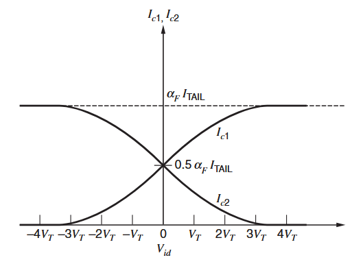

可以明显看出来，当$V_{id}>3V_T\approx78mV$时，一个管子关断，电流完全流向另一个管子

进一步定义$V_{o1}=V_{CC}-I_{c1}R_c$和$V_{o2}=V_{CC}-I_{c2}R_C$以及$V_{od}=V_{o1}-V_{o2}$，可得：
$$
V_{od}=\alpha_FI_{TAIL}R_Ctanh(\frac{-V_{id}}{2V_T})
$$
其图像如下图：

为了提高线性度以及输入范围，可以使用发射极退化手段：

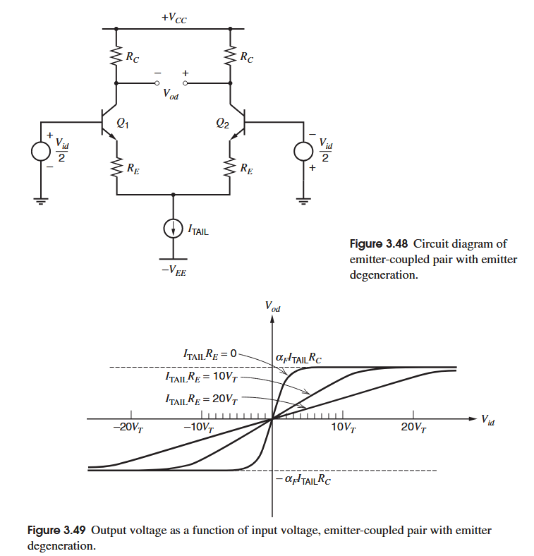

由于电阻上的压降，所以导致晶体管完全关断所需要的差分电压越大，进而导致截断点外推，同时由于尾电流大小不变，导致输出的最大差分电压也是不变的，所以进而导致了在线性工作区的斜率变小。

####  MOS差分对

对于MOS差分对，大信号分析方法类似，目前同样假设$R_{TAIL}->\infty,r_o->\infty$，这些假设对小信号分析会有很大影响，但对大信号分析无伤大雅。同样在输入的环路列KVL，并且根据MOS的输入特性以及$I_{TAIL}=I_{d1}+I_{d2}$，和$V_{id}=V_{i1}-V_{i2}$，可以得到当时的两边电流与$V_{id}$的关系：
$$
I_{d}=\frac{I_{TAIL}}{2}\pm\frac{k'}{4}\frac{W}{L}V_{id}\sqrt{\frac{4I_{TAIL}}{k'(w/L)}-V_{id}^2}
$$

可以根据这个式子得到差分输入的工作范围，即一边电流为0一边电流为$I_{TAIL}$，有$V_{id}$与$I_{TAIL}$的关系：

$$
|V_{id}|\leq \sqrt{\frac{2I_{TAIL}}{k'(W/L)}}
$$
也可以由在$V_{id}=0$时$I_{d1}=I_{d2}=I_{TAIL}/2$，得到$V_{id}$与$I_{d1}$的关系：
$$
|V_{id}|\leq \sqrt{2}\left (\sqrt{\frac{2I_{d1}}{k'(W/L)}}\right )\bigg |_{V_{id}=0}=\sqrt{2}(V_{ov})|_{V_{id}=0}
$$

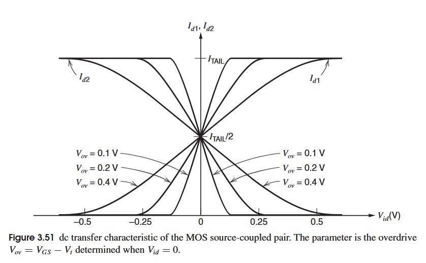

MOS差分对的直流输出取决于电流，即两个电流的差值:$\Delta I_d$:
$$
\Delta I_d=I_{d1}-I_{d2}=\frac{k'}{2}\frac{W}{L}V_{id}\sqrt{\frac{4I_{TAIL}}{k'(W/L)-V_{id}^2}}
$$
那么也可以得到差分输出电压：
$$
V_{od}=V_{o1}-V_{o2}=V_{DD}-I_{o1}R_D-V_{DD}+I_{d2}R_D=-(\Delta I_d)R_D
$$
那么我们也可以理解差分输出的第一个特性：**差分对的级联可以直接级联**，这是因为当输入的差分电压为0时，在晶体管和电阻匹配的情况下，输出的差分电压也是零，保证了输出的电压平衡，能够以同一个共模输入到下一个差分对，假使一个输出1.2V，一个输出1.7V，那么就需要额外的电容隔离来控制偏置。

###  差分对的交流特性
Gray对差分对的小信号分析可谓细致且系统，具体的分析过程不加以赘述，只挑关键和结论记录，详情见Gray3.5.4-3.5.6

先确定几个增益以及系数便于后续讨论：
$$
差分输入：v_{id}=v_{i1}-v_{i2} \\
共模输入：v_{ic}=\frac{v_{i1}+v_{i2}}{2} \\
差模输出：v_{od}=v_{o1}-v_{o2} \\
共模输出：v_{oc}=\frac{v_{o1}+v_{o2}}{2}
$$
引入四个增益系数：
$$
差模增益：A_{dm}=\frac{v_{od}}{v_{id}}\bigg |_{v_{ic}=0}  表示了单位差模输入引起的差模输出变化 \\
共模增益：A_{cm}=\frac{v_{od}}{v_{ic}}\bigg |_{v_{id}=0}  表示了单位共模输入引起的共模输出变化 \\
差模到共模增益：A_{dm-cm}=\frac{v_{oc}}{v_{id}}\bigg |_{v_{ic}=0}  表示了单位差模输入引起的共模输出变化 \\
共模到差模增益：A_{cm-dm}=\frac{v_{od}}{v_{ic}}\bigg |_{v_{id}=0}  表示了单位共模输入引起的差模输出变化
$$
由上述系数的定义，进而得到两种输出的组合：
$$
v_{od}=A_{dm}v_{id}+A_{cm-dm}v_{ic} \\
v_{oc}=A_{cm}v_{ic}+A_{dm-cm}v_{dm}
$$
在正式讨论小信号前，先进行CMRR的讨论，对于完美对称的差分对，差分输入的影响和共模输入的影响完全隔离，即$A_{dm-cm}$和$A_{cm-dm}$都为0，但$A_{cm}$却不一定为0，故而定义**共模抑制比：CMRR**为：
$$
CMRR=\left |\frac{A_{dm}}{A_{cm}} \right |
$$
有意思的是，这个定义是与拉扎维书中的定义：$CMRR=\left | \frac{A_{dm}}{A_{cm-dm}}\right|$不同的，两位其实都在表达一个意思：期望信号的增益比上不期望信号的增益，只是两位对于不期望信号有所不同，Gray其实也对拉扎维定义的CMRR有所讨论：在并非完美对称的差分对中，$A_{dm-cm}\neq 0,A_{cm-dm}\neq 0$，那么产生了新的比值：$A_{dm}/A_{cm-dm},A_{dm}/A_{dm-cm}$，而前者尤为重要，因为它代表了不期望的共模输入信号产生了差分输出，在多级放大器中，这个比值会比前面定义的CMRR更为重要。

####  完美对称的差分对的小信号分析
作为对称的差分对，即使加上尾电流源的阻抗，也仍然满足半边电路的条件，因为对称，所以两边互补，同时互不影响，也就导致尾电流源上的节点作为虚拟地，下图给出的是bipolar差分对的小信号图，把$r_\pi \to \infty$就可以得到MOS差分对的电路了

根据电路可以很轻松得到差分增益为：

$$
A_{dm}=\frac{v_{od}}{v_{id}}\bigg |_{v_{ic}=0}=-g_mR
$$
在考虑进管子的输出电阻时，将$R$改为$R||r_o$，同时，MOS的$g_{mb}$可以忽略，因为源极接虚拟地，而衬底接地。

对于共模增益，也可以依据半边电路得到简化，不过此时尾电流源阻抗不能忽略，因为此时尾电流源上的节点会因为共模输入变化同步变化，所以不是虚拟地。

有：

$$
A_{cm}=\frac{v_{oc}}{v_{ic}}\bigg |_{v_{id}=0}=-G_mR
$$
其中$G_m$是共模输入时的跨导，可以根据电路得知这是一个射极/源极退化的跨导，故而比差分情况下更小，所以$|A_{dm}|>|A_{cm}|$，这也就是之前说的差分放大器的第二个特点：**差分对对差分输入比共模输入更敏感**

##### 对于bipolar差分对
$$
A_{cm}\simeq -\frac{g_mR}{1+g_m(2R_{TAIL})}
$$
如果考虑bipolar的输出阻抗，那么$R$换为$R||R_o$，$R_o$为射极退化的共射放大器的输出阻抗，退化的电阻为$R_E=2R_{TAIL}$

结合前面的差分增益可以得到CMRR：
$$
CMRR=1+2g_mR_{TAIL}
$$
同时可以得到差模和共模情况下的输入阻抗：
$$
R_{id}=\frac{v_{id}}{i_{b}}\bigg |_{v_{ic}=0}=2r_{\pi} \\
R_{ic}=\frac{v_{ic}}{i_b}\bigg |_{v_{id}=0}=r_{\pi}+(\beta _0+1)(2R_{TAIL})
$$
##### 对于MOS差分对
如果考虑衬偏效应，$g_{mb}\neq 0$
$$
A_{cm}\simeq -\frac{g_mR}{1+(g_m+g_{mb})(2R_{TAIL})}
$$
如果计入MOS管的输出阻抗，那么$R$就换为$R||R_o$，其中$R_o$为源极退化的共源放大器的输出阻抗，退化电阻为$R_S=2R_{TAIL}$

结合前面的差分增益可得CMRR：
$CMRR=1+2(g_m+g_{mb})R_{TAIL}$
###  差分对失调
前面提到对于非完美对称的差分对，有：$A_{dm-cm}\neq 0,A_{cm-dm}\neq 0$，而导致失调的因素很多，可以简单列一下以下几个：
1. 晶体管不匹配
   - 阈值电压不匹配：由掺杂浓度不同导致
   - 尺寸不匹配（W/L差异）：导致跨导和输出阻抗不同，以及电流差异
   - 迁移率不同：产生电流差异
2. 负载不匹配
   - 电阻不匹配
   - 有源负载不匹配
3. 工艺与制造偏差
   - 掺杂浓度或氧化层厚度差异：导致器件参数（如$V_{th},\mu,C_{ox}$）漂移，是失调的主要原因
   - 版图布局：不对称的版图会导致器件受到不同的应力，热流，工艺偏差影响
4. 温度因素
   - 热梯度：不同的区域温度会导致晶体管以及其他器件特性漂移
   - 温度系数不匹配：不同器件对温度响应曲线不同导致的失调
5. 噪声与时间漂移
   - 低频噪声（如1/f噪声、burst noise）：低频随机过程导致失调电压在短期内波动
   - 器件老化与电迁移：长时间工作后MOS管的参数变化

由于这些失调的存在，导致哪怕输入的差分信号为0，也会有非零的差分输出，所以引入失调输入信号，在这个信号的补偿下，差分输出回到0.

输入的失调信号如下图(b)所示，它即包含一个和输入串联的失调电压，也包含一个并联的失调电流。在MOS管中只有输入失调电压，而没有电流成分，因为MOS管本身输入电流为零，而bipolar既有输入电压也有输入电流，所以对于bipolar两者都要考虑。

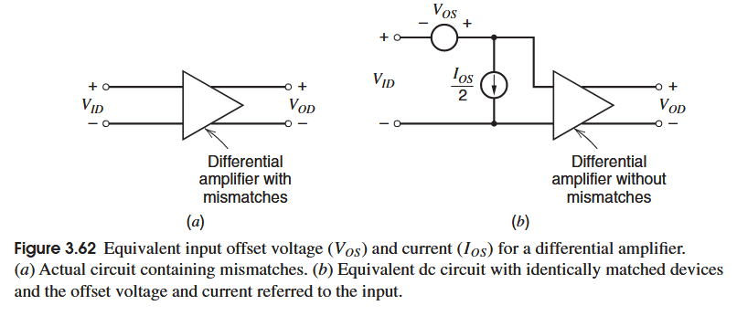

对于bipolar和MOS的失调电压电流书上有详细推导，这里直接给结论：

####  对于bipolar：

$$
V_{os}=V_Tln[(\frac{R_{c2}}{R_{c1}})(\frac{A_2}{A_1})(\frac{Q_{B1}(V_{CB})}{Q_{B2}(V_{CB})})]
$$
其中$(V_{CB})$代表基区的电荷是$V_{CB}$的函数，对$R_{c2}R_{c1},A_2A_1,Q_{B1}Q_{B2}$进行差模共模化，在进行ln的近似分析得到：

$$
V_{os}\simeq V_T(-\frac{\Delta R_C}{R_C}-\frac{\Delta A}{A}+\frac{\Delta Q_B}{Q_B})  \\
\simeq V_T(-\frac{\Delta R_C}{R_C}-\frac{\Delta I_s}{I_s})
$$

可以看到三个参数同时影响失调电压，当三个参数同时为一个相位（包含符号），失调情况最严重，不过也可以相互抵消。

对于温度导致的漂移，有经验公式：
$$
\frac{dV_{os}}{dT}=\frac{V_{os}}{T}
$$

对于bipolar的输入失调电流：
$$
I_{os}\simeq -\frac{I_C}{\beta _F}(\frac{\Delta R_C}{R_C}+\frac{\Delta \beta _F}{\beta _F})
$$

####  对于MOS：
$$
V_{os}=\Delta V_t +\frac{(V_{GS}-V_t)}{2}\left (-\frac{\Delta R_L}{R_L}-\frac{\Delta (W/L)}{(W/L)}\right )
$$

对比这个式子与bipolar的式子可以得到一些有用的结论：

MOS失调电压的第一项是有关阈值电压的，这一项在bipolar中是没有的，且其与偏置电流无关，仅受工艺影响，这也限制了MOS管失调的下限，可以导致失调电压比bipolar大一个数量级。

第二项在MOS和bipolar中的类似，但系数不同，bipolar中是$V_T$，MOS中是$V_{ov}/2$，很明显，前者会小于后者至少两倍以上，比如对于bipolar$V_T=26mV$，而MOS的$V_{ov}/2$会达到50mV至500mV。

对于温度漂移，MOS的失调电压的两个部分$\Delta V_t$和$V_{ov}$，前者根据费米能级变化，费米能级随温度上升而下降，故$V_t$具有负温度系数。后者受迁移率变化影响，当温度升高时，迁移率下降，而过驱动电压为了补偿这一部分降低，会随温度升高而上升，具有正温度系数。两者同时作用于$V_{os}$，使得失调电压受温度影响小，当然，如果$\Delta V_t$占比较大，则也会导致失调电压随温度漂移较严重的情况，不过由于是差分结构，只要两边的漂移一致，那么本身就具有一阶的抵消效应。

###  失调差分对的小信号分析
Gary对于这一部分的分析堪称“严酷”，十分系统且详细的介绍了如何分析失调时的小信号，在得到小信号等效电路情况下同时给出了直接的推导，也给出了简化的推导方法，这里不再细讲，直接介绍核心部分。

失调导致的最重要的后果就是$A_{dm-cm}\neq 0,A_{cm-dm}\neq 0$，也就是在分析差模和共模时，共模信号会影响差模输出，而差模信号也会影响共模输出。

对于电阻负载的失调：$\Delta R=R_1-R_2,R=(R_1+R_2)/2$，同时定义电流：$i_d=i_1-i_2,i_c=(i_1+i_2)/2$，得到：
$$
v_d=i_dR+i_c(\Delta R)  \\
v_c=i_cR+\frac{i_d(\Delta R)}{4}
$$
进而得到负载电阻在差模和共模中的等效模型：

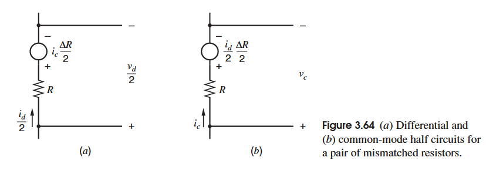

对于晶体管失调：$\Delta g_m=g_{m1}-g_{m2},g_m=(g_{m1}+g_{m2})/2$，得到电流：
$$
i_d=i_1-i_2=g_{m1}v_1-g_{m2}v_2=g_mv_d+\Delta g_mv_c \\
i_c=(i_1+i_2)/2=(g_{m1}v_1+g_{m2}v_2)/2=g_mv_c+\frac{\Delta g_mv_d}{4}
$$
进而得到受控电流源在差模和共模中的等效模型：

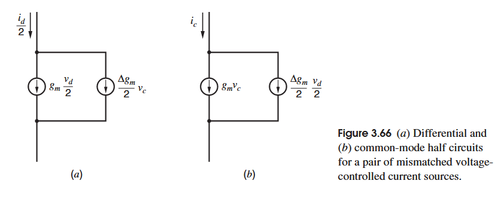

结合以上两个等效模型，得到差模和共模的完整等效半边电路：

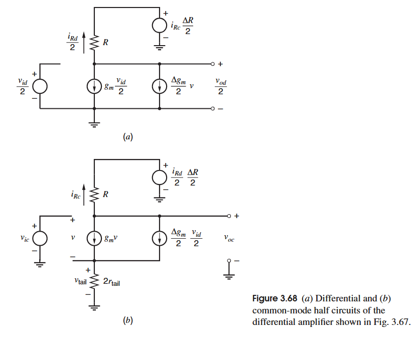

可以根据这个等效电路直接解得小信号增益：
$$
v_{od}=A_{dm}v_{id}+A_{cm-dm}v_{ic} \\
A_{dm}=\frac{v_{od}}{v_{id}}\bigg |_{v_{ic}=0}
=-g_mR+\frac{\Delta g_mr_{TAIL}\frac{\Delta g_m}{2}R-\frac{\Delta g_m}{2}\frac{\Delta R}{2}}{1+2g_mr_{TAIL}} \\
A_{cm-dm}=\frac{v_{od}}{v_{ic}}\bigg |_{v_{id}=0}
=-\left( \frac{g_m\Delta R+\Delta g_mR}{1+2g_mr_{TAIL}}\right)
$$

$$
v_{oc}=A_{cm}v_{ic}+A_{dm-cm}v_{id} \\
A_{cm}=\frac{v_{oc}}{v_{ic}}\bigg |_{v_{id}=0}
=-\left( \frac{g_mR+\frac{\Delta g_m}{2}\frac{\Delta R}{2}}{1+2g_mr_{TAIL}}\right) \\
A_{dm-cm}=\frac{v_{oc}}{v_{id}}\bigg |_{v_{ic}=0}
=-\frac{1}{4}\left[g_m\Delta R+\frac{\Delta g_mR-g_m\Delta R\left(2g_mr_{TAIL}\left(\frac{\Delta g_m}{2g_m} \right)^2 \right)}{1+2g_mr_{TAIL}} \right]
$$
这个结果是精确的，与直接分析整个电路得到的结果一致，不过后者的分析更为复杂。

接下来用一种简化方法分析，这个分析是基于失配本身的性质决定的，因为失配只是平均值的一小部分，那么对于失配发生的部分可以进行简化：
- 共模半边电路中，差模信号控制的失调部分，我们认为其仅受差分信号控制
- 差模半边电路中，共模信号控制的失调部分，我们认为其仅受共模信号控制

听上去很混乱，但结合图就比较好理解了：

上图是差模和共模不受失调影响的半边电路，他们分别形成了两份电流$\hat{i}_{Rd},\hat{i}_{Rc}$，将它们分别代入到共模电路中的$i_{Rd}$和差模电路中的$i_{Rc}$

最后得到：
$$
A_{dm}=\frac{v_{od}}{v_{id}}\bigg |_{v_{ic}=0} \simeq-g_mR \\
A_{cm-dm}=\frac{v_{od}}{v_{ic}}\bigg |_{v_{id}=0} \simeq-\left(\frac{g_m\Delta R+\Delta g_mR}{1+2g_mr_{TAIL}} \right)
$$
由上面的两个式子可以看出来$A_{dm}/A_{cm-dm}$几乎正比于$1+2g_mr_{tail}$，且$A_{cm-dm}$与精确计算得到的结果一致，这是因为图 3.68a 中的$g_m$发生器是由纯差分信号控制的。在其他例子中，用这种方法计算的共模-差模增益只能大致正确。
$$
A_{cm}=\frac{v_{oc}}{v_{ic}}\bigg |_{v_{id}=0}\simeq-\frac{g_mR}{1+2g_mr_{tail}} \\
A_{dm-cm}=\frac{v_{oc}}{v_{id}}\bigg |_{v_{ic}=0}\simeq-\frac{1}{4}\left(g_m\Delta R+\frac{\Delta g_mR}{1+2g_mr_{tail}} \right)
$$
通过上面的式子可以看得出来，经由尾电流源输出阻抗的退化，$A_{cm-dm},A_{dm-cm},A_{cm}$都在变小，而当$r_{tail}\to\infty$时，$A_{cm-dm}\to0,A_{cm}\to0$，但同时$A_{dm-cm}$并不会同步趋向0，而是
$$
\lim_{r_{tail}\to\infty}A_{dm-cm}\simeq-\frac{g_m\Delta R}{4}
$$

需要额外说明的一点是，在考虑到两边晶体管的失配以及体效应的失配时，即使$r_{tail}\to\infty$，$A_{cm-dm}$也$\neq0$，这是由于尾电流源上的点被视为源跟随器变化，而体效应的失配导致$g_{mb}\Delta v_{bs}$不同导致$A_{cm-dm}\neq0$。不过$r_{tail}$仍然是重要的参数，它影响了电路对共模信号的敏感性。

# Current Mirros,Active Loads,and References
##  Current Mirrors
电流镜的理念就不赘述了，这里简单介绍以下理想电流镜的特征：
 - 输出电流是输入电流精确乘电流增益，这个增益不受输入频率影响
 - 输出电流不受输出电压的影响
 - 输入端与公共端（电源端或地端）之间电压差为0
 - 能负载多个输出而不影响输出效果

但实际上满足上述理想条件不现实，以下是几个偏差：
 - 最重要的偏差是输出电流会受输出端电压的影响，这个特征可以用小信号输出阻抗$R_o$表示，正如前一章所述，这个输出电阻会直接影响差分放大器的CMRR，一般来说，减小电流可以增大输出电阻，但减小电流往往意味着诸多性能的损耗
 - 另一个偏差是增益偏差，指代的是输出比输入的增益，这个增益偏差来自两个部分，一个是系统偏差，一个是随机偏差，前者是指即使器件完美匹配也会产生的误差$\epsilon$，是设计本身导致的误差，后者是由于器件失配导致的误差
 - 对于输入电压最小值，我们希望它越小越好，这可以让他满足各种各样的电路设计以及电源电压条件，不过既然是有电流流入，就必然产生了压差，如何让它更小是一个偏差
 - 输出电压裕度，将输出电压的最小值尽可能减小，可以使得其输出电压有更大的工作范围，以便于其作为有源负载工作，当然前提是其工作在饱和区
###  Simple Bipolar Current Mirrors

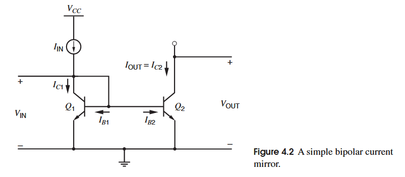

上图是简单的bipolar电流镜电路图，首先假设两个bipolar的$V_{CE}$不影响集电极电流：
$$
V_{BE2}=V_Tln\frac{I_{C2}}{I_{S2}}=V_{BE1}=V_Tln\frac{I_{C1}}{I_{S1}}
$$
可得
$$
I_{C2}=\frac{I_{S2}}{I_{S1}}I_{C1}
$$
再根据Q1的集电极列KCL得到：
$$
I_{IN}-I_{C1}-\frac{I_{C1}}{\beta _F}-\frac{I_{C2}}{\beta _F}=0
$$
对于相同的晶体管：
$$
I_{OUT}=I_{C2}=I_{C1}=\frac{I_{IN}}{1+\frac{2}{\beta _F}}
$$
对于大的$\beta _F$，基区电流很小，可以得到：
$$
I_{OUT}=I_{C1}\simeq I_{IN}
$$
这个结果在直流和低频是准确的，但在超过3-dB点之后，基区电流会因为基区-发射区电容的阻抗降低而显著变大，导致$\beta _F$下降，使得电流镜的增益下降。

当Q1和Q2不相同时，可以得到：
$$
I_{OUT}=\frac{I_{S2}}{I_{S1}}I_{C1}=\left(\frac{I_{S2}}{I_{S1}}I_{IN} \right)\left(\frac{1}{1+\frac{1+(I_{S2}/I_{S1})}{\beta _F}} \right)
$$
鉴于$I_{S}$正比于其发射区面积，那么第一项就说明可以通过控制两边bipolar发射极面积比例以实现电流增益，这个可以通过并联单元bipolar减小光刻误差。第二项是由于$\beta _F$的有限性导致的系统偏差，当然，过大的$I_{S2}/I_{S1}$也会放大这个误差，也会导致过大的占用芯片面积。

接下来是考虑输出电阻影响的情况。

图中所标点$V_{CE2}=V_{CE1}$且$V_{BE2}=V_{BE1}$

$$
I_{OUT}=\frac{I_{S2}}{I_{S1}}I_{C1}\left(1+\frac{V_{CE2}-V_{CE1}}{V_A}\right) \\
=\frac{\frac{I_{S2}}{I_{S1}}I_{IN}\left(1+\frac{V_{CE2}-V_{CE1}}{V_A}\right)}{1+\frac{1+(I_{S2}/I_{S1})}{\beta _F}}
$$

那么系统偏差为：
$$
\epsilon =\left(\frac{1+\frac{V_{CE2}-V_{CE1}}{V_A}}{1+\frac{1+(I_{S2}/I_{S1})}{\beta _F}} \right)-1\simeq \frac{V_{CE2}-V_{CE1}}{V_A}-\frac{1+(I_{S2}/I_{S1})}{\beta _F}
$$

可以看出bipolar电流镜的系统偏差来自于两部分：第一部分是有限的输出阻抗，虽说是取决于输出阻抗，但其实并非取决于$r_{o2}$而是厄利电压$V_A$，后者与偏置电流无关，而偏置电流在变化时，$V_{IN}$也会以电流的自然对数关系变化，$V_{IN}=V_{CE1}=V_{BE1}=V_{BE(on)}$，进而影响系统偏差，第二部分就是前面说过的有限的$\beta _F$导致的。

最后，最小的输出电压以保证Q2工作在正向有源区的条件为$V_{OUT(min)}=V_{CE2(sat)}\simeq 0.7V$

###  Simple MOS Current Mirrors

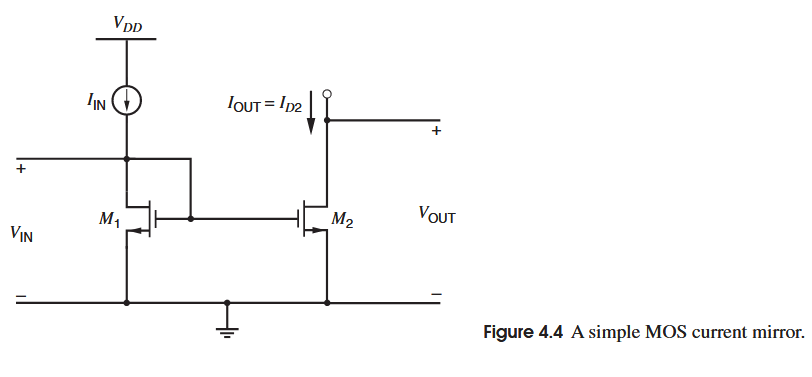

MOS的电流镜过于熟悉，这里就简单带过了；

首先是不考虑沟道长度调制效应：

$$
V_{GS2} = V_t+\sqrt{\frac{2I_{D2}}{k'(W/L)_2}}=V_{GS1}=V_t+\sqrt{\frac{2I_{D1}}{k'(W/L)_1}} \\
I_{OUT}=\frac{(W/L)_2}{(W/L)_1}I_{D1}=\frac{(W/L)_2}{(W/L)_1}I_{IN}
$$

在考虑沟道长度调制效应后：

$$
I_{OUT}=\frac{(W/L)_2}{(W/L)_1}I_{IN}\left(1+\frac{V_{DS2}-V_{DS1}}{V_A} \right) 
$$

可以看到系统偏差为：

$$
\epsilon =\frac{V_{DS2}-V_{DS1}}{V_A}
$$

同样的，虽然是由于输出阻抗的有限导致的系统偏差，但实际上这个偏差取决于厄利电压$V_A$和漏源电压而非输出电阻 $r_{o2}=\frac{1}{\lambda I_{D2}}$

最后，关于最小的输出电压，$V_{OUT(min)}=V_{ov2}=\sqrt{\frac{2I_{OUT}}{k'(W/L)_2}}$，可以根据设计参数进行减小，这和bipolar不同。但当过驱动电压小于$2nV_T$，$n$在弱反型区有定义为$(1+\chi)$,$V_T$定义为热电压，那么这个结果就失效了，比如说在n=1.5的室温下，$2nV_T$为78mV，若晶体管工作在弱反型区，则$V_{OUT(min)}\simeq 3V_T$

###  Simple Current Mirror with Beta Helper
如前面分析bipolar电流镜偏差，其中有一部分就是由于有限的$\beta _F$导致的，当bipolar电流镜有多个输出时，基区电流的增加会导致$\beta _F$的减小，进而导致偏差的变大，故而引入*Beta Helper*如下图所示，（在有些电路中会在Q2的发射极即Q1Q3的基极加入一个电阻连接至地，用以控制Beta Helper的电流，以确保稳定的瞬态响应，这个电阻在MOS中并不需要，因为MOS管的栅极阻抗无穷大，其电流仅为pA级别）

在Q2的发射极，还是取流入器件为正，流出器件为负：
$$
I_{E2}=-\frac{I_{C1}}{\beta _F}-\frac{I_{C3}}{\beta _F}=-\frac{2}{\beta _F}I_{C1} 
$$
忽略有限的输出阻抗导致的效应，Q2的基区电流为：
$$
I_{B2}=-\frac{I_{E2}}{\beta _F+1}=\frac{2}{\beta _F(\beta _F+1)}I_{C1} 
$$
在Q1集电极有：
$$
I_{IN}-I_{C1}-\frac{2}{\beta _F(\beta _F+1)}I_{C1}=0 
$$
最后得到：
$$
I_{OUT}=\frac{I_{IN}}{1+\frac{2}{\beta _F(\beta _F+1)}}\simeq I_{IN}\left(1-\frac{2}{\beta _F(\beta _F+1)} \right) 
$$
可以看到这个系统偏差被缩小了$[\beta _F+1]$倍，虽然beta helper对输出阻抗没有变化，但其改变了输入的最小电压$V_{IN}=V_{BE1}+V_{BE2}$，输入电压的裕度变小了，对于固定的偏置电流，意味着输入阻抗变大了。

beta helper常用于pnp型bipolar电流镜，因为它们的$\beta _F$常常小于npn的，同时在多个输出时，也需要它来补偿$\beta _F$的变小。

对于$\beta _F\to \infty$的MOS管而言，不需要再使用beta helper来减小系统偏差，*不过，beta helper结构可以增加MOS以及bipolar电流镜的带宽。*

###  Simple Current Mirror with degeneration

如上图所示就是使用了发射极退化的bipolar电流镜，其核心想法是通过退化增大输出电阻，进而减小由于输出电阻有限导致的系统偏差，在上图的退化技术中，假设$r_\pi >>R_E$，对于Q3则有：
$$
R_o\simeq r_{o3}\left(1+g_mR_E \right)=r_{o3}\left(1+\frac{I_{C3}R_3}{V_T}\right)
$$
这个增加的部分同时反应到了系统偏差上，就输出电阻部分的偏差而言：
$$
\epsilon =\frac{V_{CE3}-V_{CE1}}{V_A(1+\frac{I_{C3}R_3}{V_T})}
$$
当然这个技术导致了输入电压和输出电压的最小值上升，需要在原来的基础上额外加$I_CR_E$

假设Q4要输出两倍的$I_{IN}$，在Q1Q4回路列KVL可得(忽略基区电流)：
$$
I_{OUT}=I_{C4}=\frac{1}{R_4}(I_{IN}R_1+V_Tln(\frac{I_{IN}}{I_{C4}}\frac{I_{S4}}{I_{S1}})) 
$$
通过复制Q1形成Q4，有$I_{S4}=2I_{S1}$，同时我们可以让发射极的退化电阻压降变大，使得输出主要由第一项决定：$I_{OUT}=(R_1/R_4)I_{IN}=2I_{IN}$，其中$R_4=R_1/2$，这个电阻也可以通过复制$R_1$并联形成。

对于MOS电流镜而言，源极退化其实并不常用，因为MOS本质上就是一个受控电阻，那么直接对MOS本身参数调制即可，比如调制沟道长度L，为了保持电流和$V_{ov}$一定，W也要同步调整以保持$W/L$恒定。

###  Cascode Current Mirror

Cascode结构能提供可观的高输出电阻，如下图所示是bipolar cascode电流镜，Q1Q3是普通的电流镜，Q2用于形成Cascode结构提高输出阻抗，Q4用于偏置Q2，由于流过电流相同，从Q2Q4的基极到Q1Q3的集电极有相同的电压差，保证了Q1工作在正向有源区，且Q3和Q1的$V_{CE}$一致

根据射极退化可得到在$g_{m2}r_{o1}\simeq g_{m1}r_{o1}>>\beta _0$时：
$$
R_o=r_{o2}\left(1+\frac{g_{m2}r_{o1}}{1+\frac{g_{m2}r_{o1}}{\beta _0}} \right)\simeq \beta _0r_{o2}
$$
这个结果乍一看确实没问题，但有一个深层的问题，我们假设了$g_{m2}r_{o1}>>\beta _0$即$r_{o1}>>r_{\pi 2}$，这个关系本身是没问题的，它意味着流入Q2的集电极电流会更多的从Q2的基区流出，但这个电流镜结构导致这个电流关系出现了偏差，即$i_{b2}$的变化必然通过镜像回路导致$i_{e2}$产生相同的变化，那么Q2集电极电流必然是平等的分流去Q2的基极和发射极，那么输出阻抗就会减半：
$$
R_o\simeq \frac{\beta _0r_{o2}}{2}
$$
cascode电流镜的一个问题是电压裕度：

$$
V_{IN(min)}=V_{BE3}+V_{BE4}=2V_{BE(on)} \\
V_{OUT(min)}=V_{CE1}+V_{CE2}\simeq V_{BE(on)}+V_{CE2}
$$

这个问题在低电源电压尤为重要。

另一个问题是由于$\beta _F$导致的系统偏差，虽然输出阻抗变大使得一部分系统偏差变小，但$\beta _F$导致的偏差变大了，本质上是由于Q1Q3的基极电流叠加进入Q4，再加上自身基区的电流，这些电流叠加之后与$I_{IN}$相差再被复制到输出，计算过程省略，直接给出结果(电流增益为1)：

$$
I_{OUT}=I_{C2}\left(\frac{\beta _F}{\beta _F+1} \right)\left(\frac{I_{IN}}{1+\frac{2}{\beta _F}+\frac{1}{\beta _F+1}} \right) \\
=I_{IN}(1+\epsilon) \\
其中\epsilon =-\frac{4\beta _F+2}{\beta _F^2+4\beta _F+2} \\
若\beta _F>>1，\epsilon\simeq -\frac{4}{\beta _F+4}
$$

而相同情况下，simple current mirror的$\beta _F$部分的系统误差为$-2/\beta _F$

接下来是MOS cascode current mirror，

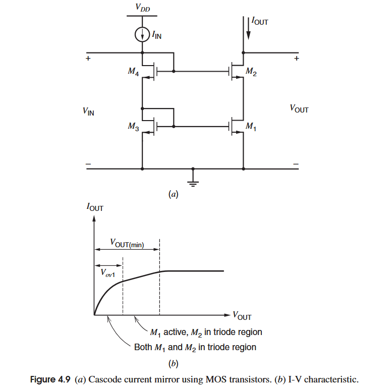

其输出阻抗为：
$$
R_o=r_{o2}[1+(g_{m2}+g_{mb2})r_{o2}]+r_{o1}
$$
与bipolar不同的是，MOS管的cascode电流镜由于$\beta _F\to \infty$，那么也就没有被减弱的$\beta _F$系统偏差以及$\beta _Fr_{o}/2$的修正输出电阻，但，MOS衬底的漏电流会从输出节点向地产生电阻分流，当$V_{OUT}>V_{OUT(min)}$时，输出电阻会受到影响。

在$V_{GS4}=V_{GS2}$时，$V_{DS1}=V_{DS3}$，那么可以认为$\epsilon \simeq 0$

这种连接方式的缺点是浪费了输出电压裕度，使M2和M1工作在饱和区的最小输出电压$V_{OUT(min)}=V_{DS1}+V_{DS2}$，由于M1复制了M3的漏源电压，导致$V_{OUT(min)}$从$2V_{ov}$变为了$V_{t}+2V_{ov}$，也就是浪费了一个阈值电压的裕度。

第一个修改方案是加入一个源极跟随器作为电平移动：

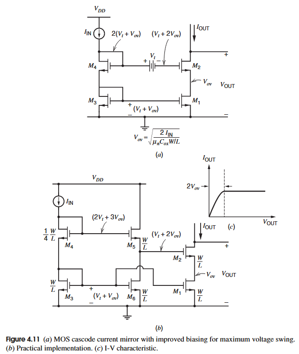

上图非常清晰的展示了这种方法的思路和实现，M5实现电平移动，使M4的电位下降一个$V_t+V_{ov}$之后再给M2栅极，进而使M1漏极下降至$V_{ov}$，M5由M6和M3进行偏置。

需要注意的是，为了使M1的漏源电压在两次的$V_{GS}$移动之后仍为$V_{ov}$，需要使M4的栅极再上升一个$V_{ov}$，再结合M3的栅漏电压，以及保持偏置电流不变下，M4的(W/L)需要变为原来的1/4。

实际设计中，$(W/L)_4$其实要比1/4来的更小，有两个原因，一，实际的MOS管的饱和区和线性区并不泾渭分明，所以$V_{ov}$需要来的更大一些以保证足够大的输出阻抗；二，根据KVL环路：
$V_{DS1}=V_{GS3}+V_{GS4}-V_{GS5}-V_{GS2}$，在固定的偏置电流下，这些$V_{GS}$中的$V_{ov}$部分固定，而$V_{t}$会受衬偏效应影响，其中的$V_{t2}>V_{t3}，V_{t5}>V_{t4}$，故$V_{ov4}$要更大一些以保证$V_{DS1}$的值，从而$(W/L)_4$需要更小。

然后是这个电路的缺点，
 - 第一，系统偏差

   为了降低输出最小电压，$V_{DS1}$从$V_{t}+V_{ov}$降为了$V_{ov}$，这就再次引回了系统偏差：
   
$$
\epsilon =\frac{V_{DS1}-V_{DS3}}{V_A}\simeq -\frac{V_t}{V_A}
$$
   不过这个值相较无cascode结果变小，并且不随$V_{OUT}$变化
 - 第二，功耗

   M5作为源极跟随器的存在导致了新的支路的产生，这也就增加了功耗。

抛开功率的问题先不谈，如何解决系统偏差，问题在于如何使M3的漏源电压也等于$V_{ov}$，

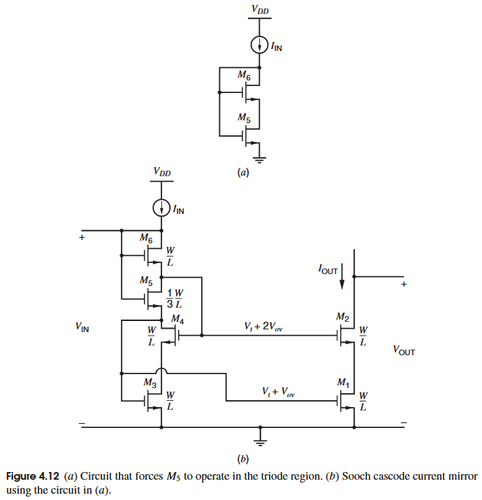

如上图的(a)所示，由于M6是二极管连接方式，那么说明其一定工作在饱和区，而其栅源压差$V_{GS6}>V_t$也是M5的栅漏压差$V_{GD5}>V_t$，说明M5工作在线性区。

为了使M1的$V_{DS1(min)}=V_{ov}$，M2的$V_{DS2(min)}=V_{ov}$，那么它们两个的栅极压差为$V_{ov}$，正如上图和上上图中所示，那么问题就是如何产生一个$V_{ov}$，二极管连接的肯定不行，那么正是使用M5产生这个$V_{ov}$，根据M6的饱和区和M5的线性区可有：
$$
\frac{k'}{2}\left(\frac{W}{L}\right)_6(V_{GS6}-V_t)^2=\frac{k'}{2}\left(\frac{W}{L}\right)_5(2(V_{GS5}-V_t)V_{DS5}-(V_{DS5})^2)
$$
代入条件：

$$
V_{GS6}=V_t+V_{ov} \\
V_{DS5}=V_{ov} \\
以及推得的:V_{GS5}=V_t+2V_{ov}
$$

解得：
$$
\left(\frac{W}{L}\right)_5=\frac{1}{3}\left(\frac{W}{L}\right)_6
$$
现在回到(b)图的电路中，该cascode电流镜电路被称为*Sooch* cascode current mirror，先不管M4的存在，那么M5提供$V_{ov}$，二极管连接的M3提供$V_{ov}+V_t$，那么M1和M2的栅极电压和预期的一样分别为$V_t+V_{ov}$和$V_t+2V_{ov}$。

现在加入M4进行分析，M4的目的是为了将M3的漏极电压降低到$V_{ov}$，有：

$$
V_{DS3}=V_{G2}-V_{GS4} \\
V_{G2}=V_t+2V_{ov} \\
V_{GS4}=V_{ov}+V_t \\
=>V_{DS3}=V_{ov}
$$

那么系统偏差$\epsilon =0$，在这些条件下，$V_{DS4}=V_{GS3}-V_{DS3}=V_t$，为了M4能工作在饱和区，要求$V_t>V_{ov}$，这个条件常常能够成立，但在一些情况下不成立，如低阈值或高过驱动，那么M4就会工作在线性区，导致在偏置电流下，栅源电压取决于漏源电压，进而增加系统偏差，此外，温度升高会导致阈值电压下降，而过驱动反而上升，所以要在设计时考虑各个温度下都是否满足该条件。

该高输出摆幅电流镜的一个问题是输入电压很高，会达到$3V_{ov}+2V_t$，这个值在低电源电压是个很高的值，会严重影响使用，可以在电流镜里用低阈值器件，在开关中用高阈值，但这会显著增加工艺复杂度和成本。

为了解决输入电压过高的问题，可以将偏置的电路单独作为一条输入支路：

通过M5M6生成$V_t+2V_{ov}$送往M4和M2的栅极，使支路自己生成M3和M1的漏源电压$V_{ov}$，这样一来，虽然额外增加了一条支路，但输入电压裕度变大了，$V_{IN1(min)}=2V_{ov}+V_t，V_{IN2(min)}=V_{ov}+V_t$，明显比Sooch电流镜的输入电压裕度变大了。

在这个电路中M5并不直接提供$V_{ov}$给另两个支路，其作用只是用来偏置M6，那么可以用一个二极管连接的MOS管M7替代M5和M6，只要其$V_{GS7}=V_t+2V_{ov}$即可，这可以通过调整宽长比轻松实现，通常而言，M7的宽长比(W/L)为M1~M4宽长比的$1/4$甚至更小以提供足够的$V_{GS7}$，这种方法在电流镜以及偏置电路中更为常见。

除此之外还有一种名为*Staked MOS*的低压电流镜方法，它相较上面那种方法有更好的匹配。

###  Wilson Current Mirrror
在前面分析bipolar cascode电流镜时，最大的缺点是有限的$\beta _F$导致的系统偏差，接下来的威尔逊电流镜就是通过负反馈减小这一部分影响

当$I_{IN}$与$I_{C3}$之间的偏差通过Q2的基极传出时，其被乘$(\beta _F+1)$后作为Q2的发射极电流，然后因Q1Q3电流镜复制到Q3的集电极，进而减小误差。

当输出电压变化时，比如变大时，Q2的集电极电流变大，进而Q1的集电极电流也变大，传回到Q3，使Q3的集电极电流也变大，进而减小了$I_{IN}$与$I_{C3}$之间电流差，使Q2的基极电流变小，进而使Q2的集电极电流变小，形成负反馈。

在上图的(b)中可以分析小信号的输出阻抗，这里不详述计算过程，有一点值得一提的是，其实这里的输出阻抗的特点和cascode电流镜一样，也会因为电流镜的复制原因导致Q2集电极进入的小信号电流因为复制原因平均的分到发射极和基极，不过只是这里是输出的支路将电流反馈回去。

当$r_{o3}\to \infty$，Q1Q3相同（电流增益为）：
$$
R_o=\frac{1}{g_{m1}(2)}+r_{o2}+\frac{g_{m2}r_{\pi 2}r_{o2}}{2}\simeq \frac{\beta _0r_{o2}}{2} 
$$

对于直流特性，假设$V_A\to \infty$，且每个bipolar管一样。
$$
V_{IN(min)}=V_{CE3}=V_{BE1}+V_{BE2}=2V_{BE(on)} \\
V_{OUT(min)}=V_{CE1}+V_{CE(sat)}=V_{BE(on)}+V_{CE2(sat)}
$$
对于系统偏差的分析，也不再赘述计算过程了，结果为：
$$
I_{OUT}\simeq I_{IN}\left(1-\frac{2}{\beta _F^2+2\beta _F+2} \right)\left(1-\frac{V_{BE2}}{V_A} \right) \\
\epsilon \simeq -\left(\frac{2}{\beta _F^2+2\beta _F+2}+\frac{V_{BE2}}{V_A} \right)
$$
可以得到的是，wilson电流镜的$\beta _F$系统偏差确实相比cascode变小了，但Q1和Q3的集电极-发射极电压不一样导致了输出阻抗系统偏差，这个可以通过在Q3的集电极和Q2的基极加上一个二极管连接的bipolar管来解决，所以不是很大的问题。

上图是MOS的Wilson电流镜，相比bipolar型，其电气参数取$\beta _F\to \infty,r_{\pi 2}\to \infty$，输出电阻为：
$$
R_o \simeq (1+g_{m2}r_{o3})r_{o2}
$$
如果考虑入M2的衬底效应，
$$
R_o \simeq (2+g_{m2}r_{o3})r_{o2}
$$
可以看到其实差的不大，因为M2的源极经过M1的二极管连接到地，几乎不变。
对于直流特性：

$$
V_{OUT(min)}=V_{GS1}+V_{ov2}=V_t+2V_{ov} \\
V_{IN}=V_{GS1}+V_{GS2}=2V_t+V_{ov} \\
$$

在不加入M4时，系统偏差为：
$$
\epsilon =-\frac{V_{GS2}}{V_A}
$$
加入M4后
$$
\epsilon \simeq 0
$$

## Active Load
前文中提到的差分对结构，是以差分输入，差分输出为类型的电阻负载式放大器，这个结构有一些问题：
- 首先，电阻在集成电路中的实现较为困难，精度较低
- 其次，在放大器处于反馈回路中，往往越大的增益越好，但电阻作为负载的放大器往往很难提供大的增益
- 假如在电阻上施加的压降较大，则会影响输入摆幅以及输出摆幅

基于以上原因，引入有源负载，其具有大的输出阻抗$r_o$以及较大的输出阈值。

下图所示的便是经典的五管OTA，其相较之下有更为简便的避免了共模反馈的问题：

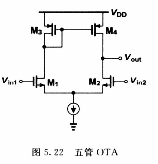

该电路通过负载的电流镜使得两边的负载都流过$I_{TAIL}/2$，形成了自偏置，这相比外加偏置的有源负载解决了共模偏置问题，同时由于复制关系，两边的电流以及跨导都没有被浪费，相比普通的电阻负载，其共模抑制能力更强。

### 小信号分析
下图展示的是bipolar的五管OTA的小信号模型，其中$\beta _F \to \infty$，MOS的版本只需要将$r_{\pi}\to \infty$即可。其中的（b）图是简化后的小信号图，并且在负载的电流镜中加入了误差项

定义输入的小信号分别为$v_{i1}$和$v_{i2}$，以及共模信号$v_{1}=v_{ic}=(v_{i1}+v_{i2})/2$,差模信号$v_{id}=(v_1-v_2)/2$，进一步简化模型，使$r_{tail}\to \infty ,r_{o(dp)}\to \infty$，那么有：
$$
i_1=g_{m(dp)}(v_{i1}-v_1)=\frac{g_{m(dp)}v_{id}}{2} \\
i_2=g_{m(dp)}(v_{i2}-v_1)=-\frac{g_{m(dp)}v_{id}}{2}
$$
可以看到，假如是非电流镜结构的负载，如电阻负载，只有$i_2$会传输到单输出节点，$i_1$被浪费了，那么总体的电路跨导为$G_{m}[dm]=\frac{i_{out}}{v_{id}}\bigg |_{v_{out}=0}=-\frac{i_2}{v_{id}}=\frac{g_{m(dp)}}{2}$

而对于电流镜负载的结构，$i_1$也能被复制到输出节点，进而提高了跨导，输出电流为：
$$
 i_{out}=-(1-\epsilon)i_3-i_2 
$$
假设$\epsilon_m =0$，有$i_{3}=-i_1$，那么根据$i_{out}=g_{d(dp)}v_{id}$:
$$
 G_{m}[dm]=\frac{i_{out}}{v_{id}}\bigg|_{v_{out}=0}=g_{m(dp)}  
$$

对于输出阻抗，可按下图的方式求得，在输出节点加一个电压源，然后测量输入的电流，其余的电压源接地

首先$i_{t1}$由测试电压经过$r_{o4}$流向地，故：
$$
 i_{t1}=\frac{v_t}{r_{o4}} 
$$
从测试电压向输入管M2看去便是一个被退化的共源管，退化的电阻为$r_{tail}$和从源看进去的M1的阻抗，为$1/g_{m1}$，若$1/g_{m}\ll r_{tail}$，那么可得：
$$
 i_{t2}+i_{t4}\simeq \frac{v_{t}}{r_{o2}\left(1+g_{m2}(\frac{1}{g_{m1}}\parallel r_{tail})\right)}\simeq \frac{v_t}{2r_{o2}} 
$$
对于$i_{t3}$，其受$v_{3}$控制，在假设电路的复制是无偏差的情况下，那么这份电流等于M1漏极的小信号电流，假设$r_{tail}$很大，小信号电流不流经它，那么这份电流完全由M2提供，则有：
$$
 i_3\simeq i_{2}+i_{4}\simeq \frac{v_t}{2r_{o2}} 
$$
那么总的输出阻抗为：
$$
R_o=\frac{v_t}{i_t}\bigg|_{\substack{v_{i1}=0 \\ v_{i2}=0}}\simeq \frac{1}{\frac{1}{r_{o(dp)}}+\frac{1}{r_{o(mir)}}}=r_{o(dp)}\parallel r_{o(mir)}
$$
往往在记忆这个输出阻抗以及推导其他放大器的输出阻抗时，我们简单的记忆为输出点的两个MOS管的输出阻抗的并联，这种理解从上述的分析可以发现有很大的问题，本质上是认为M1 M2的源极可以认为接地导致的，这种理解导致忽略了$r_{o2}$受到退化的影响以及电流镜对小信号的复制作用，不过从结果上看，复制小信号的部分正好是一个$2r_{o2}$的并联，导致结果是正确的，这种直觉式的分析虽然漏洞百出，不过在分析时确实会带来巨大的便捷，这一点在后续的cascode以及folded cascode都有展现。

对于输入阻抗，MOS管的输入阻抗为无穷大，而bipolar的输入阻抗可以近似认为直接是$2r_{\pi (dp)}$，不过实际上，由于电路的不对称以及高增益反馈的输出阻抗从T2到节点1，导致会有微小的偏差于$2r_{\pi (dp)}$

最后，有源负载的差分放大器能够将差分的双输入转变为对地的单端输出，同时，高输出阻抗也要求下一级也有高的输入阻抗以保持高增益，该结构的双端口等效电路如下图所示：

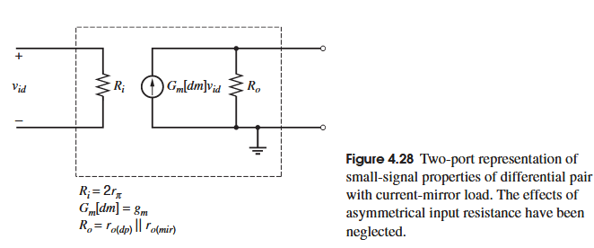

### CMRR
接下来我们把电阻负载的差分放大器和电流镜负载的差分放大器放在一起讨论它们的CMRR，并且它们都是差分输入，单端输出。

之前在单独讨论电阻负载的差分放大器时，那时输出为差分输出，故CMRR的定义有所不同，详情见[完美对称的差分对的小信号分析](#完美对称的差分对的小信号分析)，这里分析的都是单端输出，故对于输出电压有，其中$A_{dm}>0,A_{cm}<0$：

$$
v_o=-\frac{v_{od}}{2}+v_{oc}=-\frac{A_{dm}v_{id}}{2}+A_{cm}v_{ic} \\
=-\frac{A_{dm}}{2}\left(v_{id}-\frac{2A_{cm}}{A_{dm}}v_{ic}\right) \\
=-\frac{A_{dm}}{2}\left(v_{id}+2\left|\frac{A_{cm}}{A_{dm}}\right|v_{ic}\right) \\
=-\frac{A_{dm}}{2}\left(v_{id}+\frac{2v_{ic}}{CMRR}\right)
$$

可以看到在这里CMRR的定义为，共模输入对输出的影响:
$$
 CMRR=\left|\frac{A_{dm}}{A_{cm}}\right|=\left|\frac{G_m[dm]R_o}{G_m[cm]R_o}\right|=\left|\frac{G_m[dm]}{G_m[cm]}\right| 
$$
其中对于$G_m[cm]$定义为共模跨导：
$$
 G_m[cm]=\frac{i_{out}}{v_{ic}}\bigg|_{v_{out}=0} 
$$
那么对于电阻负载的结构很容易根据退化级共源结构的公式得到：

$$
 G_m[cm](resistively\enspace loaded)=-\frac{i_2}{v_{ic}}\simeq -\frac{g_{m(dp)}}{1+g_{m(dp)}(2r_{tail})}  \\
CMRR=\frac{1+2g_{m(dp)}r_{tail}}{2}\simeq g_{m(dp)}r_{tail}=g_{m1}r_{o5}
$$

其中$g_{m(dp)}$为输入对管的跨导，$r_{tail}$为尾电流源的小信号输出阻抗。可以看出由于该结构的跨导为$g_{m(dp)}/2$故导致CMRR被减半了。当用bipolar实现该结构时，由于bipolar的本征增益更大，所以CMRR也会更好。

接下来分析电流镜负载的CMRR，我们先假设T1 T2 T3 T4都有无穷大的小信号输出阻抗，且T3 T4的复制关系完美，虽然这种假设不可能在现实中成立，但通过这个分析我们可以更好理解为什么该电路的CMRR较好，且更好理解该电路的小信号模型。

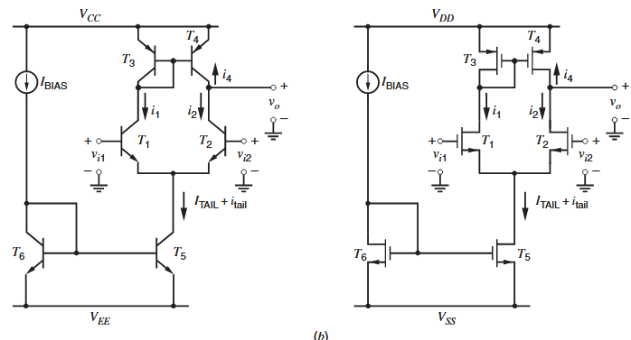

对于上面所述的假设条件，对于T1 T2的小信号电流有：$i_1=i_2=i_{tail}/2$，且由于无小信号输出阻抗，T1的小信号电流全部被T3的受控源吸收，并且由于完美复制，即$\epsilon_m=0$，有关系：$i_1=-i_3=-i_4$，则在输出点有KCL：$i_{out}=-i_2-i_4=-i_2+i_1=0$，则$G_m[cm]=\frac{i_{out}}{v_{ic}}\bigg|_{v_{out}=0}=0$，则可知$CMRR\to \infty$。

先不谈这个结果在实际中的不成立点，可以看到由于复制的关系，这个电路的CMRR非常好。接下来分析为什么这个关系在现实中为什么不成立。

在纳入小信号输出阻抗考虑时，我们可以把原本$G_m[cm]$的输出电流变化转化为输出点的电压变化，假使$i_4$和$i_2$的变化量完全一致那么输出节点的变化必然为零，这是由MOS管的输出特性所决定的，如果两边对称，则T1 T3的漏端（集电极）也应该完全不变，但如果把T3的小信号输出阻抗考虑进去（甚至可以先不考虑T1本身的小信号阻抗），$i_1$不能完全被T3的受控源吸收，一部分会被T3的输出阻抗吸收造成漏级（集电极）的电压变化，这种偏移和前面的结论便冲突了，也可以用公式来表示上述内容，将T1 T3的漏极作为F点，有：

$$
 \Delta v_F=\Delta i_{1}\left(\frac{1}{g_{m3}}\parallel r_{o3}\right) \\
|\Delta i_{4}|=g_{m4}\Delta v_{F}=g_{m4}\Delta i_{1}\frac{r_{o3}}{1+g_{m3}r_{o3}} \\
\Delta v_{out}=(\Delta i_1g_{m4}\frac{r_{o3}}{1+g_{m3}r_{o3}}-\Delta i_2)r_{o4}=-\Delta i_{1}\frac{r_{o4}}{1+g_{m3}r_{o3}}
$$

把方向纳入考虑的话，可以发现$\Delta v_F$的变化与$\Delta v_{out}$一样。如果把T1 T2的输出阻抗纳入考虑结果可以预见是大差不差的。

那么接下来分析准确的CMRR，这里Gary和Razavi均有各自的方法，前者精确的用误差项$\epsilon _m$和$\epsilon _d$表示复制的误差与输入的跨导误差和小信号输出阻抗误差，最终经过详细的推导得到准确的答案，并给予适当简化，而Razavi先是考虑各个管的输出阻抗，使用完全对称的假设得到了近似的结果，再单独考虑输入管失调的问题（但忽略了输入管的输出阻抗），Razavi在他的书中讨论电阻负载的失配对CMRR的影响时也是先考虑尾电流源的输出阻抗再加上负载失配的情况，虽然后者可以较为灵巧的解释电路且方法非常简短，但当需要详细分析时，他的奇技淫巧反而令人难以理解，其对于各个情况，各个情况以及误差的分析十分跳跃，而且Razavi对于长式子的化简以及表达实在令人难以恭维，所以此处重点介绍Gary的方法。

首先对于输入管误差，取
$$
i_1=i_2(1-\epsilon_d)
$$
其次考虑复制误差，取
$$
 i_4=i_3(1-\epsilon_m) 
$$
故输出电流为：
$$
 i_{out}=-i_4-i_2=i_1(1-\epsilon_m)-i_2=i_2((1-\epsilon_d)(1-\epsilon_m)-1)=-i_2(\epsilon_d+\epsilon_m-\epsilon_d\epsilon_m) 
$$
由于$\epsilon_m,\epsilon_d\ll 1$，对于$\epsilon_d\epsilon_m$这个二阶小量可以忽略
$$
 i_{out}\simeq-i_2(\epsilon_d+\epsilon_m) 
$$
则共模跨导为：
$$
 G_m[cm]\simeq-\left(\frac{i_2}{v_{ic}}\right)(\epsilon_d+\epsilon_m) 
$$
括号的式子等于阻抗负载的差分放大器的共模跨导，则替代进去有：
$$
 G_m[cm]\simeq-\left(\frac{g_{m(dp)}}{1+g_{m(dp)}(2r_{tail})}\right)(\epsilon_d+\epsilon_m) 
$$
则该电路的CMRR为：
$$
 CMRR=\left|\frac{G_m[dm]}{G_m[cm]}\right|\simeq\frac{1+2g_{m(dp)}r_{tail}}{(\epsilon_d+\epsilon_m)} 
$$
对比电阻负载的差分对的CMRR可以看出有一个$2/(\epsilon_d+\epsilon_m)$的因子区别，分子的2源于该结构差分跨导的翻倍，分母的误差项源于共模跨导的变小。

输入管的偏差来自于计算跨导时两者的负载不同，可以由上图小信号以及以下的计算得知：取输入的$v_{i1}=v_{i2}=v_{ic}$

$$
 i_1=g_{m(dp)}(v_{ic}-v_1)+\frac{v_3-v_1}{r_{o(dp)}} \\
i_2=g_{m(dp)}(v_{ic}-v_1)-\frac{v_1}{r_o(dp)}
$$

取$i_3=-i_1$，且近似负载$\frac{1}{g_{m(mir)}}\parallel r_{o(mir)}\simeq \frac{1}{g_{m(mir)}}$则有：

$$
 i_1\simeq g_{m(dp)}(v_{ic}-v_1)-\frac{v_1}{r_{o(dp)}}-\frac{i_1}{g_{m(mir)}r_{o(dp)}} \\
<=>\left(\frac{1+g_{m(mir)}r_{o(dp)}}{g_{m(mir)}r_{o(dp)}}\right)i_1\simeq g_{m(dp)}(v_{ic}-v_1)-\frac{v_1}{r_{o(dp)}} \\
i_1\simeq i_2\left(\frac{g_{m(mir)}r_{o(dp)}}{1+g_{m(mir)}r_{o(dp)}}\right) 
$$

由$i_1=(1-\epsilon_d)i_2$可以得到误差项$\epsilon_d$的表达式：
$$
 \epsilon_d=\frac{1}{1+g_{m(mir)}r_{o(dp)}}
$$
接下来讨论$\epsilon_m$的表达式，在先前的讨论中，我们假设T3的漏极看进去的阻抗$r_3\simeq 1/g_{m(mir)}$，这个假设被运用在了求差分跨导以及输入管误差中，但在讨论负载复制误差时，这个假设不能成立，故该节点看进去的误差完善为$r_3=\frac{1}{g_{m(mir)}}\parallel r_{o3}\parallel r_{\pi 3} \parallel r_{\pi 4}$，假设两个管子完美匹配，即不考虑随机失调误差，有：
$$
 r_3=\frac{r_{\pi (mir)}r_{o(mir)}}{r_{\pi (mir)}+2r_{o(mir)}+g_{m(mir)}r_{\pi (mir)}r_{o(mir)}} 
$$
根据电路小信号模型可知
$$
g_{m4}v_3=g_{m4}i_3r_3=\frac{g_{m4}r_{\pi (mir)}r_{o(mir)}i_3}{r_{\pi (mir)}+2r_{o(mir)}+g_{m(mir)}r_{\pi (mir)}r_{o(mir)}} \\
i_4=\frac{g_{m4}r_{\pi (mir)}r_{o(mir)}}{r_{\pi (mir)}+2r_{o(mir)}+g_{m(mir)}r_{\pi (mir)}r_{o(mir)}}i_3
$$
由$i_4=(1-\epsilon_m)i_3$可以得到复制误差项$\epsilon_m$的表达式：
$$
 \epsilon_m=\frac{r_{\pi (mir)}+2r_{o(mir)}}{r_{\pi (mir)}+2r_{o(mir)}+g_{m(mir)}r_{\pi (mir)}r_{o(mir)}} 
$$
对于bipolar，$r_\pi$通常远小于$r_o$，那么可以化简得到：
$$
 \epsilon_m[bip]=\frac{2+\frac{r_{\pi (mir)}}{r_{o(mir)}}}{2+\frac{r_{\pi (mir)}}{r_{o(mir)}}+g_{m(mir)}r_{\pi (mir)}}\simeq \frac{1}{1+\frac{g_{m(mir)}r_{\pi (mir)}}{2}}=\frac{1}{1+\frac{\beta _0}{2}} 
$$
对于MOS，取$r_{\pi}\to \infty$:
$$
 \epsilon_m[MOS]=\frac{1}{1+g_{m(mir)}r_{o(mir)}} 
$$
那么代回到CMRR的公式$CMRR\simeq \frac{1+g_{m(dp)}r_{tail}}{\epsilon_d+\epsilon_m}$有：
$$
 CMRR[bip]\simeq \frac{1+2g_{m(dp)}r_{tail}}{\frac{1}{1+g_{m(mir)}r_{o(dp)}}+\frac{1}{1+\frac{g_{m(mir)}r_{\pi (mir)}}{2}}} 
$$
取$g_{m(mir)r_{o(dp)}}\gg 1,g_{m(mir)}r_{\pi (mir)}/2\gg 1$，得到简化结果：

$$
 CMRR[bip]\simeq (1+2g_{m(dp)}r_{tail})g_{m(mir)}\left(r_{o(dp)}\parallel \frac{r_{\pi (mir)}}{2}\right) \\
\simeq (2g_{m(dp)}r_{tail})g_{m(mir)}\left(r_{o(dp)}\parallel \frac{r_{\pi (mir)}}{2}\right) 
$$

对比电阻负载的单端输出的CMRR:$g_{m(dp)}r_{tail}$，有源负载的CMRR提高了$2g_{m(mir)}\left(r_{o(dp)}\parallel \frac{r_{\pi (mir)}}{2}\right)$倍
对于MOS情况：
$$
 CMRR[MOS]\simeq\frac{1+2g_{m(dp)}r_{o(tail)}}{\frac{1}{1+g_{m(mir)}r_{o(dp)}}+\frac{1}{1+g_{m(mir)}r_{o(mir)}}} 
$$
取$g_{m(mir)}r_{o(dp)}\gg 1,g_{m(mir)}r_{o(mir)}\gg 1$，可得到化简式子：

$$
 CMRR[MOS]\simeq (1+2g_{m(dp)}r_{o(tail)})g_{m(mir)}(r_{o(dp)}\parallel r_{o(mir)}) \\
\simeq (2g_{m(dp)}r_{o(tail)})g_{m(mir)}(r_{o(dp)}\parallel r_{o(mir)})
$$

对比电阻负载的单端输出的CMRR:$g_{m(dp)}r_{tail}$，有源负载的CMRR提高了$2g_{m(mir)}\left(r_{o(dp)}\parallel r_{o(mir)}\right)$倍

接下来考虑随机失配的影响，其中不进行推导，只给出结果以及结果分析。

对于差模输出跨导，在考虑输入管，负载管跨导失调的情况下：
$$
 G_m[dm]\simeq g_{m(1-2)}\left[\frac{1-\left(\frac{\Delta g_{m(1-2)}}{2g_{m(1-2)}}\right)^2}{1+\left(\frac{\Delta g_{m(3-4)}}{2g_{m(3-4)}}\right)}\right] 
$$
其中$\Delta g_{m(1-2)}=g_{m1}-g_{m2},g_{m(1-2)}=(g_{m1}+g_{m2})/2,\Delta g_{m(3-4)}=g_{m3}-g_{m4},g_{m(3-4)}=(g_{m3}+g_{m4})/2$，该结果的近似成立于每个晶体管的$g_mr_o\gg 1$，尾电流管$(g_{m1}+g_{m2})r_{tail}\gg 1$的情况。

可以看出来其实输入管的跨导偏差对整体的跨导影响并不大，这是由于在两边的输入管跨导一致时，尾电流管的漏源小信号电压为零，而当一边的跨导大于另一边时（栅级小信号电压不修改，同时忽略输入管的小信号输出阻抗），比如$g_{m1}>g_{m2}$时，保持$v_{g1}=v_{id}+v_{ic}$，但由于跨导较大，导致从尾电流源的输出阻抗吸收一部分小信号电流以满足跨导增加，但这部分电流又在尾电流输出阻抗上产生压降，导致尾电流源漏极也是M1的源极电压上升，导致$v_{gs1}=v_{g1}-v_{s1}$减小，抑制了电流的变化，这种效应导致了整体差模跨导受$g_{m1}-g_{m2}$影响变小，但与此同时，$g_{m3}$和$g_{m4}$却可以直接影响$i_1$到输出端的复制，故而影响更大一些。

对于共模输出跨导，考虑输入管的跨导误差、输出阻抗误差，负载电流镜管的跨导误差，有：
$$
 G_m[cm]\simeq -\frac{1}{2r_{tail}}(\epsilon_d+\epsilon_m) 
$$
其中$\epsilon_d$和$\epsilon_m$的定义仍然取
$$
i_1=i_2(1-\epsilon_d)
$$

$$
i_4=i_3(1-\epsilon_m) 
$$
在这里
$$
 \epsilon_d\simeq \frac{1}{g_{m3}r_{o(dp)}}-\frac{\Delta g_{m(1-2)}}{g_{m(1-2)}}\left(1+\frac{2r_{tail}}{r_{o(dp)}}\right)-\frac{2r_{tail}}{r_{o(dp)}}\frac{\Delta r_{o(dp)}}{r_{o(dp)}} 
$$
以上各项均为单个增益误差，不考虑高阶误差，即各个误差之间的相互作用。

首先第一项源于输入管的负载不同，T1负载为二极管，T2负载为小信号地，这一点在前面解释过。第二项源于$g_{m1}$和$g_{m2}$的失调，第三项源于$r_{o1}$和$r_{o2}$之间的失调，后者对$G_m[cm]$的影响相较于第二者对之的影响更大，因为电流镜会削弱跨导失调对于$G_m[cm]$的影响，相反，$G_m[dm]$受$r_{o1},r_{o2}$的影响相对而言并不大，因为电流镜以及差分输入导致$g_{m1},g_{m2}$并不在输出相互抵消（甚至相互增强）。

对于复制误差：
$$
 \epsilon_m=\frac{1}{1+g_{m3}r_{o3}}+\frac{(g_{m3}-g_{m4})r_{o3}}{1+g_{m3}r_{o3}}\simeq \frac{1}{g_{m3}r_{o3}}+\frac{\Delta g_{m(3-4)}}{g_{m(3-4)}} 
$$

同样，以上各项均为单个增益误差，不考虑高阶误差，即各个误差之间的相互作用。

第一项是前面提到的系统误差，源于电流镜本身的输出阻抗，导致T3的漏极看进去的阻抗不是$\frac{1}{g_{m3}}$而是$\frac{1}{g_{m3}}\parallel r_{o3}$，导致电流复制的偏差，这一点在前面解释过了。第二项源于$g_{m3},g_{m4}$的失调。

在没有失配的时候共模跨导非常小，这是由于电流镜结构所导致的，而失配则总是通过增大$|G_{m}[cm]|$进而减小CMRR。

##  Voltage and Current References
需要提前说明的是，“基准”和“偏置”两个概念在电路里几乎是息息相关的，产生了基准之后用以偏置电流（或电压），甚至有时候基准本身就是一种偏置，在接下来的部分将详细讲解这些基准电路。
###  Low-Current Biasing
所谓的Low-Current也就是指能产生几uA到几百nA的电流偏置，他和后面谈到的Supply-Insensitive Biasing 和 Temperature-Insensitive Biasing并不是互斥或对立关系，他们彼此相交甚至包含。故而我们先介绍一下***sensitivity***即***灵敏度***的定义：
####  Sensitivity
对于一个受$x$变量影响的变量$y$，变量$y$对参数$x$的灵敏度定义如下：

$$
S_x^y=\lim _{\Delta x\to 0}\frac{\Delta y/y}{\Delta x/x}=\frac{x}{y}\frac{\partial y}{\partial x}
$$

对于输出电流$I_{OUT}$对电源电压$V_{SUP}$的灵敏度有：
$$
S_{V_{SUP}}^{I_{OUT}}=\frac{V_{SUP}}{I_{OUT}}\frac{\partial I_{OUT}}{\partial V_{SUP}}
$$

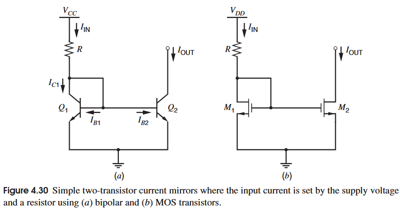

上图展示的是极为简单的电流偏置，仅用电源电压和电阻实现，这个*电流镜*电路的缺点很明显，如果需要小电流的话，那么电阻的值就要很大，比如对于（a）的电路，假设$V_{BE(on)}=0.7V$，电源电压为5V，设定输出电流为5uA，而Q1最大化取10倍Q2，则输入电流为50uA，解得$R=86k\Omega$，这个电阻的面积会影响很多面积，同时，当电源电压远大于$V_{BE(on)}$或者$V_{GS}$时，那么输入电流等于输出电流的情况下，输出电流约等于电源电压除以偏置电阻，那么输出电流对电源电压的灵敏度约为$S_{V_{SUP}}^{I_{OUT}}\approx 1$，可见其性能一般。

故接下来介绍***Wildar 电流源***，这个名字虽然较为陌生，但其使用程度可谓广泛。
####  Wildar Current Source

Wildar电流源的思想是将两个管子的射-基电压（源-栅电压）不一致形成的电压来实现输出的小电流。需要注意的是因为这个输出的电流对于输入电流和电源电压的依赖性小于上面电流镜的对于两者的依赖性，故这个电路是*电流源*。
##### Bipolar Wildar Current Source
对于(a)电路，可以用KVL进行分析得到，当然其中Q1Q2的$V_{BE}$并不一致：
$$
V_Tln\left(\frac{I_{IN}}{I_{OUT}}\frac{I_{S2}}{I_{S1}}\right)=I_{OUT}R_2
$$
这是一个典型的超越方程，在实际设计电路中，$I_{IN}$和$I_{OUT}$通常已知，那么可以直接对电阻进行设计。不过我们也可以意识到，在$ln$项中的$I_{IN}$受到指数倍的抑制，这使得它的性能比上一个电路良好。

对于这个电路的定量灵敏度分析，可以通过全差分方程的形式进行，对刚刚的式子两边对$V_{OUT}$求导，其中$I_{OUT}$也是$V_{CC}$的函数：
$$
V_T\frac{\partial}{\partial V_{CC}}ln\frac{I_{IN}}{I_{OUT}}=R_2ln\frac{\partial I_{OUT}}{\partial V_{CC}}
$$
最后得到：
$$
S_{V_{CC}}^{I_{OUT}}=\left(\frac{1}{1+\frac{I_{OUT}R_2}{V_T}}\right)S_{V_{CC}}^{I_{IN}}
$$
当电源电压较大时，输入电流对电源电压的灵敏度为1，假设$I_{IN}=1mA,I_{OUT}=5\mu A,R_2=27.4k\Omega$，那么可以得到$S_{V_{CC}}^{I_{OUT}}\simeq 0.16$，可见其性能比上一个电路的优势。
##### MOS Wildar Current Source
对于图(b)的MOS管Wildar电路，分析方式类似，不过由于square-law 的特性，这个结果是闭式解，可以轻松得到结果，并不需要像bipolar的电路一样进行迭代才能得到答案，

$$
\sqrt{I_{OUT}}=\frac{-\sqrt{\frac{2}{k'(W/L)_2}}+\sqrt{\frac{2}{k'(W/L)_2}+4R_2V_{ov1}}}{2R_2}
$$

对于灵敏度分析，采取同样的方法，其中$V_{ov1}$是$V_{DD}$的函数，得到：
$$
S_{V_{DD}}^{I_{OUT}}=\frac{V_{ov1}}{\sqrt{V_{ov2}^2+4I_{OUT}R_2V_{ov1}}}S_{V_{DD}}^{I_{IN}}
$$
同样假设$V_{DD}>>V_{GS1},I_{IN}\simeq V_{DD}/R_1$，则$S_{V_{DD}}^{I_{IN}}$约为1，再假设输出电流远小于输入电流，而$V_{ov2}$通常很小，则$I_{OUT}R_2\simeq V_{ov1}$，那么则有：
$$
S_{V_{DD}}^{I_{OUT}}=0.5S_{V_{DD}}^{I_{IN}}=0.5
$$

####  Peaking Current Source
上述的Wildar电流镜能提供微安级别的电流输出，而接下来的Peaking Current Source能在能够接受范围的电阻下提供纳安的电流。
##### Bipolar Peaking Current Source

鉴于输出的电流很小，所以忽略Q2的基极电流，再假设 $V_A\to \infty$，由KVL有：
$$
I_{OUT}=I_{IN}exp\left(-\frac{I_{IN}R}{V_T} \right)
$$
在已知$I_{IN}$和$I_{OUT}$设计R时可以有上式的变形：
$$
R=\frac{V_T}{I_{IN}}ln\frac{I_{IN}}{I_{OUT}}
$$
假如$I_{IN}=10uA,I_{OUT}=100nA$，那么$R\simeq 12k\Omega$

定性分析这个电路，当输入电流较小时，R上的压降可以忽略不计，那么输出电流跟随输入电流，随着输入电流增大，Q1的$V_{BE1}$随着$I_{IN}$增大呈对数增大，而R的压降随$I_{IN}$变大而线性变大，那么Q2的$V_{BE2}$随着输入电流增大而逐渐变小，总而言之输出电流会随着输入电流变大而先变大后变小。如下图所示，这个最大值根据R而定，这种尖峰的存在也就是这个电路的名称由来

##### MOS Peaking Current Source
对于MOS管也有一样的电路：

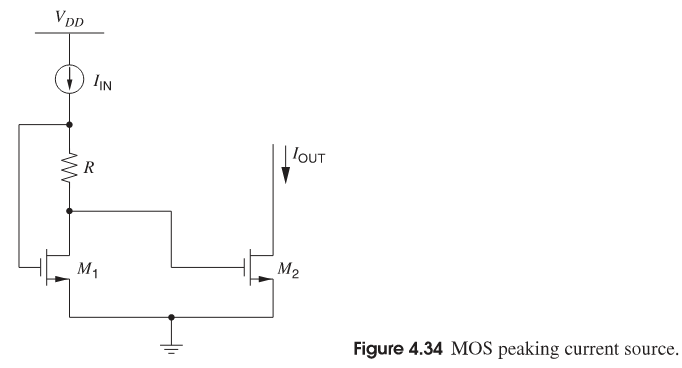

由于M1M2的源体都连在一起可以认为它们的阈值电压一致，可以由KVL得到：
$$
V_{ov2}=V_{ov1}-I_{IN}R
$$
假如两个MOS管都在强反型区，那么很自然有：
$$
I_{OUT}=\frac{k'(W/L)_2}{2}(V_{ov1}-I_{IN}R)^2 
$$
但由于输入和输出的电流都很小，所以两个管子其实都可能工作在弱反型区，也就是两个管子的过驱动电压都小于$2nV_T$，那么漏极电流就是栅源电压的指数函数，在$V_{DS}>3V_T$时，有：
$$
I_{OUT}=\frac{W}{L}I_texp\left(\frac{V_{GS2}-V_t}{nV_T} \right)\simeq I_{IN}exp\left(-\frac{I_{IN}R}{nV_T}\right) 
$$
其中，$I_t$为M2的栅源电压为$V_t$，宽长比为1，且漏源电压远大于$V_T$时的漏极电流，$V_t$为阈值电压，$V_T$为热电压，n通常取1.5

下图展示的是在使用强反型和弱反型模型时的输出电流-输入电流关系，可以明显看到强反型关系低估了输出电流的大小。

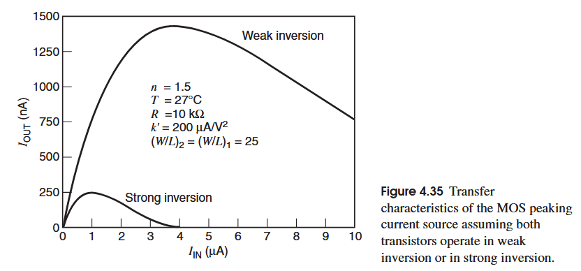

定量而言，Peak Current Source的输入输出电流关系可以表达为：
$$
I_{OUT}=I_{IN}exp\left(-\frac{I_{IN}R}{nV_T}\right) 
$$
对于MOS情况，n取1.3~1.5，对于bipolar情况，n取1

定性而言，都是一开始电阻压降较小，输入输出呈跟随状态，随着输入电流变大，电阻压降变大速度大于晶体管基射（栅源）电压变大速度，导致输出管的基射（栅源）电压变小，输出电流变小，且输出电流最大值取决于电阻。

###  Supply-Insensitive Biasing
前面我们已经介绍了Sensitivity，以及普通的电流镜和Wildar电流镜的电源敏感度，虽说Wildar电流镜已经相比普通电流镜减小了将近一半，但依旧需要进一步在结构上进行优化以实现更好的性能。

如何使得输出的量不受电源电压影响，一个思路就是用一个常量（不受电源电压影响）来控制输出量，最方便的标准就是晶体管的基-射电压或者阈值电压、热电压以及反偏pn结（齐纳二极管）的击穿电压，这些量均可以降低电源电压的影响，但前三者的问题是会受温度的巨大影响。

基-射极电压以及阈值电压有着负温度系数，在1~2mV/°C；而热电压有着正温度系数，为$k/q\simeq 86uV/°C$。

而齐纳二极管的缺点则是其需要至少7~10V的电源电压，因为标准工艺下重掺杂的结点（通常为npn晶体管发射极-基极结点）上产生最低击穿电压约为6V，此外，在反向击穿条件时，pn结会引入大量噪声。

接下来介绍基于基-射极/栅-源极电压的参考电压电路

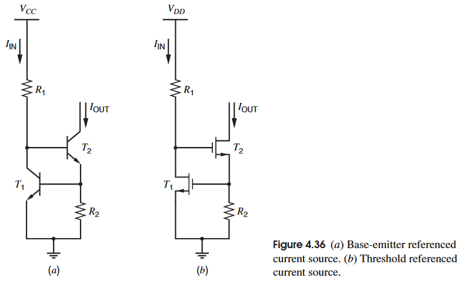

其实这个电路与Wilson电流镜类似，只是用电阻替换了二极管连接的晶体管，也可以用另一个被偏置的MOS管实现这个电阻的效果(被Allen书中引用，称为校准共源共栅电流镜)，为了使得T1能有足够的基-射电压吸收输入电流，T2产生输出电流在R2上形成对应压降。有：
$$
I_{OUT}=\frac{V_{BE1}}{R_2}=\frac{V_T}{R_2}ln\frac{I_{IN}}{I_{S1}} 
$$
再根据灵敏度的定义有：
$$
S_{V_{CC}}^{I_{OUT}}=\frac{V_T}{V_{BE(on)}}S_{V_{CC}}^{I_{IN}} 
$$
在$V_{CC}>>V_{BE(ON)}$时，$I_{IN}\simeq V_{CC}/R_1$那么$S_{V_{CC}}^{I_{IN}}$约等于1，在取$V_{BE(on)}=0.7,V_T=0.026$时，$S_{V_{CC}}^{I_{OUT}}\simeq 0.037$，可见其受电源电压影响已经变小很多。

对于b图的MOS情况，
$$
I_{OUT}=\frac{V_{GS1}}{R_2}=\frac{V_t+\sqrt{\frac{2I_{IN}}{k'(W/L)_1}}}{R_2} 
$$
其输出阻抗为：
$$
R_{OUT}\simeq g_{m2}g_{m1}r_{o1}r_{o2}R_2 
$$
可以认为是反馈放大了其输出阻抗，是典型的Gain-Boosting

如果输入电流较小，且T1的宽长比较大，那么可以认为输出电流取决于阈值电压，因此这个电路被称为*阈值基准 threshold-referenced*，进行灵敏度的求解：
$$
S_{V_{DD}}^{I_{OUT}}=\frac{V_{ov1}}{2I_{OUT}R_2}S_{V_{DD}}^{I_{IN}}=\frac{V_{ov1}}{2V_{GS1}}S_{V_{DD}}^{I_{IN}} 
$$
假设阈值电压为1V，过驱动为0.1V，同时$S_{V_{DD}}^{I_{IN}}\simeq 1$，则$S_{V_{DD}}^{I_{OUT}}\simeq 0.045$

这个电路不是完全隔离于电源电压因为其集电极/漏极几乎正比于电源电压，这种灵敏度问题在输入电流来自于电源端到电阻产生的偏置电路中尤为明显，会导致电路中某些部分的电流随电源电压变化。

此外，这个结构在偏置中极为常见，但不同的书中对这个结构有不同的讲解，甚至连名字都不一样，
例如在Gary的书中，这种结构叫*阈值基准*，在Allen书中，这个结构叫*调制共源共栅电流镜*，马丁的书中则是并没有提及这个结构，且只是简单对比了Wilson电流镜和cascode电流镜，而在拉扎维的书中甚至没有介绍Wilson电流镜和这个结构，于本人而言，叫这个结构为电流镜有些不妥，因为它本身如果按照Gary的用法使用，其并不直接复制输入电流，而是一个基准源，此外，由于其中环路的存在，哪怕它具有和cascode结构类似的输出阻抗，其环路造成的不稳定仍然使其作为电流镜的功能有待商榷，不过这个结构终究是源自于Wilson电流镜，其发明是由于在三极管时代cascode结构受到$\beta$偏差影响较大，而Wilson电流镜能较好抑制这一误差，这一点在前面分析过，不过到了MOS管时代，这个优势也就无从说起了。

###  Self-Biasing
其实这一章在Gary书中是隶属于Supply-Insensitive Biasing下的，但其使用之广泛，就单独提出来了。

在上文的分析中，可以看到敏感度的一个很大因素是被输入电流和电源电压直接的关系所恶化，那么通过输出反过来再控制输入，就可以进一步减弱敏感度，这种手段就叫*自偏置self-biasing*或者*自举bootstrap*(自举的定义以及使用更加广泛，可以简单认为是输入和输出同时同步同向变化所引起的效果)

下图展示了这种自偏置的思路以及工作点定义，其中电流镜保持1：1复制。（实线的$I_{IN}-I_{OUT}$曲线取自于阈值基准的关系）

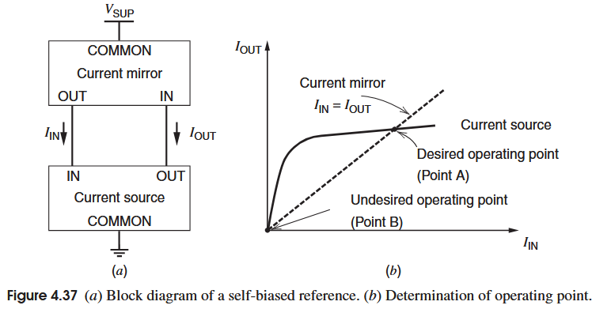

Gary提到了自偏置的两个条件，一个是“转移”，在上图中即电流源的输入输出关系，一个是“跟随”，即上图中输入跟随输出，不过在一些结构中，只需要跟随就能达到*自举*的效果。

很明显这是一个正反馈电路，但只要其环路增益小于1，那么依然能保持稳定，可以注意到有两个稳定点，一个是期望的工作点，一个是不期望的0点，理论上设计0点的环路增益大于1，便可以自动收敛到期望的工作点。

但在实际中由于低电流工作点时极小的跨导，使得大于1的环路增益不能实现，便需要*启动电路start-up citcuit*注入电流使得电路向正常工作点收敛。

下图展示的是以$V_{BE}$基准和$V_t$基准为例的自偏置电流基准（在Allen的书中，这个结构才被称为$V_t$基准源，中文名为自举基准）

其中T3T6是复制电流出去的管子，而在左侧加入了启动电路，这个电路的输出电流分析并不困难，但求解困难会遇到麻烦，比如bipolar的$V_{BE}$基准因为电流源是超越方程故而解出输出电流并不现实，不过我们可以简单取$I_{OUT}\simeq \frac{V_{BE(on)}}{R}$作为输出，就这个结果可以看出输出电流已经和电源电压关系不大了。

对于MOS的自举基准,忽略沟道长度调制效应：
$$
I_{OUT}R=V_t+\frac{2I_{IN}}{\mu _nC_{ox}(W/L)_1} \\
I_{IN}=I_{OUT} \\
I_{OUT}=\frac{V_t}{R}+\frac{1}{\mu _nC_{ox}(W/L)_1R^2}+\frac{1}{R}\sqrt{\frac{2V_t}{\mu _nC_{ox}(W/L)_1R}+\frac{1}{(\mu _nC_{ox}(W/L)_1)^2R^2}}
$$
那么其实输出电流近似为$I_{OUT}\simeq \frac{V_t}{R}$，也与电源电压近似无关

对于(a)中的启动电路，在电路位于0点时，T1的集电极处于低电位，而左侧存在4个导通二极管的$V_{BE(on)}$，使得D1导通向主体电路通电，使得Rx上的压降变大，可以调整Rx的阻值使得当电路处于正常工作点时D1处于关断状态，即T1的集-射压差为两个开启电压，而设置$I_{IN}R_X$为两个开启电压即可。

在(b)中不使用二极管方法，因为浮空二极管在MOS工艺中并不可行，在电路处于0点时，T1的栅极为低电平，在经过T7T8之后在T9形成高电平使得其导通（T7关断，T8三极管区），进而将T4T5的栅极拉低从而启动电路。

此外，启动电路除了能启动电路以外还需要做到：尽可能走小电流以减小功耗；在主电路开启之后不影响主电路或最好关闭以减小功耗。

接下来介绍一个参数：分式温度系数（fractional temperature coefficient），对于输出电流的结构，其计算公式为：
$$
TC_F=\frac{1}{I_{OUT}}\frac{\partial I_{OUT}}{\partial T}
$$
很明显，它表示了输出变化量受温度的影响，比如对于$V_{BE}$基准电路：
$$
I_{OUT}=\frac{V_{BE}}{R} \\
\frac{\partial I_{OUT}}{\partial T}=\frac{1}{R}\frac{\partial V_{BE}}{\partial T}-\frac{V_{BE}}{R^2}\frac{\partial R}{\partial T} \\
TC_F=\frac{1}{I_{OUT}}\frac{\partial I_{OUT}}{\partial T}=\frac{1}{V_{BE}}\frac{\partial V_{BE}}{\partial T}-\frac{1}{R}\frac{\partial R}{\partial T}
$$
同理，$V_t$基准电路的分式温度系数为：
$$
TC_F=\frac{1}{I_{OUT}}\frac{\partial I_{OUT}}{\partial T}\simeq \frac{1}{V_t}\frac{\partial V_t}{\partial T}-\frac{1}{R}\frac{\partial R}{\partial T}
$$
在这里我们可以看到一些情况：对于$V_{BE}$而言，它的温度系数是负数，如果电阻的温度系数是正数，那么$V_{BE}$基准电路的温度系数会很大，也就是说它的温度性能并不好，这或许也是它如今使用不多的原因之一。当然，如果温度系数中的温度函数并不是一个常数，那么求出这个电路的温度系数也许意义不大，所以现在评估一个电路的温度性能采用的是温漂系数，取其在温度测量范围中的最值差除以整个测量区间作为导数：
$$
TC=\frac{X_{max}-X_{min}}{X_{nominal}(T_{max}-T_{min})}
$$
其中X为测量的变量，可以是电流，也可以是电压。

在CMOS电路中也可以用$V_{BE}$基准电路，如下图所示，因为上面的电流镜，导致M2和M3的栅源电压一致，进而使得输出电流由Q1的$V_{BE}$和电阻$R$决定

进而有
$$
I_{OUT}=\frac{V_{BE}}{R} 
$$

同时，在bipolar电路中也可以实现$V_T$基准（热电压基准），这会用到前面讲过的Wildar电流源：

根据Wildar 电流源公式：
$$
V_Tln\left(\frac{I_{IN}}{I_{OUT}}\frac{I_{S2}}{I_{S1}}\right)=I_{OUT}R_2
$$
由于加入了Q3Q4的电流镜，导致$I_{IN}=I_{OUT}$，为了使得电路的0工作点的环路增益大于1进而促使电路趋向理想工作点，Q2的发射极面积为Q1的发射极面积的两倍，也就是$I_{S2}=2I_{S1}$，故有：
$$
I_{OUT}=\frac{V_T}{R_2}ln2
$$
对于这个电路的分式温度系数可以得到：
$$
TC_F=\frac{1}{V_T}\frac{\partial V_T}{\partial T}-\frac{1}{R_2}\frac{\partial R_2}{\partial T}
$$
对于正温度系数的热电压和正温度系数的扩散电阻，它们的互相抵消会使得电路的温度系数更小，表现为更好的温度效果。

在CMOS中也可以形成$V_T$基准，如下图所示

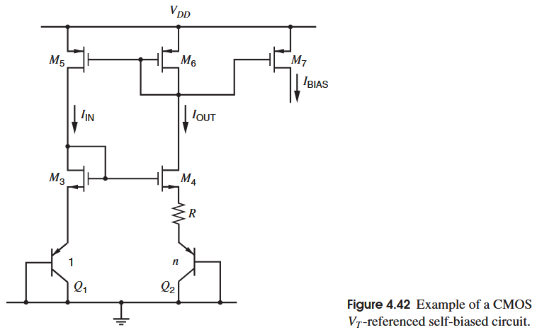

其中M5和M6匹配，以实现复制的功能，M3与M4匹配，进而它们的源电位相同，得到：
$$
V_{BE1}=I_{OUT}R+V_{BE2}
$$
其中Q2的射极面积为Q1的n倍，故而有：
$$
I_{OUT}=\frac{V_Tln(n)}{R} 
$$
需要注意的是，由于MOS管M3M4的失配或者沟道长度调制效应，会导致它们有着不同的漏源电压，而电阻R上的压降通常很小，比如100mV，那么M3M4源极电位的小小偏差就可能导致巨大的误差，所以在实践中常常使用cascode或者wilson电流镜以减小偏差，当然在全工艺中，往往使用cascode结构，它除了能减弱沟道长度调制效应带来的误差，还能增强电路的PSRR，唯一的问题可能就是它要使用较高的电压裕度。

可以看到，在一些基准电路中我们会故意制造管子之间的不对称，这种不对称的原因是为了形成自举，就以CMOS中的$V_T$基准（图4.42）为例，假如两边的bipolar管一致，那么输出电流就为0，也就是转移和复制的关系被唯一收敛到0点，而只有假如不对称导致转移关系偏移形成另一个我们期望的解，才能保证电路能输出预期值，接下来看一个经典的电路

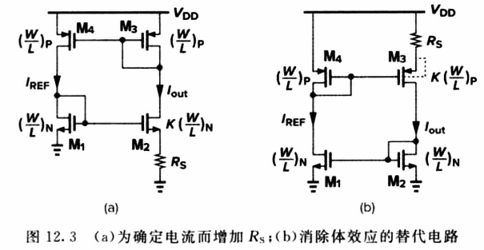

这个电路被称为*constant-transconductance*，这个名字的由来接下来会解释，以其中的（a）图为例，可以看到M2和M1就有明显的不对称，根据电流关系有：
$$
V_{ov1}+V_{t1}=V_{ov2}+V_{t2}+I_{OUT}R_S \\
假设两个阈值电压一致： \\
I_{OUT}R_S=\sqrt{\frac{2I_{OUT}}{\mu _nC_{ox}(W/L)_N}}-\sqrt{\frac{2{I_{OUT}}}{\mu _nC_{ox}K(W/L)_N}} \\
I_{OUT}=\frac{2}{\mu _nC_{ox}(W/L)_N}\frac{1}{R_S^2}\left(1-\frac{1}{\sqrt{K}} \right)^2
$$
虽然这个结构类似于bipolar的$V_T$基准，但就结果而言，这个结果即不和$V_T$有关，也极不美观，难以看出它在电路结构上的理解方法，这是由于ln函数和sqrt函数以及bipolar管和MOS管对于热电压/阈值电压的区别，也就是由于晶体管本身的转移性质导致了结果的不同，但分析方法一致。

需要注意的是，我们在上述计算过程中忽略了体效应，也就是说实际上M1M2的阈值电压并不一致，由于M2的源极更高一些，会导致M2的阈值电压也相应较高，导致实际电流比理论值小一些，所以为了恢复到原来预期的电流，可以修改管子的比例K，或者调制电阻R，**一般设计而言取K为4**，因为这样根号4取2较为方便计算，而跨导也可以直接表示为$1/R_{S}$。当然，也可以采取（b）图的方法，使得偏差管的体和源相连，这一点可以在版图上进行隔离进而实现。此外，沟道长度调制效应会导致电路受到外部电压的影响，比如电源电压，虽然从公式上看输出电流不受电源电压的影响，但在小信号角度而言，电源波纹（ripple）会影响电路性能，故而可以增长管子的长度或者使用cascode结构。

接下来看一看这个电路的一些细节问题：
$$
g_{m1}=\sqrt{2\mu _nC_{ox}(W/L)_NI_{OUT}} \\
g_{m1}=\frac{2\left(1-\sqrt{1/K} \right)}{R_S} \\
g_{m2}=\frac{2\left(\sqrt{K}-1 \right)}{R_S}
$$
可以看到这个跨导仅由工艺参数和电阻决定，故而称为*constant-transconductance*。

接下来看这个典型的Wildar电流镜以及其错误电路的环路分析

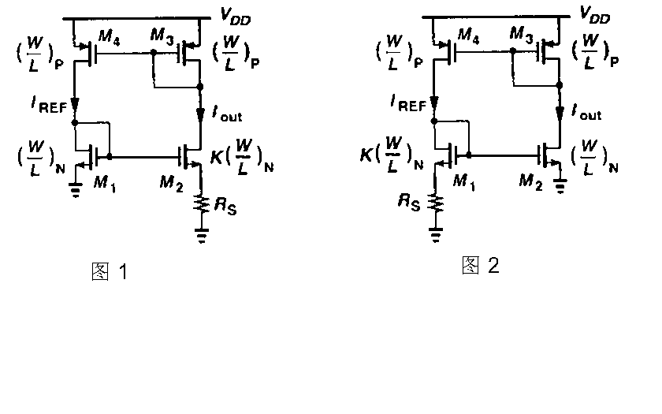

前面提到，管子的不对称和电阻的引入是为了转移关系和复制关系能在非零点有一个稳定解，从另一个说法来看，也可以认为是在预期工作条件下能够有稳定的环路关系。

对于上图图1进行环路分析，从M1和M2的栅极断开加入一个测试电压$v_t$：
$$
v_t\times \frac{g_{m2}}{1+g_{m2}R_S}\times \frac{1}{g_{m3}}\times g_{m4}\times \frac{1}{g_{m1}}=v_{out} \\
g_{m3}=g_{m4};g_{m2}=\sqrt{K}g_{m1} \\
Loop Gain=\frac{v_{out}}{v_t}=\frac{\sqrt{K}}{1+g_{m2}R_S}
$$
可以看到图1的环路反馈虽然大于0但是小于1，故而稳定

同理在图2加入相同的方法测试：
$$
v_t\times g_{m2}\times \frac{1}{g_{m3}}\times g_{m4}\times (r_{o4}\parallel (\frac{1}{g_{m1}}+R_S))=v_{out} \\
g_{m3}=g_{m4};g_{m1}=\sqrt{K}g_{m2} \\
Loop Gain=\frac{v_{out}}{v_{in}}=g_{m2}\times (r_{o4}\parallel (\frac{1}{g_{m1}}+R_S))
$$
可以看到图（b）中的反馈不仅大于零还大于1，所以其预期工作状态并不稳定，这是因为$R_S$在图一作为M2的退化电阻，而在图（b）中作为M1串联的电阻提高了增益。

不过其实如果理解自举基准的原理，也就不会有图（b）的错误产生，为了在电流源产生转移关系的偏移，必然是在输出的管下面加入电阻配合管子的宽长变化。

# Output Stages

##  CMOS Class AB Output Stages
###  Common Drain Configuration

###  Common-Source Configuration With Error Amplifiers
接下来介绍的*误差放大器辅助的共源结构*其核心思想其实是*super-source-follower*或者说*gm-boosting*，通过误差放大器对比输入与输出，进而调整输出管来控制输入与输出一致

根据反馈或者直接分析可以得到该结构的输出阻抗为

$$
R_o=\frac{1}{(g_{m1}+g_{m2})A}\parallel r_{o1} \parallel r_{o2}
$$
在分析计入运放的失调之前，先进行一些约定：$k_p'(W/L)_1=k_n'(W/L)_2$以及$-V_{t1}=V_{t2}=V_t$，并且在输入电压，两个运放的失调电压为0时，$-I_{D1}=I_{D2}=I_Q$

进而有：
$$
V_{gs1}=-V_t-V_{ov} \\
v_{gs2}=V_t+V_{ov} \\
其中V_{ov}=\sqrt{\frac{2I_Q}{k'(W/L)}}
$$

接下来加入失调电压，那么对于上面的误差放大器，其差分输入从0变为$V_o-V_i+V_{OSP}$，同理，下面的放大器，其差分输入从0变为$V_o-V_i-V_{OSN}$。那么两个输出管的栅源电压也因为失调电压产生了一定的偏差：
$$
V_{gs1}=-V_t-V_{ov}+A[V_o-(V_i-V_{OSP})] \\
V_{gs2}=V_t+V_{ov}+A[V_o-(V_i+V_{OSN})]
$$
进而结合MOS管在饱和区的转移方程，输出电流$I_o=V_o/R_L$，以及KCL，得到：
$$
V_o=\frac{V_i-\frac{V_{OSP}V_{OSN}}{2}}{1+\frac{1}{k'\frac{W}{L}A[2V_{ov}-A(V_{OSP}-V_{OSN})]R_L}}
$$
观察这个结果可以得到两个重要的结论：

在失调电压$V_{OSP}=V_{OSN}=0$时
$$
V_o\simeq V_i\left(1-\frac{1}{2Ag_mR_L}\right)
$$
在这个结论中可以看到，$2Ag_mR_L$为环路增益，$A,g_m,R_L$增大都会使增益误差变小，跟随效果更好。

在考虑失调电压时，$A(V_{OSP}-V_{OSN})\ll 2V_{ov}$以及$2Ag_mR_L\gg 1$时
$$
V_o\simeq V_i-\frac{V_{OSP}+V_{OSN}}{2}
$$
于大信号分析而言，上述关系于两个输出管工作在饱和区有效，而当输入变大或减小到一定数值时，输出也跟随变大或减小，但由于跟随的增益小于1，导致误差放大器的差分输入减少或减小，即当$V_i$上升到一定程度时，误差放大器输入减小，使得放大器输出减小，进而上方的MOS管的$I_d$变大，而下方的MOS管$I_d$变小，再进一步使得下方MOS管关断，对于$V_i$下降则相反。

这种输出级的优势相比上一种在于其进一步增大了输出摆幅，也就是多了一个阈值电压的摆幅。但这个结果也有两个问题，**第一个就是由于为了强化高频速度，增加带宽时必须的，但与此同时会影响结构的稳定性，第二个就是误差放大器的失调电压对静态电流的影响，大的静态电流可以减小交越失真，但同时会增大功耗，以及减小输出摆幅。**

控制静态电流的方法，可以通过反馈进行稳定，还可以通过减小误差放大器的增益控制，这里介绍后面的方法。这种方法也就是通过减少误差放大器的增益，减少失调对于输出管的栅压影响。

定义无失调时$V_i=0$的静态电流$I_Q=\frac{I_{D2}-I_{D1}}{2}$，注意漏电流是从漏级流入，源流出。考虑失调电压和误差放大器增益的静态电流为：
$$
I_Q=\frac{k'}{4}\frac{K}{L}\left((V_{ov}+A[V_o+V_{OSN}])^2+(-V_{ov}+A[V_o+V_{OSP}])^2\right)
$$
在不考虑失调电压时，此时输出电压为0($V_i$=0)，静态电流为：
$$
I_Q=\frac{k'}{2}\frac{K}{L}\left(V_{ov}\right)^2
$$
代入前面得到的考虑失调电压下输入输出电压关系到考虑失调电压的静态电流关系式中,并且取$V_i=0$，得到：
$$
I_Q=\frac{k'}{2}\frac{W}{L}\left(V_{ov}-A\left[\frac{V_{OSP}-V_{OSN}}{2}\right]\right)^2
$$
定义由于失调导致的静态电流差为$\Delta I_Q$:
$$
\Delta I_Q=I_Q|_{\substack{V_{OSP}=0 \\V_{OSN}=0}}-I_Q=\frac{k'}{2}\frac{K}{L}A(V_{OSP}-V_{OSN})\left[V_{ov}-A\left(\frac{V_{OSP}-V_{OSN}}{4}\right) \right]
$$
再定义误差静态电流与理论静态电流的比值用以衡量偏差比：
$$
\frac{\Delta I_Q}{I_Q|_{\substack{V_{OSP}=0 \\V_{OSN}=0}}}=A\left(\frac{V_{OSP}-V_{OSN}}{V_{ov}} \right)\left[1-\left(\frac{V_{OSP}-V_{OSN}}{4V_{ov}}\right) \right] \\
\simeq A\left(\frac{V_{OSP}-V_{OSN}}{V_{ov}}\right)  当A(V_{OSP}-V_{OSN})\ll 4V_{ov}时
$$
根据如上的关系式，我们可以看出，如果已知失调电压大小，以及需要设计的静态电流的误差量，就可以反推出误差放大器的最大增益：
$$
A<\left(\frac{V_{ov}}{V_{OSP}-V_{OSN}} \right)\left(\frac{\Delta I_Q}{I_Q|_{\substack{{V_{OSP}=0} \\V_{OSN}=0}}} \right)
$$
下图展示了一个利用误差放大器的输出级电路，包括了其中的误差放大器：

该图仅展示了上半部分，即输入到上方误差放大器到上半部分输出管，对称的下半部分结构没有展示。

这一部分的gary的电路分析有些难以苟同，原论文(H. Khorramabadi. “A CMOS Line Driver with 80 dB Linearity for ISDN Applications,” IEEE Journal of Solid-State Circuits, Vol. 27, pp. 539–544, April 1992.)则是直接给出了放大器主体管的作用进而直接得到放大增益，这里给出个人分析思路：

该电路左边部分，即$I_{BIAS}$，M17M13M15构成了Wilson电流镜，用以构成偏置电流，为了控制整体增益，负载是M15和M16（原论文中依靠这两个$1/g_m$的负载把整体增益控制在7），其中M13和M14负责电流镜结构，使得M13和M15的小信号电流复制到M14，使得M12的跨导不被浪费，即整体跨导为$G_m=g_{m11}=g_{m12}$，而输出阻抗则为$R_{OUT}=1/g_{m15}=1/g_{m16}$（未考虑体效应），则最后放大器的增益为：$A=G_mR_{OUT}=\frac{g_{m11,12}}{g_{m15.16}}$。

此外有一些小细节需要注意，M13和M14对M17进行复制，故有：
$$
I_{D13}=I_{D14}=-I_{BIAS}\frac{(W/L)_{13}}{(W/L)_{17}}
$$
此外，根据KCL，有：$I_{D16}=-I_{BIAS}\frac{(W/L)_{13}}{(W/L)_{17}}+\frac{I_{TAIL}}{2}$，那么可以知道$|I_{D14}|=I_{BIAS}\frac{(W/L)_{13}}{(W/L)_{17}}>I_{TAIL}$。

对于M1，其也是M17的复制，$I_{D1}=-I_{BIAS}\frac{(W/L)_{1}}{(W/L)_{17}}$，当然实际上输出的静态电流会受到失调电压的影响，以及沟道长度调制效应（即输出电压）的影响，此处均不考虑，也就是$V_{OSP}=0,V_i=0,V_o=0$，在实际设计中，会取$(W/L)_1\gg (W/L)_{17}$，以减小偏置电流的功耗。

# Operational Amplifiers with Single-Ended Outputs
一般而言，规定理想的单端运算放大器为具有差分输入，无限增益，无限输入阻抗，0输出阻抗，其本身作为一种模拟运算单元工作于集成电路中，通常是电压放大器，实际上我们不直接使用放大器本身的特性，如它的增益，我们通过环路来控制其特性以满足运算的功能，故称为运算放大器。
##  运放的应用
关于反馈的部分，这里不进行介绍，后面会单独出一章详细解释，在分析时，只需要注意在运放输入端的虚短与虚断（即两个输入点的电压一致，称为虚短，两个输入点的电流为0，称为虚断），英文中称为**summing-point constraint**，当然这个假设前提是开环增益a足够大。

下图展示了几个具有反馈回路的运算放大器

第一个（a）是反向放大器，取开环增益为a，并将其考虑在内，取X点的KCL：
$$
\frac{V_s-V_i}{R_1}+\frac{V_o-V_i}{R_2}=0 \\
V_i=\frac{-V_o}{a} \\
=> \frac{V_o}{V_i}=-\frac{R_2}{R_1}\left[\frac{1}{1+\frac{1}{a}\left(1+\frac{R_2}{R_1}\right)}\right]
$$
当$a\left(\frac{R_1}{R_1+R_2}\right) \gg 1$时，闭环增益有$\frac{V_o}{V_s}\simeq -\frac{R_2}{R_1}$
其中$V_i=\frac{-V_o}{a}$，当输出值为有限值得时候，a如果很大，可以认为$V_i$为零，这个等式有一个隐含的条件就是电路的反馈为负反馈，且电路工作在稳定点。

第二个（b）是同向放大器，同样取开环增益为a，$V_i=V_o/a$,在X点有KCL：
$$
V_x=V_o\left(\frac{R_1}{R_1+R_2}\right)=V_s-\frac{V_i}{a} \\
=>\frac{V_o}{V_s}\simeq\left(1+\frac{R_2}{R_1}\right)
$$
这个近似结果成立于$aR_1/(R_1+R_2)\gg 1$。而在$R_1\to \infty,R_2\to 0$时，变为电压跟随器，即第三个（c）所示。

需要注意的是这两个放大电路的区别，同相放大器的输入阻抗很明显远大于反相放大器的输入阻抗，且同相放大器的输入$V_s$直接等于放大器的输入$V_i$，这与反相放大器的不同，体现在输入共模范围上。

第四个展示的是差分放大器，即将两个输入的差值进行放大的电路。

直接给出传递函数：$V_o=\frac{R_2}{R_1}(V_1-V_2)$

这种差分放大器通常需要检测和放大两个较大电压之间的微小差值。例如，典型的应用是测量惠斯通电桥两臂之间的差分电压。其共模输入如同同相放大器当$R_2\gg R_1$时一样为$(V_1+V_2)/2$。

上图是非线性放大器中的对数放大器，其广泛运用于大动态范围输入的检测和运算，取虚断虚短假设，那么输入的$V_s$由电阻R转换为电流进入反馈的三极管，同时由于虚短，三极管的$V_{CB}=0$那么其工作于正向有源区，则基-射压差与集电极电流呈对数关系。有：
$$
I_1=\frac{V_s}{R}=I_c=I_S\left[exp\left(\frac{V_{be}}{V_T}\right)-1\right]\simeq I_Sexp\left(\frac{V_{be}}{V_T}\right) \\
V_o=-V_{be}  \\
=>V_o=-V_Tln\left(\frac{V_s}{I_SR}\right)
$$
可以用这个方法得到诸多非线性的放大器，举个例子：将两个信号通过该电路取log然后相加，再通过反相放大器中将$R_1$换为二极管就得到指数输出，总体而言就是两个信号的相乘。其他非线性运算，如限幅、整流、峰值检测、平方、平方根、幂级数和除法等，都可以用概念上类似的方法进行。

上图所展示的是积分器以及微分器，公式如下：

对于积分器：
$$
I_1=\frac{V_s}{R}=I_2 \\
V_o=-\frac{1}{C}\int_0^tI_2d\tau+V_o(0) \\
=>V_o(t)=-\frac{1}{RC}\int_0^tV_s(t)d\tau+V_o(0)
$$
对于微分器：
$$
I_1=C\frac{dV_s(t)}{dt}=I_2 \\
V_o(t)=-I_2R=-RC\frac{dV_s(t)}{dt}
$$
在介绍后面的放大器之前，我们先介绍内部放大器的概念：在单片的模拟系统中，如ADC，滤波器，PLL中，其内部的运放的性能和独立封装，通用的运放，如LM741，OPA2134不同。在芯片内部，大多数运放只驱动内部的已知节点，他们的输出节点通常是已知的较小的纯容性节点，它们称为*内部运放(internal amplifiers)*，还有一小部分用于将信号输出到外界，而他们的输出则可能是较大且不确定的阻性或容性负载，它们称为*输出缓冲(output buffers)*，而独立的通用运放则可能面对更加严苛的负载条件，如几百pF的容性负载或者2k$\Omega$的阻性负载。

在MOS工艺中，电容常常是反馈回路的元件，因为其在工艺中相比电阻精度高，此外其dc开路特性降低了静态功耗，配合MOS开关可以做到离散的信号处理，进而进行如积分，滤波等行为。

上图所示的就是一个使用电容作为反馈回路的反相放大器，其传递函数很容易得知为$V_o/V_s=-C_1/C_2$，但这个电路有个问题，由于在dc时电容的阻抗为无穷大，导致输入点的电位浮空，即没有偏置，故而引入开关电容电路

图中的开关由MOS管构成，且由两个互不重合的时钟信号控制，以防止节点同时被多个电源控制，当$\phi_1$高电平时如图C所示，这个阶段输入电压源向$C_1$充电，$C_2$两端接地，这个阶段称为采样阶段，总电荷为：
$$
 Q_1=(0-V_s)C_1+(0)C_2=-V_sC_1 
$$
而在$\phi_2$为高电平时，$C_1$两端为地（一端在放大器为理想时为虚拟地），而$C_2$一端为输出电压，一端为地，这个阶段称为电荷转移阶段，有：
$$
 Q_2=(0)C_1+(0-V_o)C_2=-V_oC_2 
$$
假设在这个过程中电荷守恒$Q_1=Q_2$，则有传递函数：
$$
 V_o/V_s=C_1/C_2 
$$
需要注意的几点是：第一，$V_s$和$V_o$指代的是$\phi_1$和$\phi_2$高电平结束时的电压值，实际的波形并不如这个传递函数所示，因为涉及到电荷的转移即电容的充放电，那么$Q_1,Q_2$实际上除了受到输入电压的影响还受到充电放电时间的影响和放大器带宽以及MOS开关电阻大小的影响。而只要保证$\phi_1$和$\phi_2$的时间够长，就能保证充电和放电的完整。第二，转递函数为正，是由于在输入电压$V_s$为正时，$C_1$在输入电压端为正，放大器输入端为负，在转移阶段，由于电压差为0，开始放电，负电荷移动到$C_2$的放大器输入端，在输出端产生正电荷，进而相比地位（放大器输入端）为正电荷，Gary的解释为，由于电荷转移阶段$C_1$上的正电压放电为负变化，在反相放大的作用下变为正相输出。 

MOS工艺极好的适配构建开关电容电路有两个主要的原因：
- 第一，零输入电流，连接至MOS管栅极不存在dc电流，进而没有参与电容的充放电干扰，这对于$\beta_F$为有限值的bipolar是做不到的。
- 第二，零偏差开关，对于MOS管而言，其漏极以及源极是可以互换的，在栅极的控制信号电位取高电平与低电平时(在以前的电路中采用双电轨即$-V_{SS}$和$V_{DD}$，现在减小了电源电压之后取GND和$V_{DD}$)，其余电路中节点电压不高于高电平和且不低于低电平（这一点总是成立），当$\phi$取低电平时，能直接关断MOS管，而当$\phi$取高时，只要节点电压不高于高电位减去一个阈值电压，那么MOS管就能打开，且随着电容充电，dc电流逐渐降为0，MOS开关也工作于三极管区（线性区），当电流为0时，漏源电压差也为0，能保证输入电压零偏差的传递到开关另一端，这是MOS作为开关的重要原因，这一点bipolar是做不到的，因为当bipolar的集电极-发射极电流为零时，仍然可以存在压差。

用上图所示的开关电容放大器解释为什么这种放大器对于寄生电容不敏感，在放大器负输入端引入$C_P$作为该点的所有可能寄生电容，由于增益取决于放大器输入节点的电荷量，故其他点的寄生电容不影响增益（但会影响最大时钟频率），而输入节点的寄生电容对于电路增益的影响误差反比于运放的开环增益。

我们依然用开环增益a来表示输入节点的电压而不是虚短来表示，在采样阶段的电荷不变，$Q_1=(0-V_s)C_1+(0)C_2=-V_sC_1$，而在电荷转移阶段引入寄生电容对于电荷的重分布：

$$
 Q_2=\left(-\frac{V_o}{a}\right)C_1+\left(-\frac{V_o}{a}\right)C_P+\left(-\frac{V_o}{a}-V_o\right)C_2 
$$
有：
$$
 \frac{V_o}{V_s}=\frac{C_1}{C_2}\left[\frac{1}{1+\frac{1}{a}\left(\frac{C_2}{C_1+C_2+C_P}\right)}\right] 
$$
得到：
$$
 \frac{V_o}{V_s}=\frac{C_1}{C_2}(1-\epsilon) 
$$
其中
$$
 \epsilon=\frac{1}{1+\frac{1}{a}\left(\frac{C_2}{C_1+C_2+C_P} \right)} 
$$
可以看出来，当$a\to \infty$时，$\epsilon \to 0$，传递的结果也就越趋近于$C_1/C_2$，故而称这个电路为*寄生不敏感(parastic insensitive)*
## 基础二级运放
接下来介绍的二级运放为最基础的五管OTA加上共源级配合补偿电容（或有必要则加入调零组件）的二级运放，虽然结构简单，但能提供好的输入摆幅，直流增益，PSRR，CMRR。

### 输入阻抗，输出阻抗，电压增益
由于输入于pmos的栅极，故低频的输入阻抗为无穷大。输出阻抗为M6和M7的小信号输出阻抗并联$R_o=r_{o6}\parallel r_{o7}$。

电压增益$A_v=A_{v1}A_{v2}$，其中$A_{v1},A_{v2}$分别为第一级电压增益和第二级电压增益，有：
$$
A_{v1}=G_{m1}R_{o1}=g_{m1}(r_{o4}\parallel r_{o2}) \\
A_{v2}=-g_{m6}(r_{o6}\parallel r_{o7}) \\
A_{v}=-g_{m1}g_{m6}(r_{o4}\parallel r_{o2})(r_{o6}\parallel r_{o7})
$$
可见这个增益的数量级为$(g_mr_o)^2$级别，MOS的本征增益有$g_mr_o=\frac{2V_A}{V_{ov}}$，其中$V_A$受MOS管的长度影响，$V_{ov}$受偏置条件影响。
### 输出摆幅
输出摆幅定义为在输出电压$V_o=V_O+v_o$发生变化时，所有的晶体管能正常工作在饱和区的区间值，可以很容易通过电路得知：
$$
 -V_{SS}+V_{ov6}<V_o<V_{DD}-|V_{ov7}| 
$$
### 输入失调电压
之前提及的输入失调电压指的是在差分输出电压为零时的差分输入电压值，由于这里只有一个输出，故稍作修改，改为输出电压相对地的电压差为零时的差分输入电压。当然这个定义有意义的前提是$V_{DD}=|V_{SS}|$且$V_{ov6}=|V_{ov7}|$，这个前提保证了在输出电压为零时输出摆幅最大，如果$V_{DD}\ne |V_{SS}|$，那么就取中间值作为参考点以满足最大摆幅。

输入失调电压由两部分组成，一部分为系统失调电压，由电路设计本身造成，与工艺和不对称无关，一部分为随机失调电压，由不对称与失配造成。

#### 系统失调电压
假设电路完全对称，不存在失配，那么由于$I_{d3}=I_{d4}$，那么则有$V_{GS3}=V_{GS4}$，由于M3是二极管连接，有$V_{ds3}=V_{gs3}$，同时由于完全对称，所以$V_{DS4}=V_{DS3}=V_{GS4}=V_{GS3}$。

为了使输出电压工作在0，那么M6和M7的漏电流就需要相等以保持平衡，由于连接关系，有$V_{DS4}=V_{GS6}$，假设$V_{t3}=V_{t4}=V_{t6}$，那么有：
$$
V_{ov3}=V_{ov4}=V_{ov6} \\
\frac{I_{DS3}}{(W/L)_3}=\frac{I_{DS4}}{(W/L)_4}=\frac{I_{DS6}}{(W/L)_6} \\
$$
结合电流关系：$I_{DS3}=I_{DS4}=|I_{DS5}|/2$，以及电流镜关系：$I_{DS5}/I_{DS7}=(W/L)_5/(W/L)_7$有：
$$
 \frac{(W/L)_3}{(W/L)_6}=\frac{(W/L)_4}{(W/L)_6}=\frac{1}{2}\frac{(W/L)_5}{(W/L)_7} 
$$
在前面的假设情况中，可以得到输出电压为：
$$
 V_O=V_{DS6}-V_{SS}=V_{ov3}+V_{t3}-V_{SS} 
$$
那么根据输入失调电压定义可得：
$$
 V_{OS(sys)}=\frac{\frac{V_{DD}-V_{SS}}{2}-(V_{t3}+V_{ov3}-V_{SS})}{A_v} 
$$
尽管这个值在绝大多数情况不为零，但可以通过在宽长比选择以及版图绘制时减少其受工艺的影响，原理就是通过设置最小MOS管单元，然后根据比例重复这些单元以实现前文中M3，M4，M5，M6，M7的比例关系。

*实际上，对于匹配器件，沟道长度几乎从不直接配比，因为高速工作时使用较小的沟道长度会导致对工艺变化的较大敏感性。另一方面，如果匹配器件的沟道宽度足够大，从而对工艺变化的敏感性不明显，则有时会直接进行配比。本分析的一个关键点是，M3、M4 和 M6 使用相同的沟道长度与其他要求相冲突。首先，出于稳定性原因，M6 应具有较大的跨导，因此通道长度较短。其次，为了获得低噪声和随机输入失调电压，M3 和 M4 的跨导应较小，因此通道长度应较长。*

#### 随机失调电压
随机失调电压的公式之前以及给出过，这里进行重复：
$$
 V_{OS}\simeq \Delta V_{t(1-2)}+\Delta V_{t(3-4)}\frac{g_{m3}}{g_{m1}}+\frac{V_{ov(1-2)}}{2}\left[\frac{\Delta \left(\frac{W}{L} \right)_{(3-4)}}{\left(\frac{W}{L} \right)_{(3-4)}}-\frac{\Delta \left(\frac{W}{L} \right)_{(1-2)}}{\left(\frac{W}{L} \right)_{(1-2)}} \right] 
$$
通过这个公式可以分析得到减小随机失调电压的方法：第一项是输入对管的阈值电压差，第二项是负载电流镜管的阈值电压差，可以选择较小的$(W/L)$来使得其跨导小于输入对管的跨导，可以为M3 M4选择更长的沟道长度，第三项是输入对管和负载管的宽长失配，可以通过控制输入对管的过驱动电压较小使得其变小，如50mV~200mV。

### 输入电压范围
所谓输入电压范围就是输入电压能保证电路正常工作的范围，分析比较简单，上界就是从上电源出发找一条最长的压降到输入，下界就是从下电源出发找一条最长的压升到输入。这里给出这个电路的输入摆幅：
$$
 -V_{SS}+V_{t3}+V_{ov3}-|V_{t1}|<V_{IC}<V_{DD}-|V_{ov5}|-|V_{ov1}|-|V_{t1}| 
$$
不过需要额外提一嘴的是阈值电压受到体效应的影响进而会对输入摆幅产生影响。假如M1 M2的衬底连接至$V_{DD}$，那么当输入较高时，$|V_{SB}|$较小，对阈值电压影响较小，故摆幅的上界可以用零偏时的阈值电压近似，当输入较低时，$|V_{SB}|$较大，对阈值电压影响较大，故在考虑下界时，可以将体效应纳入考虑。

### CMRR
这个单输出的二级运放的CMRR，仅须考虑第一级的影响即可，因为第二级是单输入单输出，对CMRR不产生贡献，这是因为CMRR的定义是输入共模信号到输出的差分增益比差分信号到差分输出的增益，而单端输入单端输出并没有共模差模的定义。

根据定义有：
$$
 CMRR=\left|\frac{A_{dm}}{A_{cm}}\right|=\left|\frac{\frac{v_o}{v_{o1}}\frac{v_{o1}}{v_{id}}}{\frac{v_o}{v_{o1}}\frac{v_{o1}}{v_{ic}}}\right|=CMRR_1 
$$
可得：

$$
 CMRR\simeq(2g_{m(dp)}r_{(tail)})g_{m(mir)}(r_{o(dp)}\parallel r_{o(mir)}) \\
\simeq \left|\frac{2}{V_{ov(dp)}}\frac{2}{V_{ov(mir)}}\frac{1}{V_{A(tail)}}\left(\frac{V_{A(dp)}V_{A(mir)}}{|V_{A(dp)}|+|V_{A(mir)}|} \right)\right|
$$

(gary书上式子有误，缺少了尾电流阻抗部分)

其中$g_{m(dp)}$和$r_{o(dp)},V_{A(dp)},V_{ov(dp)}$为输入管的跨导、小信号阻抗、厄利电压和过驱动电压，$r_{tail},V_{A(tail)}$为尾电流管M5的小信号阻抗和厄利电压，$g_{m(mir)},r_{o(mir)},V_{ov(mir)},V_{A(mir)}$分别为负载电流镜的跨导，小信号阻抗，过驱动电压以及厄利电压。可以看出，可以通过减小过驱动电压来增大CMRR，或者用高阻抗的电流镜结构在M5上，不过代价是牺牲输入电压裕度。

### PSRR
对于PSRR+，其计算公式为$PSRR^+=\frac{A_v}{A^+}$，其中$A^+=v_o/v_{dd}$

由于M8 M5 M7都是$I_{BIAS}$的倍数，故而认为它们的$v_{gs8}=v_{gs5}=v_{gs7}=0$，也就导致它们的受控源不参与小信号分析，只有输出阻抗参与分析，如下图所示：

在计算PSRR+时为了便于分析，将$v_{dd}$的施加分为两部分，一部分加在第一级尾电流源的源极，一部分加在第二级负载管的源极，在施加其中一个$v_{dd}$时，其他的电压源接地，包括另一个$v_{dd}$，定义加在第二级负载管的源极的$v_{dd}$在输出级产生的小信号输出电压为$v_{oa}$，定义加在第一级尾电流源的源极的$v_{dd}$在输出级产生的小信号输出电压为$v_{ob}$，根据叠加定理，有$v_o/v_{dd}=(v_{oa}+v_{ob})/v_{dd}$。

对于（a）图，也就是$v_{oa}$，由于第一级没有输入，也就没有输出变化到第二级，导致$v_{gs6}=0$，故M6的受控源也失效，第二级施加的$v_{dd}$到输出仅受M6 M7输出阻抗的分压，即：
$$
 \frac{v_{oa}}{v_{dd}}=\frac{r_{o6}}{r_{o6}+r_{o7}}=\frac{\frac{V_{A6}}{I_{D6}}}{\frac{V_{A6}}{I_{D6}}+\frac{|V_{A7}|}{I_{D6}}}=\frac{V_{A6}}{V_{A6}+|V_{A7}|} 
$$

对于（b）图，也就是$v_{ob}$，有：
$$
 \frac{v_{ob}}{v_{dd}}=\frac{v_{gs6}}{v_{dd}}\frac{v_{ob}}{v_{gs6}} 
$$
其中第一项代表当其他电源接地，施加信号在$r_{tail}$的顶端和地端之间，这种情况就是源极添加退化电阻的共栅级的情况，但其也可以等效为源极退化的共源级，也就是可以等效施加信号在M1 M2的栅端和地之间，不过极性相反，这种情况也是共模输入的情况，也就是$v_{dd}=-v_{ic}$，进而有：
$$
 \frac{v_{gs6}}{v_{dd}}=-\frac{v_{gs6}}{v_{ic}}=-G_{m}[cm]R_{o1} 
$$
其中对于$G_{m}[cm]$的定义以及详细计算可以参考[CMRR](#cmrr)：
$$
\frac{v_{gs6}}{v_{dd}}\simeq \frac{g_{m(dp)}}{1+2g_{m(dp)}r_{tail}}\left(\frac{1}{1+g_{m(mir)}r_{o(dp)}}+\frac{1}{1+g_{m(mir)}r_{o(mir)}}\right)(r_{o(dp)}\parallel r_{o(mir)})
$$
取本征增益近似：$g_{m(dp)}r_{tail}\gg 1,g_{m(mir)}r_{o(dp)}\gg 1,g_{m(mir)}r_{o(mir)}\gg 1$，得到近似结果：
$$
 \frac{v_{gs6}}{v_{dd}}\simeq \frac{r_{o(dp)}\parallel r_{o(mir)}}{2r_{tail}g_{m(mir)}(r_{o(dp)}\parallel r_{o(mir)})}=\frac{1}{2g_{m(mir)}r_{tail}} 
$$
那么对于整个电路有：
$$
 \frac{v_{ob}}{v_{dd}}\simeq -\frac{g_{m6}(r_{o6}\parallel r_{o7})}{2g_{m(mir)}r_{tail}} 
$$
如果在控制系统偏差的要求下使得$V_{ov3}=V_{ov6}$，便会有：$g_{m6}/g_{m(mir)}=I_{D6}/I_{D3}$，同时，有$V_{A5}=V_{A7}$以及$I_{D5}=2|I_{D3}|$故有：
$$
 \frac{v_{ob}}{v_{dd}}\simeq-\frac{I_{D6}}{2I_{D3}}\left(\frac{\frac{V_{A6}}{I_{D6}}\frac{|V_{A7}|}{I_{D6}}}{\frac{V_{A6}}{I_{D6}}+\frac{|V_{A7}|}{I_{D6}}}\right)\frac{|I_{D5}|}{|V_{A5}|}=-\frac{|I_{D5}|}{2I_{D3}}\left(\frac{V_{A6}}{V_{A6}+|V_{A7}|}\right)\frac{|V_{A7}|}{|V_{A5}|}=-\frac{V_{A6}}{V_{A6}+V_{A7}} 
$$
故：
$$
 A^+=\frac{v_o}{v_{dd}}=\frac{v_{oa}+v_{ob}}{v_{dd}}\simeq 0 
$$
因此，在低频中，若电路完美匹配，有$PSRR^+\to \infty$，不过实际上会因为不对称的失调导致无法达到无穷大。

对于PSRR-，其计算公式为$PSRR^-=\frac{A_v}{A^-}$，其中$A^-=\frac{v_{o}}{v_{ss}}$，同样在$v_{ss}$端加入小信号，其他电压源接地进行计算。

对于电路的第一级，由于M1 M2处于共栅放大，两边被一样的偏置电流控制，而对于M3为二极管连接，导致其$v_{gs3}=0$，且$v_{gs3}=v_{ds3}=0$，同时由于对称性，导致$v_{ds4}=v_{ds3}=0$，进而使得$v_{ds4}=v_{gs6}=0$，从而导致M6的受控源失效，故在第二级呈现为一个简单的输出阻抗分压的模型，故有：
$$
 A^-=\frac{v_{o}}{v_{ss}}=\frac{r_{o7}}{r_{o6}+r_{o7}}=\frac{\frac{|V_{A7}|}{I_{D6}}}{\frac{V_{A6}}{I_{D6}}+\frac{|V_{A7}|}{I_{D6}}}=\frac{|V_{A7}|}{V_{A6}+|V_{A7}|} 
$$
代入$A_v$：
$$
 PSRR^-=\frac{A_v}{A^-}=\frac{\frac{v_o}{v_{v_{id}}}}{\frac{v_{o}}{v_{ss}}}=-\frac{2}{|V_{ov1}|}\frac{2}{V_{ov6}}\left(\frac{|V_{A2}|V_{A4}}{|V_{A2}|+V_{A4}}\right)V_{A6} 
$$

上式表示的是低频时的$PSRR^-$，随着频率增加会出现衰减，主要是由于补偿电容$C_c$在高频时呈现低阻抗通路，将M6的栅漏短路，由于$v_{gs6}$保持不变，使得地的信号直接馈通到输出点，进而增大了$A^-$，使得$PSRR^-$恶化。

#### PSR与电源电容
前面提及的情况都是在低频下电源端的小信号从运放内部到输出端的传递，但实际上还有一个路径会导致电源的信号馈通到输出点，就是通过电源电容，简单而言，就是在运放被外部电容$C_I$反馈工作时，由于电源电容，导致电源上的小信号馈通到输入端，进而再通过反馈电容传递到输出

如上图所示，假设运放本身的开环增益为无穷大，由于电源电容的存在，使得从电源到输出的增益为$-C_{SUP}/C_{I}$，在上图中展示了两个电源电容的可能组成，即M1的$C_{gs1}$和$C_{gd1}$，接下来分析四种可能的方法导致电源电容的产生。
- M3导致的小信号馈通

前文提到，在地端加入小信号分析时，由于M3被恒电流偏置，导致$v_{ds3}=v_{gs3}=0$，但这也导致M1的漏端存在小信号变化，由于M1栅端接地，导致$C_{gd1}$作为电源电容将地噪声馈通到输入工作，这个问题可以通过在M1的漏端叠加cascode管进行削弱。
- 尾电流形成的小信号馈通

前文在分析尾电流源受到电源影响时，可以看出来尾电流源的电流明显会受到电源信号的影响，故尾电流提供的电流$I_{tail}$可以表示为$I_{tail}=i_{tail}+I_{TAIL}$

将M1和尾电流源的小信号模型放在一起得到上图，其中M1处于类似于源极跟随器的模式，因为第一，M1的栅极由于反馈的存在被保持在地电位，第二，MOS管在有源区工作时，其电流取决于栅极和源极的电压差。那么可有上面的b图的小信号模型。对M1的源极取KCL有：
$$
i_{tail}+v_s-g_m(0-v_s)=0 \\
<=>v_s=\frac{i_{tail}r_o}{1+g_mr_o}\simeq \frac{i_{tail}}{g_m}
$$
可以看到源电压确实受尾电流的小信号变化影响，而这个变化会通过$C_{gs}$耦合到M1的输出端，进而影响输出，在这里，电源电容为$C_{SUP}=C_{gs}$，解决方法是使用一个电源独立的尾电流源即可。

- 衬底效应的小信号馈通

电源产生的小信号会对衬底连接至电源的MOS管产生影响，M1作为输入p管，加入其衬底连接时$V_{dd}$，那么当上面产生小信号时，也会对衬底产生效应，进而改变阈值电压从而改变$v_{gs}$，小信号模型如上图（b）所示，假设这里的尾电流不发生变化，在源极列KCL有：
$$
\frac{v_s}{r_o}=g_m(0-v_s)+g_{mb}(v_{dd}-v_{s}) \\
<=>v_s=\frac{g_{mb}r_o}{1+(g_m+g_{mb})r_o}v_{dd}
$$
这份源级的电压变化也会通过$C_{gs}$馈通到栅极输入端，进而影响输出，所以在这里电源电压为$C_{SUP}=C_{gs}$。这个问题的解决方法可以通过井工艺解决，即为输入管单独放置在一个井中，其源端和衬底连接在一起。这个解决方法有两个引发的情况，第一，由于衬底效应的消失，那么之前提到的衬底效应使得共模输入范围变大的效应也就消失了，详情见[输入电压范围](#输入电压范围)，第二，这种方法要求了特定的衬底掺杂，因为如果时p管输入，那么就需要单独的n井，那么整体的衬底就需要为n型，可能会对其他管的选择有影响，当然还有双重井的情况，这里不讨论。

- 其他耦合

运放在整个系统中的版图绘制的互连可能会产生额外的耦合电容，这些电容本身就是电源电压，这个问题可以通过在版图上的精心绘制来尽可能避免，有一种方法就是用与地相连的金属线屏蔽运算放大器输入端。

### 过驱动电压

过驱动电压可以通过减小MOS管的漏电流与(W/L)的比值以减小，减小过驱动电压可以增大电压增益；增大输出摆幅；减小输入失调电压；增大CMRR；增大输入共模范围；增大PSRR，这些结论在MOS管工作在强反型时都是成立的。同时，增大MOS管的沟道长度，可以增大相应的厄利电压，进而增大电压增益；增大CMRR；增大PSRR。但遗憾的是，MOS管的特征频率正比于过驱动电压，反比于沟道长度的平方，因此，增大沟道长度，减小过驱动电压会导致MOS管的特征频率下降，进而影响整个运放的频率效应，这是对于运放性能的一个基础的***权衡(trade-off)***。

## 辅助放大器（Active-cascode Amp）

%这里跳过了对于cascode和folded cascode的介绍，他们是老生常谈的内容，广泛运用于各种电路，但对于他们的dc分析并不复杂，甚至可以说是简单，对于小信号分析会在以后谈到，最多也就是注意注意他们的优缺点，这里就不展开细说了，以后有机会再补吧。%

提高增益的一种方法称为辅助放大器，即通过加上辅助的放大器在放大器内部以提高增益，这一点可以参考[Active Cascode](#Active Cascode)，

上图展示了这种电路结构，根据以前的知识可以有：
$$
R_{OUT}|_{M4A}\simeq (A_1+1)(g_{m4A}r_{o4})r_{o4A} \\
R_{OUT}|_{M2A}\simeq (A_2+1)[g_{m2A}(r_{o2}\parallel r_{o12})]r_{o2A}
$$
那么整个电路的增益则是$A_v=g_{m1}(R_{OUT}|_{M4A}\parallel R_{OUT}|_{M2A})$​，根据这个结果，似乎对于另一半驱动M3A和M1A栅极的辅助放大器并不参与这个过程显得有些多余，实际上这些辅助放大器它们减少了折叠级联运算放大器的系统失调。此外，在电流镜将差分信号转换为单端信号之前，使用相同的辅助放大器驱动 M1A 和 M2A 的栅极可以平衡两个信号路径。

关于辅助放大器的选择，考虑到输入端的电压偏置大小，如M4的漏极处于$V_{DD}-V_{ovp}$的大小，如果再选择输入管为PMOS的话，可能会出现辅助放大器工作在非饱和区的情况，所以上面两个辅助放大器可以选择NMOS输入的差分对，下面两个辅助放大器可以选择PMOS输入的差分对：

同时，在将上图的b电路作为A1进行辅助时，需要注意输入与输出点的电压差，M22的输入为M4的漏极，而M22的输出为M4A的栅极，在放大的主体电路中，这两个点的电压差预计为$(|V_{tp}|+|V_{ovp}|)$，这也就意味着M22的栅漏压差也近似这个数值，也就是说M22的阈值电压需要大于这个数值才能保证M22工作在饱和区。同样的分析可以用于c图的辅助放大器。

上图很好的展示了该电路的偏置电路，偏置电路的设计，本身就是对主体电路MOS管的一种复制，然后该复制形成自偏置之后再去偏置主体电路，$V_{BIAS1}$代表的是输入对管的电流源的偏置，其到$V_{DD}$差不多是$|V_{tp}|+|V_{ovp}|$，而$V_{BIAS4}$则是输出支路的电流源，其到$V_{SS}$差不多是$V_{tn}+V_{ovn}$，所以在偏置电路中可以直接用二极管连接的M102和M107形成，而对于$V_{BIAS2}$和$V_{BIAS3}$其差不多是一个过驱动电压的数量级，故用处于三极管区的MOS管形成，关于这一点的计算，可以参考[Cascode Current Mirror](#Cascode Current Mirror)，可以得到一个近似关系：
$$
\left(\frac{W}{L}\right)_{106}\leq\frac{1}{3}\left(\frac{W}{L}\right)_{105} \\
\left(\frac{W}{L}\right)_{114}\leq\frac{1}{3}\left(\frac{W}{L}\right)_{113}
$$
这个电路有一个隐藏的问题，就是反馈的存在可能导致电路的不稳定，这一点也在介绍active cascode时提及了，这里依然不进行定量的分析，但提出一个可行的方案，首先我们看一看这个结构不稳定的因素，极点的存在可能威胁电路的稳定性，而在每个辅助放大器的输出节点，会有着辅助放大器自身的大的输出阻抗，而其连接至MOS管的栅极，通常情况下，MOS管的栅源电压$C_{gs}$是相较其他寄生电容较大的一部分，但在这个电路有一些不同，在这个电路中$C_{gs}$被*自举(booststrapped)*效应影响，在漏级电流恒定的情况下，源极的电压会跟随着栅极电压变化，如果栅源电压恒定，则流入栅源电容的小信号电流也为零，那么可以认为这个电容不参与这个节点的电容工作，当然实际上由于差分对会有输入，漏极的小信号变化会导致栅源电压产生变化，但自举效应仍然重要，那么根据上述的分析，在这个点，有着大的电阻，由辅助放大器提供，但电容却主要由除了$C_{gs}$外的寄生电容控制，而其他的寄生电容会受到诸多因素的影响，如工艺，温度，工作条件等等，故而在这个节点到地单独加入一个$C_c$作为补偿电容用来控制这个极点，使得电路能够稳定工作。但仍然会有一些问题，这一点以后再说。
